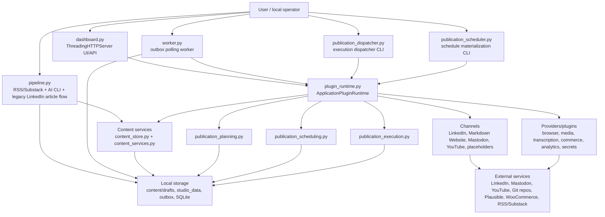
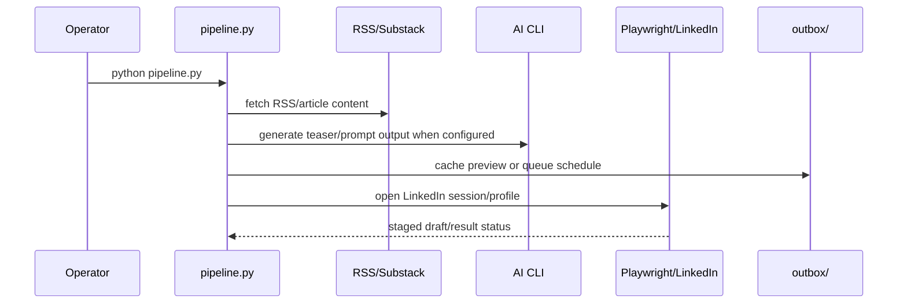
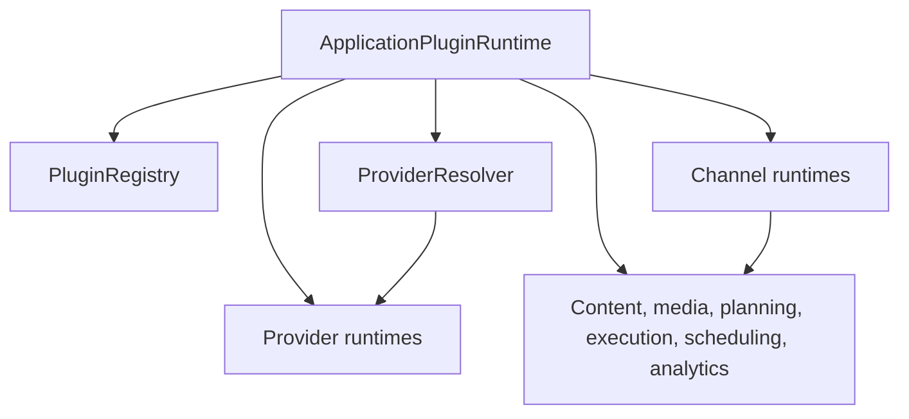
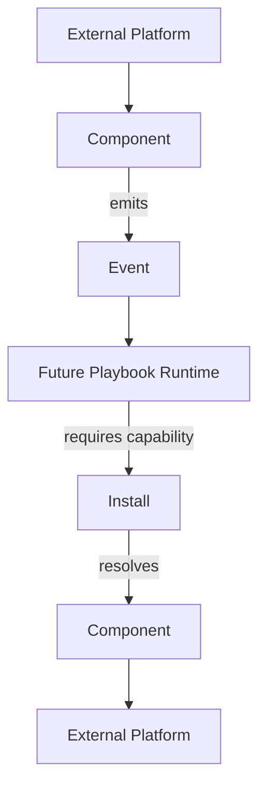

# Current Architecture

This is the architecture currently present in the repository.

## Primary Data Flows

### Substack to LinkedIn legacy flow

### Owned publication flow

```mermaid
flowchart LR
    Draft[Content draft/revision] --> Snapshot[Immutable publication snapshot]
    Snapshot --> Plan[Publication plan]
    Plan --> Target[Publication targets]
    Target --> Website[Markdown Website channel]
    Website --> Git[Managed Git worktree commit/push]
    Git --> Verify[Public URL verification]
    Verify --> Social[Dependent social targets]
    Social --> Evidence[Evidence + published post records]
    Evidence --> Analytics[Analytics/funnel readmodels]
```

### Scheduling and execution flow

```mermaid
flowchart LR
    Schedule[PublicationSchedule + RecurrenceRule] --> Occurrence[ScheduleOccurrence]
    Occurrence --> Materialize[ScheduleMaterializationService]
    Materialize --> Plan[PublicationPlan/Targets]
    Plan --> Due[PublicationExecutionService.find_due_targets]
    Due --> Lease[Execution lease]
    Lease --> Channel[Channel worker/runtime]
    Channel --> Result[Attempt status/evidence]
    Result --> Reconcile[Reconciliation queue/readmodels]
```

### Plugin runtime flow

### Phase 41 generic runtime foundation

Phase 41 adds a contract layer beside the existing plugin runtime. It does not execute playbooks and does not replace the current plugin registry, scheduler, workers, or storage.

New generic contracts live in `src/core/runtime/`:

- `EventEnvelope` and `EventSource` define universal event identity, source, tracing, idempotency, payload, and metadata fields.
- `CapabilityDescriptor` defines extensible namespaced capabilities with `read`, `write`, and `event` modes.
- `ComponentManifest` describes technical implementations that provide one or more capabilities.
- `Install` describes a configured account/workspace instance with capability bindings and secret references only.
- `CapabilityResolver` resolves `install_id + capability` to the bound component without knowing transport details.
- `LegacyCapabilityAdapter` describes existing plugin manifests as component capabilities without changing plugin behavior.

Concrete Phase 41 mappings for LinkedIn, YouTube, Website/GitHub, and the local publication calendar live outside the generic core in `runtime_foundation_mappings.py`.

The future Playbook Runtime remains future work. Current business workflows still live in `pipeline.py`, `publication_planning.py`, `publication_scheduling.py`, `publication_execution.py`, channel runtimes, and existing plugins.

## Storage Boundaries

- Source code, manifests, docs, schemas, templates, and tests are repository content.
- `studio_data/`, `outbox/`, `tmp_media/`, browser profiles, virtualenvs, caches, logs, and local DB files are runtime state and are ignored.
- `content/drafts/` is currently repository-tracked for some draft fixtures/content. It is not treated as secret storage, but it may contain authored content and should be reviewed before publication.

## External Services Actually Referenced

- LinkedIn through Playwright/browser sessions.
- RSS/Substack through feed/article fetching.
- Markdown Website Git remotes through controlled Git worktree publisher.
- Mastodon through API/OAuth PKCE channel.
- YouTube through OAuth/upload channel.
- Plausible through read-only analytics provider and browser instrumentation bridge.
- WooCommerce through read-only catalog/outcome adapter.
- GitHub Actions through CI artifact/certification import services.

## Not Present

- No external Google Calendar/Microsoft/CalDAV provider implementation.
- No vector database/RAG subsystem.
- No built visual workflow editor.
- No generic arbitrary site deployment runner; Markdown Website publishing is constrained to allowlisted repository/path operations.
