# Current Architecture

This is the architecture currently present in the repository.

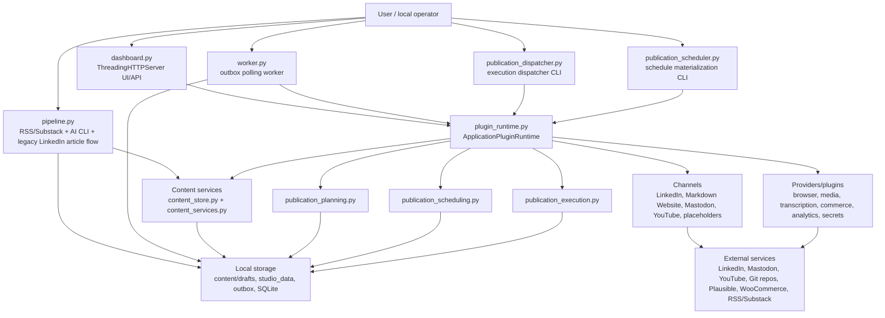

## Primary Data Flows

### Substack to LinkedIn legacy flow

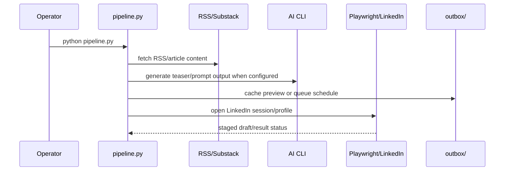

### Owned publication flow

```mermaid
flowchart LR
    Draft[Content draft/revision] --> Snapshot[Immutable publication snapshot]
    Snapshot --> Plan[Publication plan]
    Plan --> Target[Publication targets]
    Target --> Website[Markdown Website channel]
    Website --> Git[Managed Git worktree commit/push]
    Git --> Verify[Public URL verification]
    Verify --> Social[Dependent social targets]
    Social --> Evidence[Evidence + published post records]
    Evidence --> Analytics[Analytics/funnel readmodels]
```

### Scheduling and execution flow

```mermaid
flowchart LR
    Schedule[PublicationSchedule + RecurrenceRule] --> Occurrence[ScheduleOccurrence]
    Occurrence --> Materialize[ScheduleMaterializationService]
    Materialize --> Plan[PublicationPlan/Targets]
    Plan --> Due[PublicationExecutionService.find_due_targets]
    Due --> Lease[Execution lease]
    Lease --> Channel[Channel worker/runtime]
    Channel --> Result[Attempt status/evidence]
    Result --> Reconcile[Reconciliation queue/readmodels]
```

### Plugin runtime flow

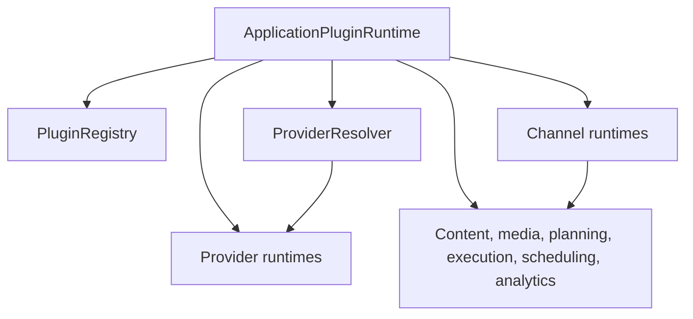

### Phase 41/42/43 generic runtime foundation

Phase 41 added a contract layer beside the existing plugin runtime. Phase 42 adds portable playbook definitions, deployment bindings, side-effect-free execution plan compilation, and an in-memory execution ledger. Phase 43 adds deterministic playbook execution for internal/test capabilities only. Phase 44 connects the first read-only production capability bridge for `calendar.event.read`.

Phase 43 executes only internal/test capabilities. Phase 44 adds one narrow production bridge: local read-only calendar access through the existing `ExecutionCalendarService`. Production platform mutations remain on the legacy path.

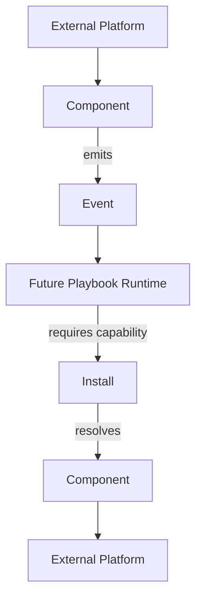

New generic contracts live in `src/core/runtime/`:

- `EventEnvelope` and `EventSource` define universal event identity, source, tracing, idempotency, payload, and metadata fields.
- `CapabilityDescriptor` defines extensible namespaced capabilities with `read`, `write`, and `event` modes.
- `ComponentManifest` describes technical implementations that provide one or more capabilities.
- `Install` describes a configured account/workspace instance with capability bindings and secret references only.
- `CapabilityResolver` resolves `install_id + capability` to the bound component without knowing transport details.
- `LegacyCapabilityAdapter` describes existing plugin manifests as component capabilities without changing plugin behavior.
- `PlaybookDefinition` describes portable intent with logical capability requirements, nodes, and DAG edges.
- `PlaybookDeployment` binds logical requirement slots to concrete installs for one workspace.
- `ExecutionPlan` is the deterministic resolved representation produced by validation and capability resolution only.
- `ExecutionLedger` records execution and node execution state transitions for future audit and observability.
- `ExecutionContext` carries the trigger event, correlation/trace IDs, variables, and completed node outputs for one execution.
- `NodeResult` is the handler result contract with `success`, `failure`, `wait`, and `skip` outcomes.
- `CapabilityHandlerRegistry` resolves execution handlers by `component_id + capability_id`.
- `PlaybookExecutor` runs a validated DAG sequentially and deterministically against registered internal handlers.
- `ExecutionTrace` exposes structured execution, node execution, and transition history.
- `CalendarEventReadHandler` bridges `calendar.event.read` to the existing local `ExecutionCalendarService` outside the generic runtime core.

Concrete Phase 41 mappings for LinkedIn, YouTube, Website/GitHub, and the local publication calendar live outside the generic core in `runtime_foundation_mappings.py`.

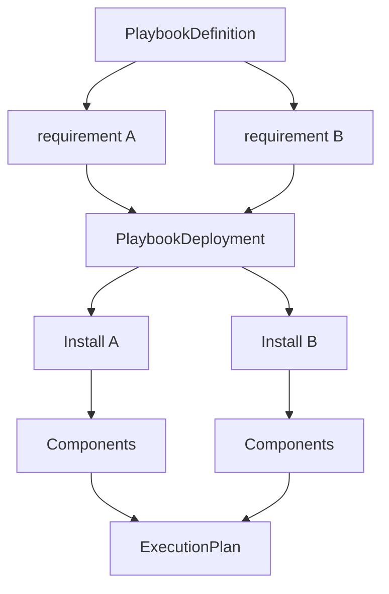

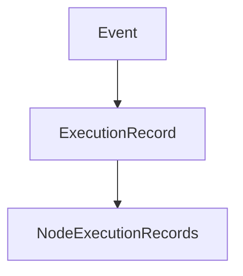

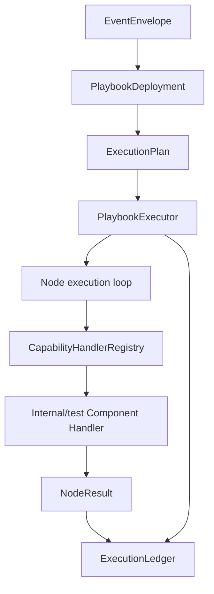

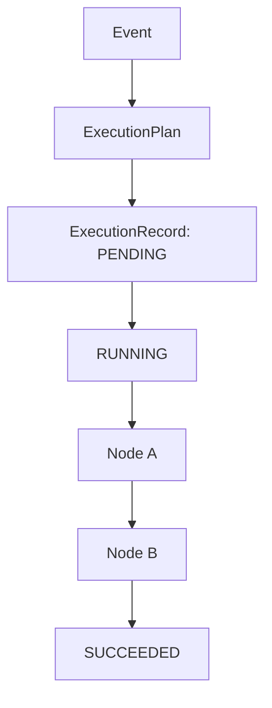

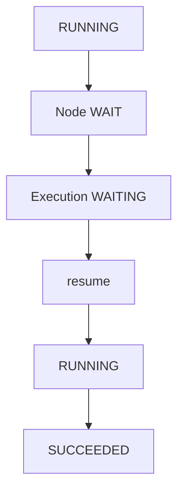

The future side-effectful production Playbook Runtime remains future work. Current business workflows still live in `pipeline.py`, `publication_planning.py`, `publication_scheduling.py`, `publication_execution.py`, channel runtimes, and existing plugins. The Phase 43 executor is isolated from `PluginRuntime`, `LinkedInChannelRuntime`, `YouTubeChannelService`, `GitPublisher`, and `ExecutionCalendarService`.

Phase 43 input mapping supports only literals, trigger event payload paths, and previous node outputs. Condition nodes use a small deterministic operator set. Transform nodes are deterministic/internal only. No Python eval, JavaScript, Jinja execution, browser automation, HTTP/API calls, subprocesses, Git writes, or production platform mutations are introduced.

### Phase 44 calendar read bridge

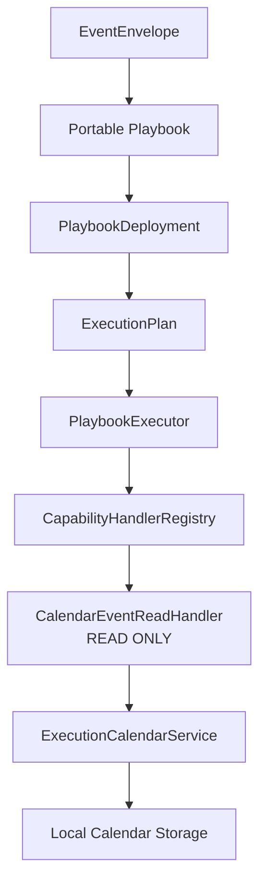

The Phase 44 route is:

```text
Event
-> Portable Playbook
-> PlaybookDeployment
-> ExecutionPlan
-> PlaybookExecutor
-> CapabilityHandlerRegistry
-> CalendarEventReadHandler
-> ExecutionCalendarService
-> normalized NodeResult
-> ExecutionLedger
```

The generic runtime core remains calendar-neutral. The production adapter lives in `publication_calendar_runtime_handlers.py`, registers only `calendar.event.read` for `publication-calendar-local`, and calls the existing local service. Calendar create/update/delete, schedule materialization, campaign coordination, external Google/Outlook calendars, browser automation, HTTP calls, Git mutations, and social platform actions are not connected to the generic runtime in Phase 44.

Existing calendar consumers remain unchanged:

```text
Current application
-> ExecutionCalendarService
```

The new route exists beside that path:

```text
Generic Runtime
-> CalendarEventReadHandler
-> ExecutionCalendarService
```

## Storage Boundaries

- Source code, manifests, docs, schemas, templates, and tests are repository content.
- `studio_data/`, `outbox/`, `tmp_media/`, browser profiles, virtualenvs, caches, logs, and local DB files are runtime state and are ignored.
- `content/drafts/` is currently repository-tracked for some draft fixtures/content. It is not treated as secret storage, but it may contain authored content and should be reviewed before publication.

## External Services Actually Referenced

- LinkedIn through Playwright/browser sessions.
- RSS/Substack through feed/article fetching.
- Markdown Website Git remotes through controlled Git worktree publisher.
- Mastodon through API/OAuth PKCE channel.
- YouTube through OAuth/upload channel.
- Plausible through read-only analytics provider and browser instrumentation bridge.
- WooCommerce through read-only catalog/outcome adapter.
- GitHub Actions through CI artifact/certification import services.

## Not Present

- No external Google Calendar/Microsoft/CalDAV provider implementation.
- No vector database/RAG subsystem.
- No built visual workflow editor.
- No generic arbitrary site deployment runner; Markdown Website publishing is constrained to allowlisted repository/path operations.
