# Current Architecture

This is the architecture currently present in the repository.

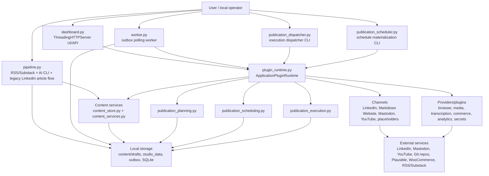

## Primary Data Flows

### Substack to LinkedIn legacy flow

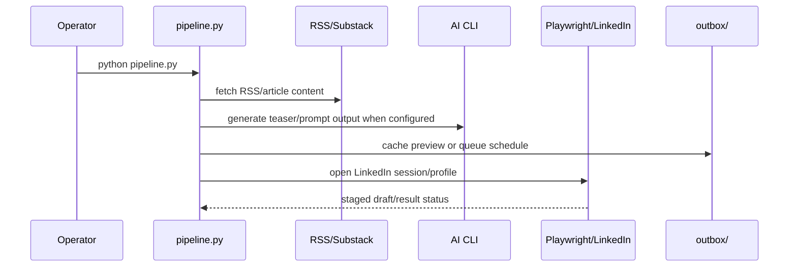

### Owned publication flow

```mermaid
flowchart LR
    Draft[Content draft/revision] --> Snapshot[Immutable publication snapshot]
    Snapshot --> Plan[Publication plan]
    Plan --> Target[Publication targets]
    Target --> Website[Markdown Website channel]
    Website --> Git[Managed Git worktree commit/push]
    Git --> Verify[Public URL verification]
    Verify --> Social[Dependent social targets]
    Social --> Evidence[Evidence + published post records]
    Evidence --> Analytics[Analytics/funnel readmodels]
```

### Scheduling and execution flow

```mermaid
flowchart LR
    Schedule[PublicationSchedule + RecurrenceRule] --> Occurrence[ScheduleOccurrence]
    Occurrence --> Materialize[ScheduleMaterializationService]
    Materialize --> Plan[PublicationPlan/Targets]
    Plan --> Due[PublicationExecutionService.find_due_targets]
    Due --> Lease[Execution lease]
    Lease --> Channel[Channel worker/runtime]
    Channel --> Result[Attempt status/evidence]
    Result --> Reconcile[Reconciliation queue/readmodels]
```

### Plugin runtime flow

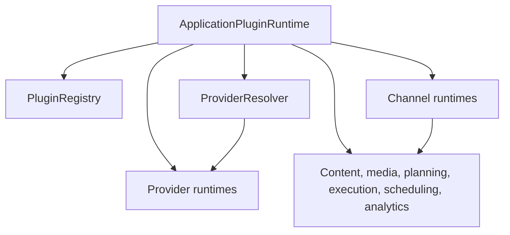

### Phase 41/42/43/44/45 generic runtime foundation

Phase 41 added a contract layer beside the existing plugin runtime. Phase 42 adds portable playbook definitions, deployment bindings, side-effect-free execution plan compilation, and an in-memory execution ledger. Phase 43 adds deterministic playbook execution for internal/test capabilities only. Phase 44 connects the first read-only production capability bridge for `calendar.event.read`. Phase 45 connects the second read-only production bridge for `git.repository.status.read`.

Phase 43 executes only internal/test capabilities. Phase 44 adds one narrow production bridge: local read-only calendar access through the existing `ExecutionCalendarService`. Phase 45 adds local read-only Git repository status access through the existing Markdown Website `GitPublisher`. Production platform mutations remain on the legacy path.

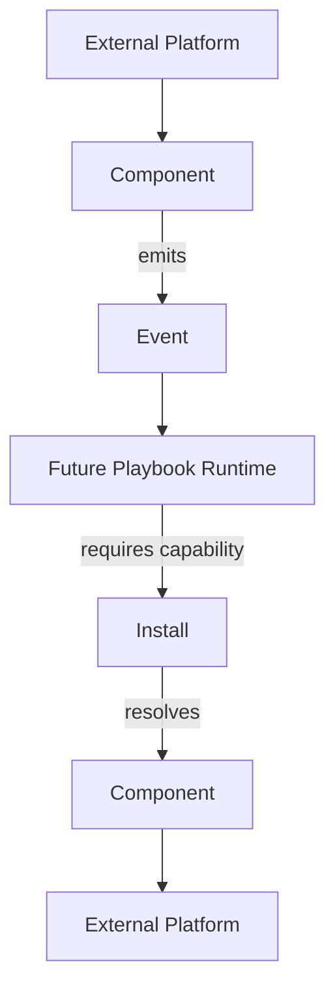

New generic contracts live in `src/core/runtime/`:

- `EventEnvelope` and `EventSource` define universal event identity, source, tracing, idempotency, payload, and metadata fields.
- `CapabilityDescriptor` defines extensible namespaced capabilities with `read`, `write`, and `event` modes.
- `ComponentManifest` describes technical implementations that provide one or more capabilities.
- `Install` describes a configured account/workspace instance with capability bindings and secret references only.
- `CapabilityResolver` resolves `install_id + capability` to the bound component without knowing transport details.
- `LegacyCapabilityAdapter` describes existing plugin manifests as component capabilities without changing plugin behavior.
- `PlaybookDefinition` describes portable intent with logical capability requirements, nodes, and DAG edges.
- `PlaybookDeployment` binds logical requirement slots to concrete installs for one workspace.
- `ExecutionPlan` is the deterministic resolved representation produced by validation and capability resolution only.
- `ExecutionLedger` records execution and node execution state transitions for future audit and observability.
- `ExecutionContext` carries the trigger event, correlation/trace IDs, variables, and completed node outputs for one execution.
- `NodeResult` is the handler result contract with `success`, `failure`, `wait`, and `skip` outcomes.
- `CapabilityHandlerRegistry` resolves execution handlers by `component_id + capability_id`.
- `PlaybookExecutor` runs a validated DAG sequentially and deterministically against registered internal handlers.
- `ExecutionTrace` exposes structured execution, node execution, and transition history.
- `CalendarEventReadHandler` bridges `calendar.event.read` to the existing local `ExecutionCalendarService` outside the generic runtime core.
- `GitRepositoryStatusReadHandler` bridges `git.repository.status.read` to the existing Markdown Website `GitPublisher` outside the generic runtime core.

Concrete Phase 41 mappings for LinkedIn, YouTube, Website/GitHub, and the local publication calendar live outside the generic core in `runtime_foundation_mappings.py`.

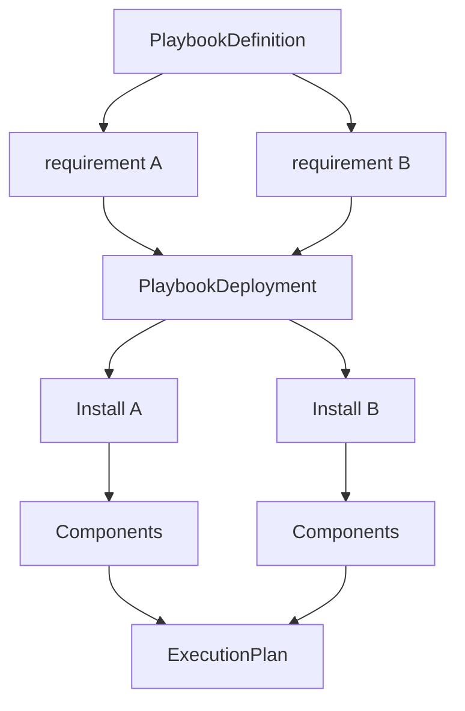

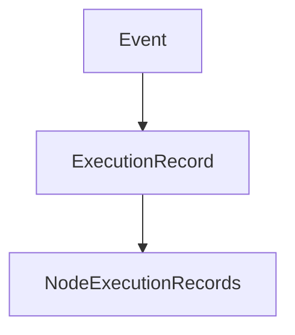

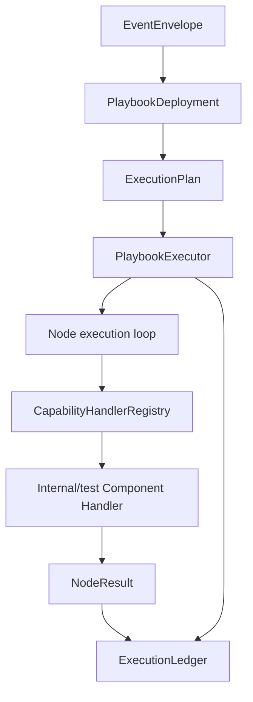

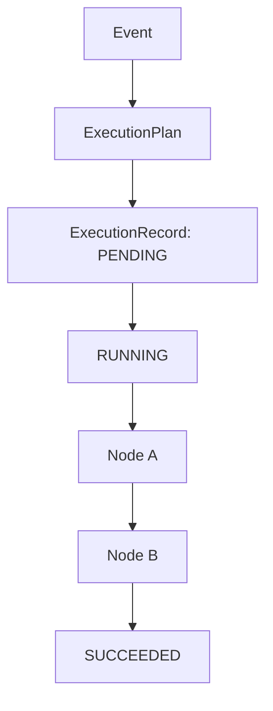

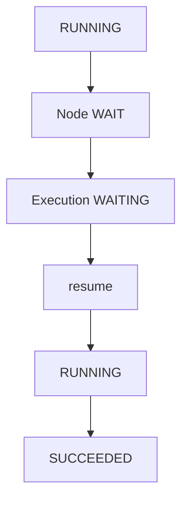

The future side-effectful production Playbook Runtime remains future work. Current business workflows still live in `pipeline.py`, `publication_planning.py`, `publication_scheduling.py`, `publication_execution.py`, channel runtimes, and existing plugins. The Phase 43 executor is isolated from `PluginRuntime`, `LinkedInChannelRuntime`, `YouTubeChannelService`, `GitPublisher`, and `ExecutionCalendarService`.

Phase 43 input mapping supports only literals, trigger event payload paths, and previous node outputs. Condition nodes use a small deterministic operator set. Transform nodes are deterministic/internal only. No Python eval, JavaScript, Jinja execution, browser automation, HTTP/API calls, subprocesses, Git writes, or production platform mutations are introduced.

### Phase 44 calendar read bridge

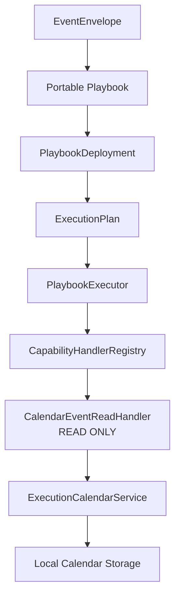

The Phase 44 route is:

```text
Event
-> Portable Playbook
-> PlaybookDeployment
-> ExecutionPlan
-> PlaybookExecutor
-> CapabilityHandlerRegistry
-> CalendarEventReadHandler
-> ExecutionCalendarService
-> normalized NodeResult
-> ExecutionLedger
```

The generic runtime core remains calendar-neutral. The production adapter lives in `publication_calendar_runtime_handlers.py`, registers only `calendar.event.read` for `publication-calendar-local`, and calls the existing local service. Calendar create/update/delete, schedule materialization, campaign coordination, external Google/Outlook calendars, browser automation, HTTP calls, Git mutations, and social platform actions are not connected to the generic runtime in Phase 44.

Existing calendar consumers remain unchanged:

```text
Current application
-> ExecutionCalendarService
```

The new route exists beside that path:

```text
Generic Runtime
-> CalendarEventReadHandler
-> ExecutionCalendarService
```

### Phase 45 Git/Website read bridge

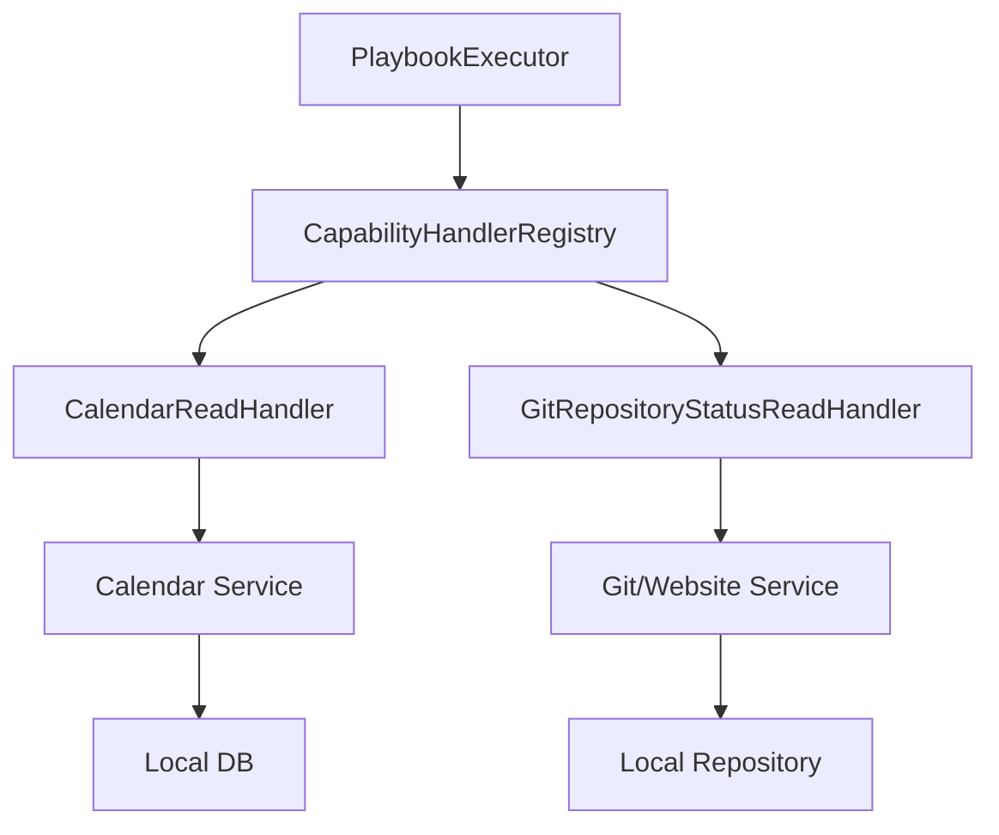

The Phase 45 route is:

```text
Event
-> Portable Playbook
-> PlaybookDeployment
-> ExecutionPlan
-> PlaybookExecutor
-> CapabilityHandlerRegistry
-> GitRepositoryStatusReadHandler
-> GitPublisher
-> normalized NodeResult
-> ExecutionLedger
```

The chosen capability is `git.repository.status.read`, not `github.file.read`, because the current Markdown Website implementation proves repository branch, HEAD, and status reads but does not expose a general file-content read capability. The component remains `github-markdown-website` because that component represents the local Markdown Website Git worktree transport.

The handler accepts only `include_changed_paths`. It does not accept shell commands or paths. Runtime tests observe only fixed read-only Git commands such as `branch --show-current`, `rev-parse --verify HEAD`, `cat-file -e <commit>^{commit}`, `status --porcelain`, and for unborn repositories `rev-parse --is-inside-work-tree`. Mutating or remote commands are not connected.

Existing Website/Git consumers remain unchanged:

```text
Current Website flow
-> GitPublisher.publish
```

The new route exists beside that path:

```text
Generic Runtime
-> GitRepositoryStatusReadHandler
-> GitPublisher
```

### Phase 46 external network read bridge

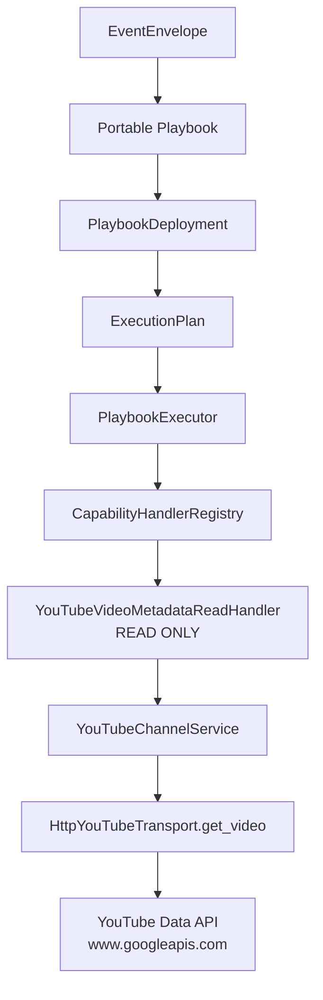

The Phase 46 route is:

```text
Event
-> Portable Playbook
-> PlaybookDeployment
-> ExecutionPlan
-> PlaybookExecutor
-> CapabilityHandlerRegistry
-> YouTubeVideoMetadataReadHandler
-> YouTubeChannelService
-> HttpYouTubeTransport.get_video
-> normalized NodeResult
-> ExecutionLedger
```

The chosen capability is `youtube.video.metadata.read`. It is intentionally more precise than `youtube.video.read` because the source plugin only validates/imports caller-supplied YouTube source data and reports transcript retrieval as not configured. The remote proof uses the existing YouTube channel service and transport, which already know how to perform YouTube Data API `videos.list` reads.

The production adapter lives in `youtube_runtime_handlers.py`. It accepts only `video_id`, rejects arbitrary URLs/endpoints/methods, resolves raw access tokens only at the handler boundary, and registers only the read capability. Upload/session/OAuth mutation methods remain on the legacy YouTube channel path and are not invoked by the Phase 46 reference flow.

The component `youtube-upload-channel` now has generic `network_policy` metadata:

```text
required: true
allowed_domains:
  - www.googleapis.com
  - oauth2.googleapis.com
```

The generic runtime core remains provider-neutral. The same `PlaybookExecutor`, `CapabilityHandlerRegistry`, `ExecutionLedger`, and trace model now support three different production I/O shapes:

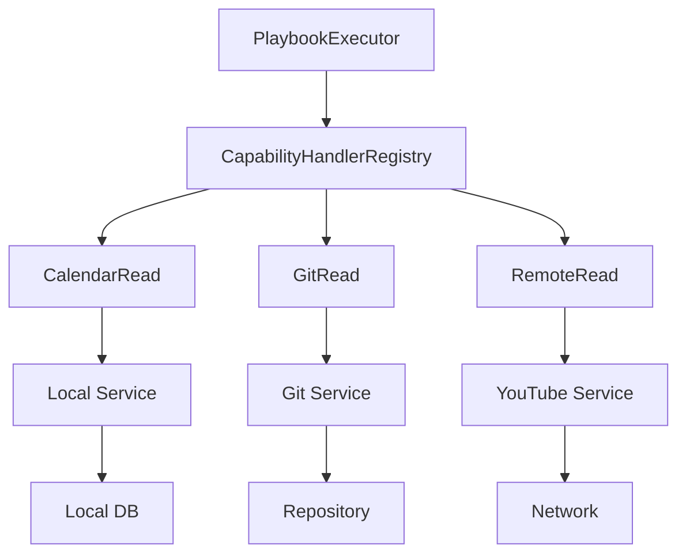

Existing YouTube consumers remain unchanged:

```text
Current YouTube source/import/upload/status flows
-> YouTubeSourcePlugin / YouTubeChannelService
```

The new route exists beside that path:

```text
Generic Runtime
-> YouTubeVideoMetadataReadHandler
-> YouTubeChannelService.read_video_metadata
```

### Phase 47 runtime policy and approvals

Phase 47 introduces runtime authorization and approval enforcement for the generic PlaybookExecutor path. It does not enable any production mutation capability.

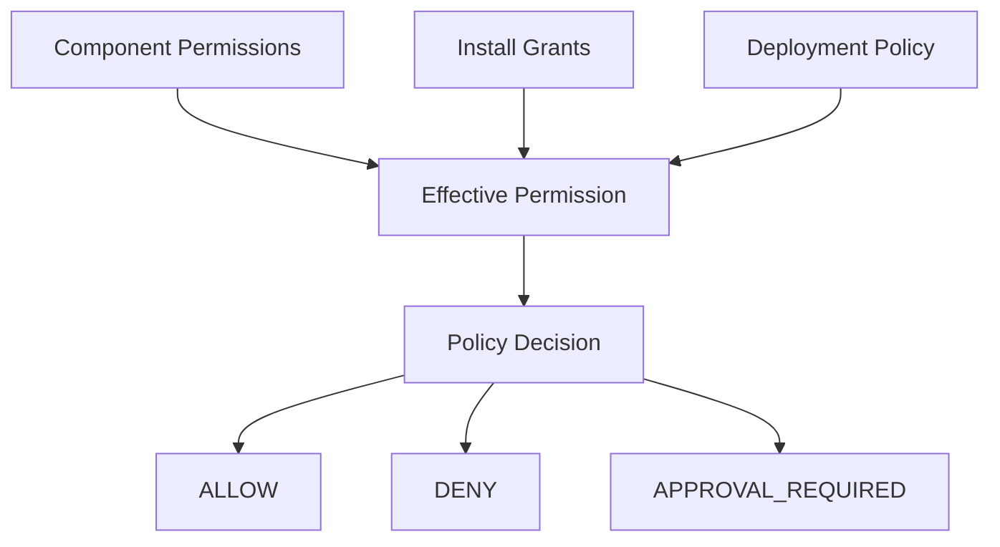

Runtime enforcement:

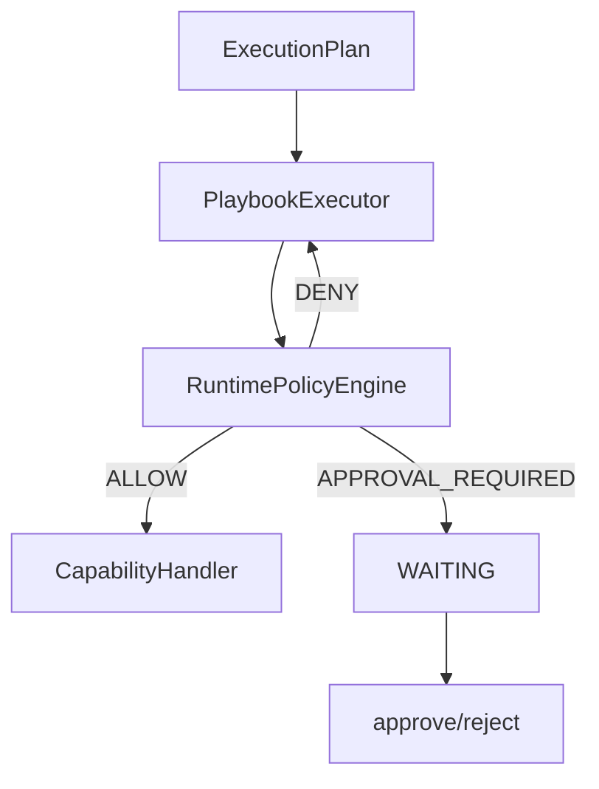

The policy layer evaluates only generic contracts:

- capability mode and capability policy metadata;
- component permissions and network policy;
- install grants and secret refs;
- deployment policy;
- current approval status.

It does not branch on provider names such as YouTube, GitHub, Calendar, or LinkedIn.

Sensitive privileges are default-deny for the generic runtime:

- mutations/write capabilities;
- external network;
- scoped secret use;
- filesystem access;
- subprocess access.

Current production bridge permissions:

```text
Calendar read
-> no network
-> no subprocess
-> no filesystem requirement
-> no secret requirement

Git repository status read
-> filesystem read
-> read-only Git subprocess
-> no network
-> no secret requirement

YouTube metadata read
-> external network
-> scoped access token ref
-> no subprocess
-> no filesystem requirement
```

Approval records are generic and contain no capability input or secret values. Approval can resume a node only when the policy decision is otherwise allowed and approval is the remaining gate. It cannot turn a hard deny into allow.

Legacy routes remain unchanged:

```text
Existing application/channel flows
-> existing services
```

Policy enforcement applies to:

```text
Generic Runtime
-> RuntimePolicyEngine
-> CapabilityHandler
```

### Phase 48 approved production mutation

Phase 48 connects the first production mutation to the same generic runtime:

```text
calendar.event.create
-> CalendarEventCreateHandler
-> ScheduleOccurrenceRepository.create
-> local publication calendar storage
```

This is local and readback-verifiable. It creates only a publication-calendar occurrence record in the existing scheduling JSON store. It does not enable external calendar mutation, LinkedIn/YouTube/Git mutations, website publish, or any second production write capability.

Approved write lifecycle:

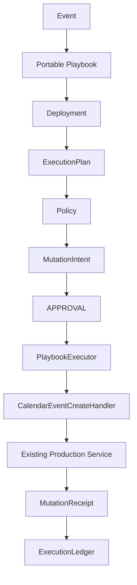

Approval authorizes an exact `MutationIntent`, not a generic capability. The runtime fingerprints normalized input before approval, rechecks policy before handler invocation, and records the applied mutation in a durable journal. The selected local mutation uses the existing `occurrence_key` duplicate handling plus the mutation journal to prevent duplicate resources across retry, resume, duplicate approval, and duplicate trigger delivery.

Phase 48 does not claim universal exactly-once semantics for external systems. It establishes durable idempotency semantics for the selected local production mutation.

### Phase 49 compensation and recovery hardening

Phase 49 does not add a new production mutation capability. The production write count remains one:

```text
calendar.event.create
```

Compensation is modeled generically:

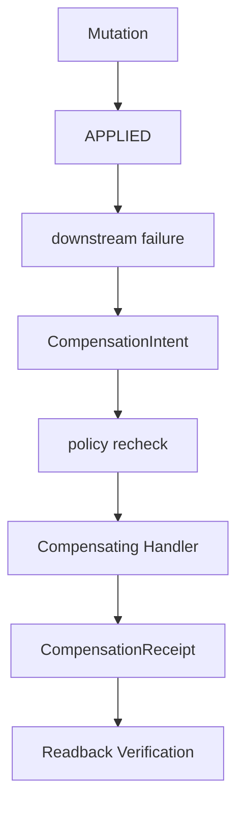

Compensation is an explicit, auditable side effect and is not equivalent to transactional rollback.

For the current calendar bridge, production compensation is blocked because the existing `ScheduleOccurrenceRepository` has no safe delete/remove inverse for the exact created occurrence. Phase 49 therefore does not register `calendar.event.delete` and does not hide a delete inside the generic core.

The mutation journal now has a production-safe SQLite adapter:

```text
Mutation Journal
      |
      +---- PREPARED
      +---- APPROVED
      +---- APPLYING
      +---- APPLIED
      |
      +---- COMPENSATING
      +---- COMPENSATED
```

`SqliteMutationJournal` uses unique idempotency keys and transactionally claims `APPLYING` before handler invocation. Duplicate workers can observe an existing in-progress or applied intent, but they cannot both claim and apply the same mutation. Recovery is explicit through `recover_mutation(...)`, which uses side-effect readback before deciding whether an `APPLYING` mutation should become `APPLIED` or return to `APPROVED` for retry.

### Phase 50 private calendar compensation

Phase 50 keeps the production write count at one:

```text
calendar.event.create
```

It adds a private, implementation-owned inverse for that create handler only. This inverse is reachable through the compensation path for the original mutation receipt, not through public capability resolution.

```text
BUSINESS CAPABILITY
calendar.event.create

PRIVATE TECHNICAL INVERSE
compensate(calendar.event.create receipt)
```

No `calendar.event.delete` capability is registered. Playbooks cannot request a generic calendar delete, and the generic runtime contains no calendar-specific delete branch.

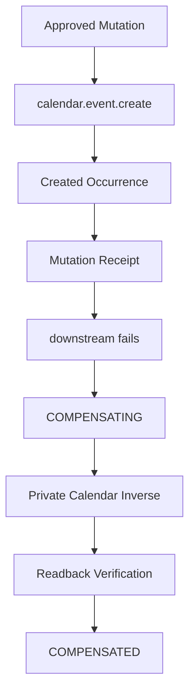

`ScheduleOccurrenceRepository.remove_created_occurrence(...)` verifies exact resource identity, runtime mutation ownership, receipt provenance, and unchanged created-state fingerprint before removing an occurrence. Changed resources and wrong-resource receipts are blocked. SQLite compensation claims keep duplicate workers from applying the same private inverse twice, and `recover_compensation(...)` lets stale `COMPENSATING` records converge after readback proves the inverse already happened.

### Phase 51 mutation safety policies

Phase 51 formalizes mutation safety as an implementation-owned runtime contract:

```text
Capability
   |
   v
Mutation Implementation
   |
   +---- Minimum MutationPolicy
   |
   v
Effective Policy Resolution
   |
   v
Safety Preflight
   |
   v
Approval / Intent
   |
   v
Mutation Execution
```

A capability defines what can be done. A mutation policy defines the minimum safety guarantees under which that implementation may be executed.

Playbooks and deployments may require stronger guarantees but may never weaken an implementation's minimum safety policy. The runtime validates approval, idempotency, readback, compensation, and recovery constraints before the handler is invoked, and repeats enforcement on resume because the effective policy is included in the mutation intent fingerprint.

The current production mutation declaration for `calendar.event.create` is:

```text
requires_approval: true
idempotency_required: true
readback: REQUIRED
compensation: SUPPORTED
recovery: AUTOMATIC
```

No new production mutation capability is introduced in Phase 51.

## Storage Boundaries

- Source code, manifests, docs, schemas, templates, and tests are repository content.
- `studio_data/`, `outbox/`, `tmp_media/`, browser profiles, virtualenvs, caches, logs, and local DB files are runtime state and are ignored.
- `content/drafts/` is currently repository-tracked for some draft fixtures/content. It is not treated as secret storage, but it may contain authored content and should be reviewed before publication.

## External Services Actually Referenced

- LinkedIn through Playwright/browser sessions.
- RSS/Substack through feed/article fetching.
- Markdown Website Git remotes through controlled Git worktree publisher.
- Mastodon through API/OAuth PKCE channel.
- YouTube through OAuth/upload channel.
- Plausible through read-only analytics provider and browser instrumentation bridge.
- WooCommerce through read-only catalog/outcome adapter.
- GitHub Actions through CI artifact/certification import services.

## Not Present

- No external Google Calendar/Microsoft/CalDAV provider implementation.
- No vector database/RAG subsystem.
- No built visual workflow editor.
- No generic arbitrary site deployment runner; Markdown Website publishing is constrained to allowlisted repository/path operations.
