# Current Architecture

This is the architecture currently present in the repository.

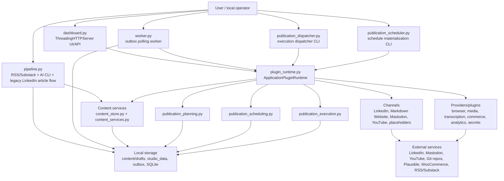

## Primary Data Flows

### Substack to LinkedIn legacy flow

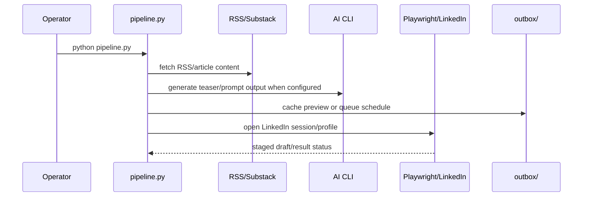

### Owned publication flow

```mermaid
flowchart LR
    Draft[Content draft/revision] --> Snapshot[Immutable publication snapshot]
    Snapshot --> Plan[Publication plan]
    Plan --> Target[Publication targets]
    Target --> Website[Markdown Website channel]
    Website --> Git[Managed Git worktree commit/push]
    Git --> Verify[Public URL verification]
    Verify --> Social[Dependent social targets]
    Social --> Evidence[Evidence + published post records]
    Evidence --> Analytics[Analytics/funnel readmodels]
```

### Scheduling and execution flow

```mermaid
flowchart LR
    Schedule[PublicationSchedule + RecurrenceRule] --> Occurrence[ScheduleOccurrence]
    Occurrence --> Materialize[ScheduleMaterializationService]
    Materialize --> Plan[PublicationPlan/Targets]
    Plan --> Due[PublicationExecutionService.find_due_targets]
    Due --> Lease[Execution lease]
    Lease --> Channel[Channel worker/runtime]
    Channel --> Result[Attempt status/evidence]
    Result --> Reconcile[Reconciliation queue/readmodels]
```

### Plugin runtime flow

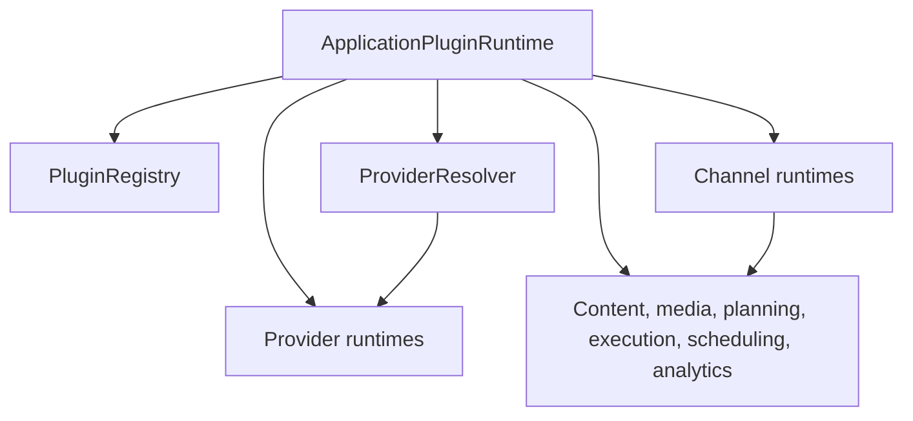

### Phase 41/42/43/44/45 generic runtime foundation

Phase 41 added a contract layer beside the existing plugin runtime. Phase 42 adds portable playbook definitions, deployment bindings, side-effect-free execution plan compilation, and an in-memory execution ledger. Phase 43 adds deterministic playbook execution for internal/test capabilities only. Phase 44 connects the first read-only production capability bridge for `calendar.event.read`. Phase 45 connects the second read-only production bridge for `git.repository.status.read`.

Phase 43 executes only internal/test capabilities. Phase 44 adds one narrow production bridge: local read-only calendar access through the existing `ExecutionCalendarService`. Phase 45 adds local read-only Git repository status access through the existing Markdown Website `GitPublisher`. Production platform mutations remain on the legacy path.

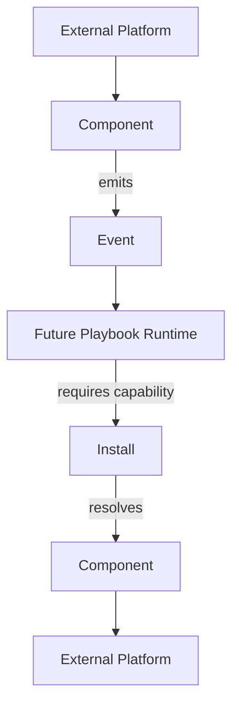

New generic contracts live in `src/core/runtime/`:

- `EventEnvelope` and `EventSource` define universal event identity, source, tracing, idempotency, payload, and metadata fields.
- `CapabilityDescriptor` defines extensible namespaced capabilities with `read`, `write`, and `event` modes.
- `ComponentManifest` describes technical implementations that provide one or more capabilities.
- `Install` describes a configured account/workspace instance with capability bindings and secret references only.
- `CapabilityResolver` resolves `install_id + capability` to the bound component without knowing transport details.
- `LegacyCapabilityAdapter` describes existing plugin manifests as component capabilities without changing plugin behavior.
- `PlaybookDefinition` describes portable intent with logical capability requirements, nodes, and DAG edges.
- `PlaybookDeployment` binds logical requirement slots to concrete installs for one workspace.
- `ExecutionPlan` is the deterministic resolved representation produced by validation and capability resolution only.
- `ExecutionLedger` records execution and node execution state transitions for future audit and observability.
- `ExecutionContext` carries the trigger event, correlation/trace IDs, variables, and completed node outputs for one execution.
- `NodeResult` is the handler result contract with `success`, `failure`, `wait`, and `skip` outcomes.
- `CapabilityHandlerRegistry` resolves execution handlers by `component_id + capability_id`.
- `PlaybookExecutor` runs a validated DAG sequentially and deterministically against registered internal handlers.
- `ExecutionTrace` exposes structured execution, node execution, and transition history.
- `CalendarEventReadHandler` bridges `calendar.event.read` to the existing local `ExecutionCalendarService` outside the generic runtime core.
- `GitRepositoryStatusReadHandler` bridges `git.repository.status.read` to the existing Markdown Website `GitPublisher` outside the generic runtime core.

Concrete Phase 41 mappings for LinkedIn, YouTube, Website/GitHub, and the local publication calendar live outside the generic core in `runtime_foundation_mappings.py`.

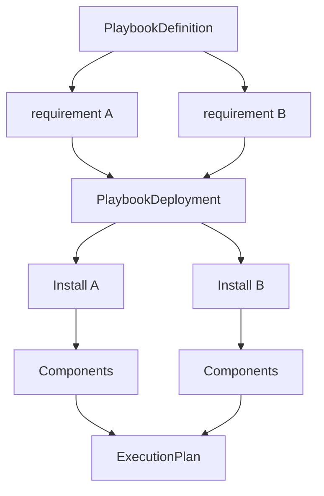

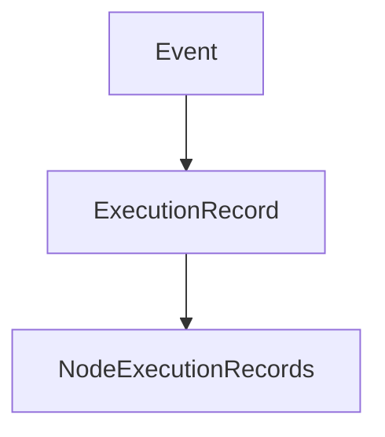

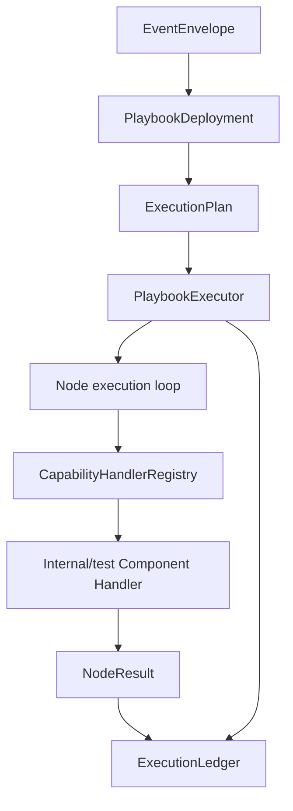

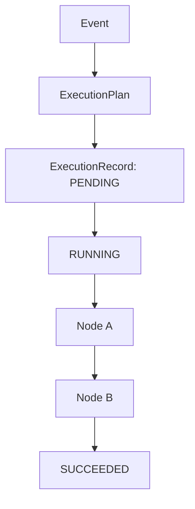

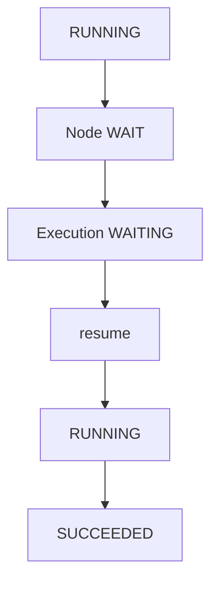

The future side-effectful production Playbook Runtime remains future work. Current business workflows still live in `pipeline.py`, `publication_planning.py`, `publication_scheduling.py`, `publication_execution.py`, channel runtimes, and existing plugins. The Phase 43 executor is isolated from `PluginRuntime`, `LinkedInChannelRuntime`, `YouTubeChannelService`, `GitPublisher`, and `ExecutionCalendarService`.

Phase 43 input mapping supports only literals, trigger event payload paths, and previous node outputs. Condition nodes use a small deterministic operator set. Transform nodes are deterministic/internal only. No Python eval, JavaScript, Jinja execution, browser automation, HTTP/API calls, subprocesses, Git writes, or production platform mutations are introduced.

### Phase 44 calendar read bridge

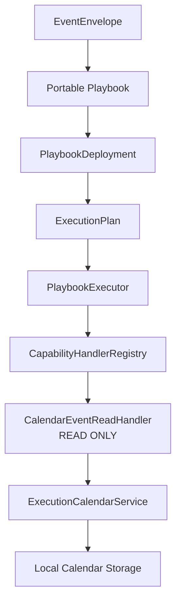

The Phase 44 route is:

```text
Event
-> Portable Playbook
-> PlaybookDeployment
-> ExecutionPlan
-> PlaybookExecutor
-> CapabilityHandlerRegistry
-> CalendarEventReadHandler
-> ExecutionCalendarService
-> normalized NodeResult
-> ExecutionLedger
```

The generic runtime core remains calendar-neutral. The production adapter lives in `publication_calendar_runtime_handlers.py`, registers only `calendar.event.read` for `publication-calendar-local`, and calls the existing local service. Calendar create/update/delete, schedule materialization, campaign coordination, external Google/Outlook calendars, browser automation, HTTP calls, Git mutations, and social platform actions are not connected to the generic runtime in Phase 44.

Existing calendar consumers remain unchanged:

```text
Current application
-> ExecutionCalendarService
```

The new route exists beside that path:

```text
Generic Runtime
-> CalendarEventReadHandler
-> ExecutionCalendarService
```

### Phase 45 Git/Website read bridge

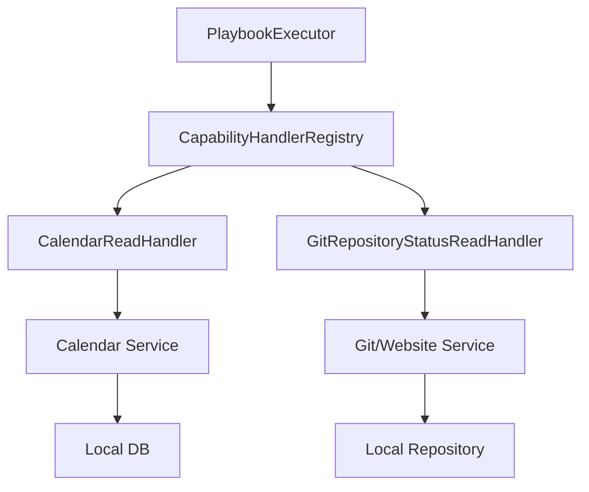

The Phase 45 route is:

```text
Event
-> Portable Playbook
-> PlaybookDeployment
-> ExecutionPlan
-> PlaybookExecutor
-> CapabilityHandlerRegistry
-> GitRepositoryStatusReadHandler
-> GitPublisher
-> normalized NodeResult
-> ExecutionLedger
```

The chosen capability is `git.repository.status.read`, not `github.file.read`, because the current Markdown Website implementation proves repository branch, HEAD, and status reads but does not expose a general file-content read capability. The component remains `github-markdown-website` because that component represents the local Markdown Website Git worktree transport.

The handler accepts only `include_changed_paths`. It does not accept shell commands or paths. Runtime tests observe only fixed read-only Git commands such as `branch --show-current`, `rev-parse --verify HEAD`, `cat-file -e <commit>^{commit}`, `status --porcelain`, and for unborn repositories `rev-parse --is-inside-work-tree`. Mutating or remote commands are not connected.

Existing Website/Git consumers remain unchanged:

```text
Current Website flow
-> GitPublisher.publish
```

The new route exists beside that path:

```text
Generic Runtime
-> GitRepositoryStatusReadHandler
-> GitPublisher
```

### Phase 46 external network read bridge

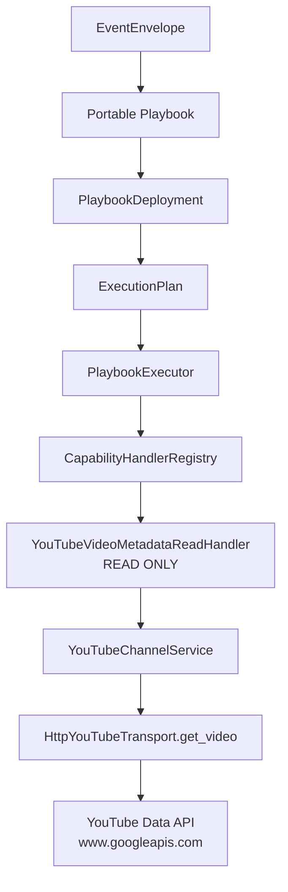

The Phase 46 route is:

```text
Event
-> Portable Playbook
-> PlaybookDeployment
-> ExecutionPlan
-> PlaybookExecutor
-> CapabilityHandlerRegistry
-> YouTubeVideoMetadataReadHandler
-> YouTubeChannelService
-> HttpYouTubeTransport.get_video
-> normalized NodeResult
-> ExecutionLedger
```

The chosen capability is `youtube.video.metadata.read`. It is intentionally more precise than `youtube.video.read` because the source plugin only validates/imports caller-supplied YouTube source data and reports transcript retrieval as not configured. The remote proof uses the existing YouTube channel service and transport, which already know how to perform YouTube Data API `videos.list` reads.

The production adapter lives in `youtube_runtime_handlers.py`. It accepts only `video_id`, rejects arbitrary URLs/endpoints/methods, resolves raw access tokens only at the handler boundary, and registers only the read capability. Upload/session/OAuth mutation methods remain on the legacy YouTube channel path and are not invoked by the Phase 46 reference flow.

The component `youtube-upload-channel` now has generic `network_policy` metadata:

```text
required: true
allowed_domains:
  - www.googleapis.com
  - oauth2.googleapis.com
```

The generic runtime core remains provider-neutral. The same `PlaybookExecutor`, `CapabilityHandlerRegistry`, `ExecutionLedger`, and trace model now support three different production I/O shapes:

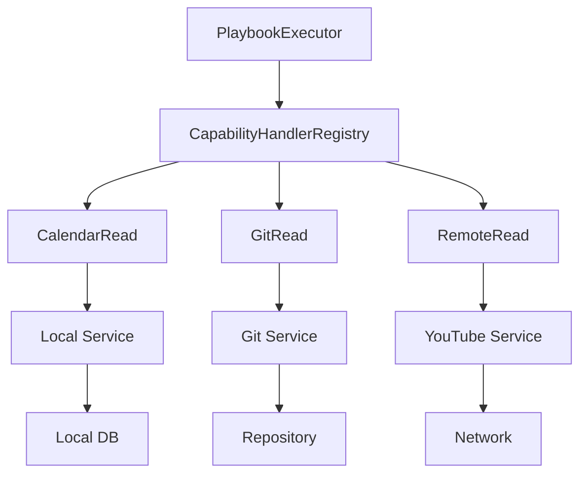

Existing YouTube consumers remain unchanged:

```text
Current YouTube source/import/upload/status flows
-> YouTubeSourcePlugin / YouTubeChannelService
```

The new route exists beside that path:

```text
Generic Runtime
-> YouTubeVideoMetadataReadHandler
-> YouTubeChannelService.read_video_metadata
```

### Phase 47 runtime policy and approvals

Phase 47 introduces runtime authorization and approval enforcement for the generic PlaybookExecutor path. It does not enable any production mutation capability.

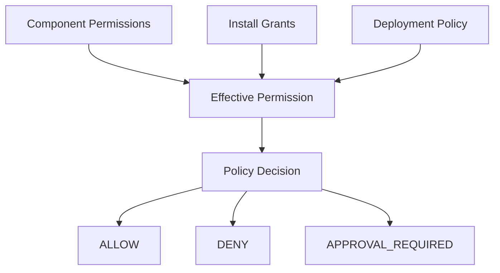

Runtime enforcement:

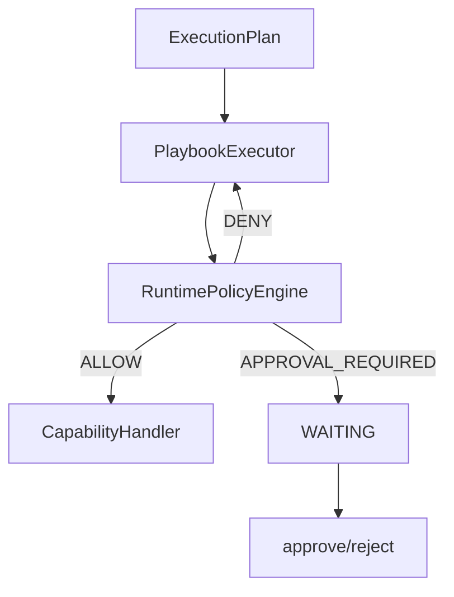

The policy layer evaluates only generic contracts:

- capability mode and capability policy metadata;
- component permissions and network policy;
- install grants and secret refs;
- deployment policy;
- current approval status.

It does not branch on provider names such as YouTube, GitHub, Calendar, or LinkedIn.

Sensitive privileges are default-deny for the generic runtime:

- mutations/write capabilities;
- external network;
- scoped secret use;
- filesystem access;
- subprocess access.

Current production bridge permissions:

```text
Calendar read
-> no network
-> no subprocess
-> no filesystem requirement
-> no secret requirement

Git repository status read
-> filesystem read
-> read-only Git subprocess
-> no network
-> no secret requirement

YouTube metadata read
-> external network
-> scoped access token ref
-> no subprocess
-> no filesystem requirement
```

Approval records are generic and contain no capability input or secret values. Approval can resume a node only when the policy decision is otherwise allowed and approval is the remaining gate. It cannot turn a hard deny into allow.

Legacy routes remain unchanged:

```text
Existing application/channel flows
-> existing services
```

Policy enforcement applies to:

```text
Generic Runtime
-> RuntimePolicyEngine
-> CapabilityHandler
```

### Phase 48 approved production mutation

Phase 48 connects the first production mutation to the same generic runtime:

```text
calendar.event.create
-> CalendarEventCreateHandler
-> ScheduleOccurrenceRepository.create
-> local publication calendar storage
```

This is local and readback-verifiable. It creates only a publication-calendar occurrence record in the existing scheduling JSON store. It does not enable external calendar mutation, LinkedIn/YouTube/Git mutations, website publish, or any second production write capability.

Approved write lifecycle:

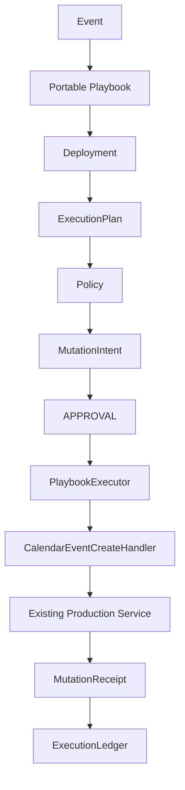

Approval authorizes an exact `MutationIntent`, not a generic capability. The runtime fingerprints normalized input before approval, rechecks policy before handler invocation, and records the applied mutation in a durable journal. The selected local mutation uses the existing `occurrence_key` duplicate handling plus the mutation journal to prevent duplicate resources across retry, resume, duplicate approval, and duplicate trigger delivery.

Phase 48 does not claim universal exactly-once semantics for external systems. It establishes durable idempotency semantics for the selected local production mutation.

### Phase 49 compensation and recovery hardening

Phase 49 does not add a new production mutation capability. The production write count remains one:

```text
calendar.event.create
```

Compensation is modeled generically:

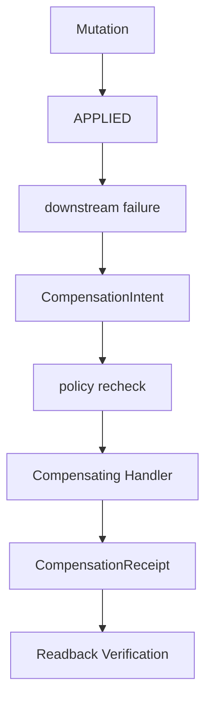

Compensation is an explicit, auditable side effect and is not equivalent to transactional rollback.

For the current calendar bridge, production compensation is blocked because the existing `ScheduleOccurrenceRepository` has no safe delete/remove inverse for the exact created occurrence. Phase 49 therefore does not register `calendar.event.delete` and does not hide a delete inside the generic core.

The mutation journal now has a production-safe SQLite adapter:

```text
Mutation Journal
      |
      +---- PREPARED
      +---- APPROVED
      +---- APPLYING
      +---- APPLIED
      |
      +---- COMPENSATING
      +---- COMPENSATED
```

`SqliteMutationJournal` uses unique idempotency keys and transactionally claims `APPLYING` before handler invocation. Duplicate workers can observe an existing in-progress or applied intent, but they cannot both claim and apply the same mutation. Recovery is explicit through `recover_mutation(...)`, which uses side-effect readback before deciding whether an `APPLYING` mutation should become `APPLIED` or return to `APPROVED` for retry.

### Phase 50 private calendar compensation

Phase 50 keeps the production write count at one:

```text
calendar.event.create
```

It adds a private, implementation-owned inverse for that create handler only. This inverse is reachable through the compensation path for the original mutation receipt, not through public capability resolution.

```text
BUSINESS CAPABILITY
calendar.event.create

PRIVATE TECHNICAL INVERSE
compensate(calendar.event.create receipt)
```

No `calendar.event.delete` capability is registered. Playbooks cannot request a generic calendar delete, and the generic runtime contains no calendar-specific delete branch.

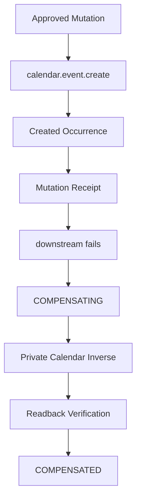

`ScheduleOccurrenceRepository.remove_created_occurrence(...)` verifies exact resource identity, runtime mutation ownership, receipt provenance, and unchanged created-state fingerprint before removing an occurrence. Changed resources and wrong-resource receipts are blocked. SQLite compensation claims keep duplicate workers from applying the same private inverse twice, and `recover_compensation(...)` lets stale `COMPENSATING` records converge after readback proves the inverse already happened.

### Phase 51 mutation safety policies

Phase 51 formalizes mutation safety as an implementation-owned runtime contract:

```text
Capability
   |
   v
Mutation Implementation
   |
   +---- Minimum MutationPolicy
   |
   v
Effective Policy Resolution
   |
   v
Safety Preflight
   |
   v
Approval / Intent
   |
   v
Mutation Execution
```

A capability defines what can be done. A mutation policy defines the minimum safety guarantees under which that implementation may be executed.

Playbooks and deployments may require stronger guarantees but may never weaken an implementation's minimum safety policy. The runtime validates approval, idempotency, readback, compensation, and recovery constraints before the handler is invoked, and repeats enforcement on resume because the effective policy is included in the mutation intent fingerprint.

The current production mutation declaration for `calendar.event.create` is:

```text
requires_approval: true
idempotency_required: true
readback: REQUIRED
compensation: SUPPORTED
recovery: AUTOMATIC
```

No new production mutation capability is introduced in Phase 51.

## Phase 52 Website/Git Admission

Phase 52 evaluates the existing Markdown Website/Git publish path for admission as the second production mutation. The selected candidate is `website.article.publish` because the current code publishes a rendered article snapshot with revision bindings and Git evidence; it is not a generic `github.file.write` operation.

Result:

```text
PHASE 52: BLOCKED
production mutation count: 1
second production mutation handler registered: NO
```

The legacy `GitPublisher.publish` flow already has useful safety properties: exact-path staging, `shell=False`, branch/root/remote-name allowlists, commit verification, and tests proving unrelated dirty files are not committed. It is still not admitted to the generic mutation runtime because the Phase 51 mutation contracts are not fully proven for runtime execution:

- The `github-markdown-website` component is currently permissioned for filesystem `read` and `read-only-git` subprocesses.
- Article publish requires filesystem write plus Git index/commit/push operations, which need a separate publish-specific permission contract.
- Remote push/fetch is not represented in generic network/egress policy.
- Duplicate/crash replay around file write, staging, commit, and push is not yet reconciled through the mutation journal.
- No generic readback verifier exists that can prove stale `APPLYING` publish records converged to a specific file/commit/remote state.

```mermaid
flowchart TD
    Existing[Existing Integration]
    Inspection[Safety Inspection]
    Policy[MutationPolicy]
    Admission[Admission Validation]
    Blocked[BLOCKED]
    Admitted[ADMITTED]
    Runtime[Generic Runtime]

    Existing --> Inspection
    Inspection --> Policy
    Policy --> Admission
    Admission --> Blocked
    Admission -. requires future proof .-> Admitted
    Admitted -. future phase .-> Runtime
```

Existing functionality is not automatically eligible for the generic mutation runtime. A production mutation must prove the safety guarantees declared by its policy before it is admitted.

## Phase 53 Component Permissions

Phase 53 adds a generic component permission model. Capabilities define what a component can provide; permissions define which host and external resources the implementation is allowed to use to provide those capabilities.

```text
requested permissions
        ∩
install grants
        =
effective permissions
```

Permissions are default-deny. A component may request filesystem scopes, named operations, and egress destinations. An install explicitly grants a subset. Extra install grants do not silently expand the component's effective permissions.

```mermaid
flowchart TD
    Capability[Capability]
    Component[Component]
    Manifest[Component Permission Manifest]
    Grants[Install Grants]
    Effective[Effective Permission Set]
    Guard[Runtime Guard]
    FS[FS]
    Ops[Ops]
    Egress[Egress]

    Capability --> Component
    Component --> Manifest
    Manifest --> Effective
    Grants --> Effective
    Effective --> Guard
    Guard --> FS
    Guard --> Ops
    Guard --> Egress
```

Current generic contracts include `ComponentPermissions`, `FilesystemPermissions`, `OperationPermissions`, `NetworkPermissions`, `EgressDestination`, `InstallPermissionGrants`, `EffectivePermissionSet`, and `PermissionContext`.

The existing Git read production bridge now declares:

```text
git.repository.status.read
filesystem.read.repository
git.status
git.rev_parse
git.cat_file
```

With policy enforcement enabled, missing repository read or missing Git operation grants block before `GitPublisher` can invoke subprocesses.

Phase 53 does not admit Website publishing. It only makes the previously missing permission, operation, and egress contracts expressible and enforceable. `website.article.publish` remains blocked on idempotency, readback, and recovery, and production mutation count remains `1`.

Phase 54 adds Website/Git publish safety evidence without registering a production publish handler. `website.article.publish` now has deterministic logical publication identity, approved-state fingerprinting, optional mutation commit trailers, and read-only file/commit/local-bare-remote readback classification.

```mermaid
flowchart TD
    Applying[APPLYING]
    FileOnly[file only]
    CommitLocal[commit local]
    CommitRemote[commit remote]
    Verifier[Readback Verifier]
    Safe[SAFE STATE]
    Ambiguous[AMBIGUOUS]
    Recover[recover or mark applied]
    Manual[MANUAL RECOVERY]

    Applying --> FileOnly
    Applying --> CommitLocal
    Applying --> CommitRemote
    FileOnly --> Verifier
    CommitLocal --> Verifier
    CommitRemote --> Verifier
    Verifier --> Safe
    Verifier --> Ambiguous
    Safe --> Recover
    Ambiguous --> Manual
```

Idempotency identifies the logical mutation. Readback determines which side effects actually occurred. Recovery chooses the only safe next action from durable evidence.

The Phase 54 Website/Git safety helpers live in `publication_git_publish_safety.py`, outside `src/core/runtime/`. The generic runtime still has no Git, Website, Markdown, branch, commit, or push branches. `GitPublisher.publish(...)` remains the existing production implementation and only gained optional safe provenance trailers (`mutation_id`, `intent_fingerprint`) for future mutation receipts.

Admission status after Phase 54:

```text
permission/operation/egress blockers: resolved structurally
idempotency/readback/recovery blockers: resolved as safety evidence
final admission: BLOCKED_HANDLER_NOT_REGISTERED
production mutation count: 1
```

No `website.article.publish` handler is registered with `PlaybookExecutor` yet, and no second production mutation capability is admitted.

## Storage Boundaries

- Source code, manifests, docs, schemas, templates, and tests are repository content.
- `studio_data/`, `outbox/`, `tmp_media/`, browser profiles, virtualenvs, caches, logs, and local DB files are runtime state and are ignored.
- `content/drafts/` is currently repository-tracked for some draft fixtures/content. It is not treated as secret storage, but it may contain authored content and should be reviewed before publication.

## External Services Actually Referenced

- LinkedIn through Playwright/browser sessions.
- RSS/Substack through feed/article fetching.
- Markdown Website Git remotes through controlled Git worktree publisher.
- Mastodon through API/OAuth PKCE channel.
- YouTube through OAuth/upload channel.
- Plausible through read-only analytics provider and browser instrumentation bridge.
- WooCommerce through read-only catalog/outcome adapter.
- GitHub Actions through CI artifact/certification import services.

## Not Present

- No external Google Calendar/Microsoft/CalDAV provider implementation.
- No vector database/RAG subsystem.
- No built visual workflow editor.
- No generic arbitrary site deployment runner; Markdown Website publishing is constrained to allowlisted repository/path operations.

### Phase 59 YouTube Resource Ingestion & Content Provenance

Phase 59 adds `youtube.video.read` capability, `ResourceRef`, `ExternalResourceSnapshot`, and `ContentRepository` upsert to bridge event-driven execution (`youtube.video.published`) with local content identity, revisioning, external refs, and source provenance.

```text
youtube.video.published (Event)
      ↓
youtube.video.read (Capability)
      ↓
ExternalResourceSnapshot (Normalized Snapshot)
      ↓
ContentRepository.upsert_external_resource
      ↓
ContentItem (Entity Identity: youtube:video:<id>)
      ↓
ContentRevision (Checksummed Metadata Revision)
      ↓
Source Provenance (Lineage tracking)
```

Key guarantees:
- `youtube.video.read` is strictly read-only and requires explicit `METADATA_ONLY` completeness. No transcripts or AI generations are claimed.
- `ResourceRef` standardizes canonical cross-platform identity (`provider:resource_type:external_id`).
- `ContentRepository` (`InMemoryContentRepository`, `SqliteContentRepository`) provides idempotent entity identity matching and creates new revisions only when metadata checksums change. Re-polls and event replays produce no duplicate revisions.
- Core content models (`ResourceRef`, `ExternalResourceSnapshot`, `ContentRepository`) maintain 100% provider neutrality without hardcoded provider branches.
- Production mutation count remains strictly 2 (`calendar.event.create`, `website.article.publish`).

### Phase 60 Transcript Artifacts

Phase 60 adds the first concrete content artifact layer for YouTube transcripts without adding AI, analytics, article generation, LinkedIn behavior, or YouTube mutations.

```text
YouTube Video ContentEntity
       |
       +---- Metadata Revisions
       |
       +---- Raw Transcript Artifact
       |          |
       |          v
       |     Normalization
       |          |
       +---- Normalized Transcript Artifact
                  |
                  v
        TRANSCRIPT_AVAILABLE
```

`Artifact` is provider-neutral and binds to the same Phase 59 `ContentItem`/entity identity plus the observed revision lineage. `transcript.raw` stores exact VTT/import bytes with content hash, provider/import source, language, track identity, retrieval time, and safe provenance. `transcript.normalized` stores deterministic JSON with integer millisecond segments, plain text projection, parser id/version, source artifact id, normalized content hash, and generation method.

Metadata, transcript and audiovisual content are different completeness levels. A transcript provides a strong textual representation of spoken/captioned content, but does not necessarily represent all visual information in a video. Successful normalized transcript ingestion sets `TRANSCRIPT_AVAILABLE`; it never sets `complete`/full audiovisual content.

Transcript source provenance must distinguish official provider captions, provider-generated ASR and user-supplied transcripts. The official implementation of `youtube.transcript.read` is `youtube-official-captions`, using only YouTube Data API `captions.list` and `captions.download` with OAuth. Production activation is honest: when the scope/token contract is not configured, the source is `NOT_CONFIGURED`/`TRANSCRIPT_AUTH_REQUIRED`. There is no fallback to unofficial APIs, scraping, browser automation, audio download, Whisper/ASR, or LLM processing.

Track selection is deterministic: serving, non-draft, preferred language, primary audio, standard/manual before ASR unless ASR is explicit, then deterministic tie checks. Ambiguous equivalent winners return `TRANSCRIPT_TRACK_AMBIGUOUS`.

Production boundaries remain unchanged: one external event source (`youtube.video.published`), two production mutations (`calendar.event.create`, `website.article.publish`), and zero caption mutation endpoints.

### Phase 61 Publication And Metrics Graph

Phase 61 makes external publication and metric history first-class in the Phase 59/60 content graph.

```text
ContentEntity
     |
     +-- Revisions
     |      |
     |      +-- Transcript Artifact
     |
     +-- Publications
             |
             +-- MetricsSnapshots
                    |
                    +-- normalized
                    +-- raw
```

Content describes what the work is. A publication describes where a manifestation of that work exists. Metrics describe observations about that publication at specific points in time.

Metrics are attached to publications rather than directly to content entities because the same conceptual content can have different performance on different channels.

Raw provider metrics are retained so normalization can evolve without requiring provider data to be fetched again.

The generic model is:

- `Publication`: `publication_id`, `content_entity_id`, `content_revision_id`, provider, install, external ref, published/observed times, state, provenance, metadata.
- `MetricsSnapshot`: append-only publication observation with observed time, normalized metrics, safe raw provider payload/ref, provider/local schema version, normalizer id/version, reporting window, and provenance.
- `ContentPerformanceQueryService`: read-only structure for later AI input, returning content identity, current revision, transcript artifact availability, publications, and normalized metric history. Raw metrics are omitted by default and require explicit snapshot access.

Publication identity is stable across metadata changes:

```text
provider + install_id + external resource identity
```

For YouTube this means the same external video id reconciles to one publication, even when title or description changes produce new content revisions. Multiple publications for one content entity are supported, for example YouTube and Website manifestations with independent metric histories.

The current YouTube implementation does not include a safe production metrics reader. The honest production status is:

```text
YOUTUBE_METRICS = BLOCKED_NO_SAFE_EXISTING_READER
```

Phase 61 includes only a deterministic local YouTube statistics normalizer for fixtures/re-normalization proof. It does not add a remote analytics capability, YouTube Studio scraping, browser automation, arbitrary provider query execution, mutations, new event sources, or AI calls.

### Phase 62 Read-Only Content Performance Context

Phase 62 exposes the Phase 61 graph through an explicit read-only context contract for future agents, playbooks, and AI preparation. The API prepares deterministic facts; it does not call AI, rank content, classify topics, make causal claims, or mutate production state.

```text
ContentEntity
     |
     v
Content Performance Context API
     |
     +-- current ContentRevision identity
     +-- transcript availability and artifact refs
     +-- Publications
     |      |
     |      +-- MetricsSnapshot history
     |
     +-- explicit raw metrics snapshot lookup
```

`ContentPerformanceContextService.get_context(content_entity_id)` returns:

- content identity and external ref
- current revision identity and provenance ref
- transcript state: availability, completeness level, normalized artifact id/ref, language, source type, generation method, parser id/version, and provenance ref
- publication state: publication id, provider, install, canonical external ref, linked content/revision ids, published/observed times, state, safe metadata, and provenance ref
- normalized metrics history with observation time, provider reporting window, normalizer id/version, provider/local schema version, and provenance refs
- freshness facts such as whether metrics exist, latest observation time, snapshot count, and publication count
- explicit redaction state

Raw payloads are opt-in. Ordinary context responses do not include raw provider metrics, raw transcript bodies, full normalized transcript text, provider headers, OAuth material, or secret values. `get_raw_metrics_snapshot(snapshot_id)` is the explicit raw metrics access boundary for debugging and future re-normalization.

The redaction contract is:

```text
raw_metrics_included: false
raw_transcript_included: false
secrets_included: false
provider_headers_included: false
```

Provider normalizers remain outside generic core. YouTube metrics remains production-blocked:

```text
YOUTUBE_METRICS = BLOCKED_NO_SAFE_EXISTING_READER
```

Production boundaries remain unchanged: two production mutations (`calendar.event.create`, `website.article.publish`), one production external event source (`youtube-data-api-uploads`), no new YouTube metrics production reader, no scraping, no browser automation, and no AI calls.

### Phase 63 Playbook Registry And Safe Context Binding

Phase 63 introduces a provider-neutral playbook registry above the read-only content performance context. It stores, validates, and selects playbook definitions; it does not execute playbooks, invoke `PlaybookExecutor`, call AI, mutate production state, scrape, automate browsers, or admit YouTube metrics.

```text
ContentPerformanceContext
        |
        v
Playbook Registry
        |
        v
Playbook Selection
        |
        v
Future Execution Layer
```

Playbook registry records are versioned first-class definitions:

- `playbook_id` + `version` is the stable key; name-only overwrites are not allowed.
- `status` is one of `draft`, `active`, `deprecated`, `disabled`, or `invalid`.
- `scope`, input contract, context contract, capability requirements, mutation policy, raw access policy, steps, provenance, and timestamps are stored with the definition.
- Multiple versions and multiple playbooks for the same content domain can exist side by side.

Context binding is explicit. A playbook can require `content-performance-context.v1`, transcript availability, publications, and/or metric history. Raw metrics and raw transcript requirements default to false. Ordinary selection excludes raw-access playbooks unless the selection policy explicitly allows that access; even then, secrets remain forbidden.

Mutation access is default forbidden:

```text
mutation_policy.allowed: false
mutation_policy.allowed_capabilities: []
```

Definitions can declare capability requirements such as `content.performance.context.read`, but Phase 63 does not activate capabilities. Missing capabilities validate as unavailable/invalid or are rejected during selection. Production mutation count remains strictly 2, and production external source count remains strictly 1.

Selection is deterministic:

- disabled and invalid definitions are excluded.
- deprecated definitions require explicit policy.
- context schema and required context facts must match.
- required read capabilities must be available.
- mutation and raw-access requirements require explicit policy.
- highest compatible version is selected only because the selection policy says so.
- tie-breakers use scope, playbook id, and version ordering.

The registry output and selection provenance contain no secrets, raw provider payloads, provider headers, OAuth material, or raw transcript bodies. AI-ready context may feed a later layer, but Phase 63 remains definition-management only.
