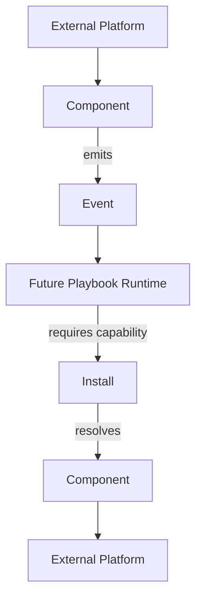
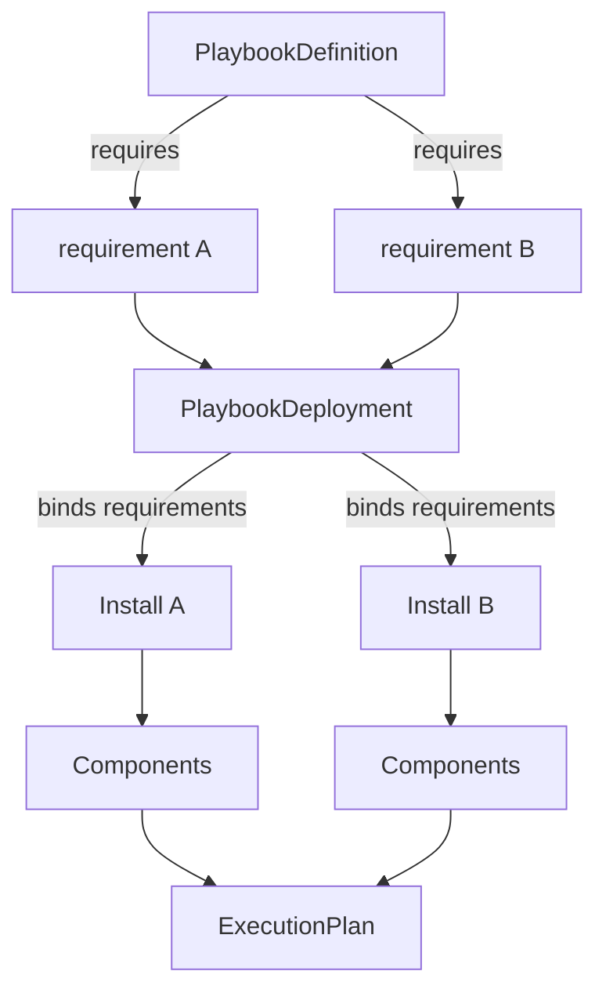
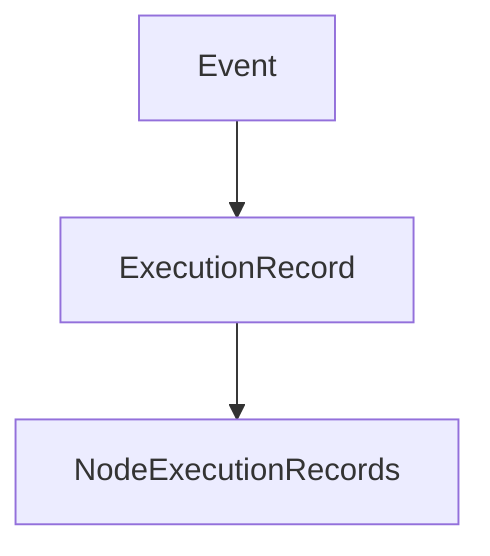
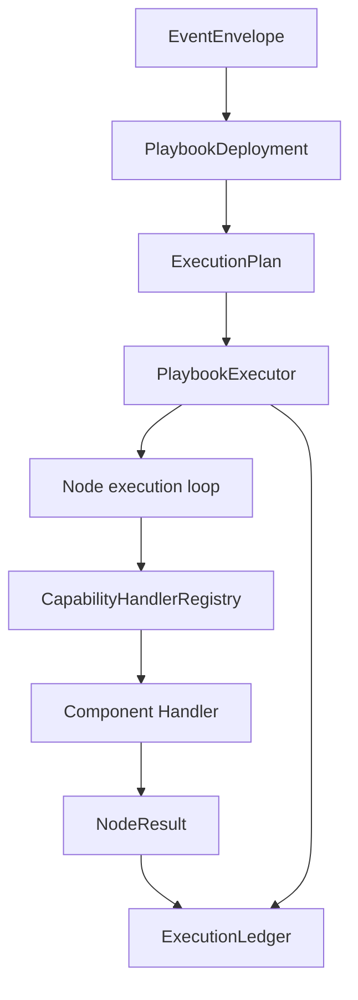
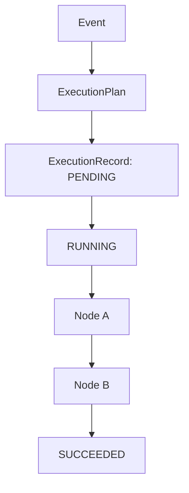
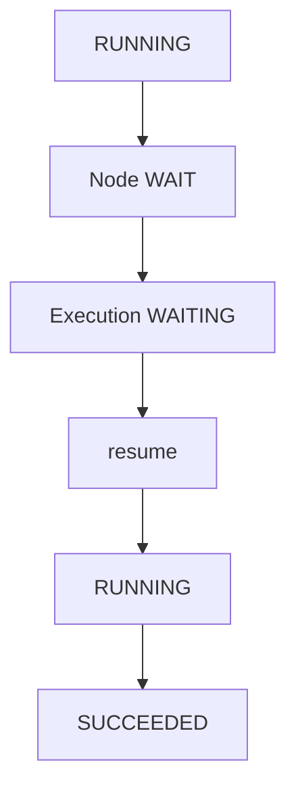

# Runtime Evolution

Phase 41 introduced contracts for a generic local-first workflow runtime without changing existing social publication behavior.
Phase 42 adds portable playbook contracts, deployment bindings, side-effect-free execution plans, and an in-memory execution ledger.
Phase 43 adds the first deterministic executor for internal/test capabilities only.

## Scope

- No rewrite.
- Existing Python stack, plugins, scheduler/workers, storage, dashboard, LinkedIn, YouTube, Markdown Website/Git, calendar, and analytics behavior remain unchanged.
- No production platform playbook execution is introduced in this phase.
- No destructive storage migration is introduced in this phase.

## Future Runtime Shape

The side-effectful production Playbook Runtime is future work. Phase 43 executes only internal/test capabilities. Production platform capabilities remain on the legacy path.

## Phase 42 Portable Playbooks

The distinction is explicit:

- `PlaybookDefinition` is portable intent. It can require logical slots and capabilities, but it must not contain install IDs, account IDs, workspace IDs, tokens, credentials, or secret references.
- `PlaybookDeployment` is environment-specific binding. It maps requirement slots to concrete installs and may contain non-secret configuration.
- `ExecutionPlan` is resolved representation. It contains concrete install/component/capability resolution and is produced without executing components.
- `ExecutionLedger` records execution and node state transitions for future observability, retries, approvals, and audit.

## New Contracts

| Contract | File | Purpose |
| --- | --- | --- |
| Event | `src/core/runtime/events.py` | Universal event envelope with source, correlation, causation, external ID, idempotency key, payload, and metadata. |
| Capability | `src/core/runtime/capabilities.py` | Extensible dot-namespaced capability descriptor with `read`, `write`, and `event` modes. |
| Component | `src/core/runtime/components.py` | Technical implementation manifest that can provide multiple capabilities. |
| Install | `src/core/runtime/installs.py` | Configured account/workspace instance with capability-to-component bindings and secret references only. |
| Resolver | `src/core/runtime/resolver.py` | Resolves `install_id + capability` to an install and component manifest. |
| Compatibility adapter | `src/core/runtime/legacy.py` | Describes capabilities from legacy plugin manifests without changing plugin behavior. |
| Phase 41 mappings | `runtime_foundation_mappings.py` | Concrete PoC component manifests and sample installs for existing domains, kept outside the generic core. |
| PlaybookDefinition | `src/core/runtime/playbooks.py` | Portable, versioned DAG definition with logical capability requirements, nodes, and edges. |
| PlaybookDeployment | `src/core/runtime/deployments.py` | Workspace binding from playbook requirement slots to concrete installs, validated through the capability resolver. |
| ExecutionPlan | `src/core/runtime/plans.py` | Deterministic, side-effect-free resolved plan containing install and component selections. |
| ExecutionLedger | `src/core/runtime/ledger.py` | Protocol plus in-memory implementation for execution and node execution state history. |
| ExecutionContext | `src/core/runtime/execution_context.py` | Per-execution context with trigger event, correlation/trace IDs, variables, and completed node outputs. |
| NodeResult | `src/core/runtime/results.py` | Handler result contract with `success`, `failure`, `wait`, and `skip` outcomes. |
| CapabilityHandler | `src/core/runtime/handlers.py` | Technical execution contract keyed by component and capability. |
| PlaybookExecutor | `src/core/runtime/executor.py` | Deterministic DAG orchestrator that updates the ledger and calls registered internal handlers only. |
| ExecutionTrace | `src/core/runtime/tracing.py` | Structured helper for execution, node execution, and transition history. |

## Phase 43 Deterministic Executor

Execution lifecycle:

WAIT lifecycle:

Phase 43 execution boundaries:

- `PlaybookDefinition` remains portable intent and contains no install IDs, account IDs, tokens, or secret references.
- `PlaybookDeployment` binds logical requirements to installs before execution.
- `ExecutionPlan` contains concrete install/component selections but no transport details or secret values.
- `PlaybookExecutor` executes a validated DAG deterministically and sequentially.
- Capability handlers are resolved by `component_id + capability_id`, not by capability alone.
- Input resolution supports literals, trigger event payload paths, and previous node outputs. It does not use Python eval, JavaScript, Jinja, or arbitrary expression execution.
- Conditions support a small deterministic operator set: `equals`, `not_equals`, `exists`, `gt`, `gte`, `lt`, `lte`, and `contains`.
- Transform nodes are deterministic/internal only, such as identity, field mapping, and uppercase string transformation.
- Retry is attempt-count based with no sleep/backoff in Phase 43.
- WAIT/resume is supported for internal handlers. No external callbacks, timers, approvals, or platform listeners are introduced.
- The Phase 43 reference flow uses only `test.*` capabilities and internal handlers.

Production isolation:

- `PluginRuntime`, `LinkedInChannelRuntime`, `YouTubeChannelService`, `GitPublisher`, and `ExecutionCalendarService` are not called by the Phase 43 executor.
- Existing dashboard, worker, scheduler, plugin runtime, and channel production paths remain unchanged.
- No LinkedIn publish/reply, YouTube upload, Git write/push, calendar mutation, browser automation, HTTP/API call, subprocess call, Research/RAG, agent planning, or visual editor behavior is added.

## Current Inventory

| Area | Current abstraction | Future abstraction | Compatibility strategy | Migration candidate | Risk |
| --- | --- | --- | --- | --- | --- |
| Plugin base classes/protocols | `PluginLifecycle` protocol and `PluginContext`; async channel runtime base exists in `plugin_sdk`. | Component lifecycle remains technical; business workflows move to future playbooks. | Leave protocols intact. Use `LegacyCapabilityAdapter` to describe capabilities from existing manifests. | Add component manifests beside plugin manifests as plugins opt in. | Medium |
| Plugin loader/registry | `plugin_runtime.bootstrap_plugins` registers built-in manifests; `PluginRegistry` maps capability strings to plugin IDs. | Runtime registry maps component IDs and install IDs; resolution is install-scoped. | Do not alter `bootstrap_plugins`; new `RuntimeRegistry` is separate. | Optional bridge from `ApplicationPluginRuntime` to `RuntimeRegistry`. | Low |
| Config models | `pipeline.AppConfig` and `config.json` contain app/provider settings; channel state lives in `studio_data`. | Install config carries account/workspace config and secret references only. | Keep existing config as source of truth. | Generate installs from channel connections and config later. | Medium |
| Account/channel config | `ChannelConnection` in `channel_models.py`, stored through `channel_store.py`. | `Install` becomes account/workspace runtime identity with component bindings. | No migration now. Installs are in-memory/sample only. | Convert channel connections to install records later. | Medium |
| Secret handling | Managed secret metadata under `src/core/managed_secrets`; config schemas use `secret_ref`. | `Install.secret_refs` and `ComponentManifest.required_secrets` contain references only. | New models reject secret-shaped config keys unless they end in `_ref`. | Persist install secret refs using managed secret references. | Low |
| Scheduler | Legacy `scheduler.py` uses `outbox`; newer `publication_scheduling.py` uses `studio_data`. | Calendar capabilities describe local publication-calendar reads and schedule mutations. | No storage migration. Existing scheduler services keep running. | Add component-backed calendar adapter later. | Low |
| Worker/job models | `worker.py` processes legacy schedule records and channel publish/metric jobs. | Future executions consume events/playbooks and resolve capabilities. | No worker changes. Existing job models remain authoritative. | Execution attempts can later carry event/correlation IDs. | Medium |
| Workflow/playbook models | Business flows are embedded in pipeline, planning, scheduling, execution, and `plugins/playbooks/creator_commerce`. | Playbooks own business logic and request capabilities. | Document only; no migration. | Extract business decisions after capabilities are stable. | High |
| Event/task models | Domain-specific audit/scheduling events exist; no universal event envelope exists. | `EventEnvelope` provides universal event identity, source, tracing, idempotency, payload, and metadata. | New envelope does not replace domain events yet. | Wrap domain events at boundaries later. | Low |
| Database/schema/migrations | Mostly file-backed JSON under `studio_data` and `outbox`; some local DB files exist in other domains. | Components/installs can later persist in config/storage. | No migration now because contracts are sufficient and least invasive. | Add forward-compatible JSON stores later. | Low |
| LinkedIn plugin | `channel.linkedin` mixes browser transport, session actions, publish, metrics, and scraping. | `linkedin-browser-channel` component; `linkedin.post.create/read`, `linkedin.analytics.read`. | Map only existing behavior. No comment reply or DM capability declared. | Split browser transport from channel business flow later. | Medium |
| YouTube plugin | `source.youtube` imports video/transcripts; `channel.youtube` handles OAuth and video/short publish/status. | Separate source/import and upload components under same provider. | Two components prove capability does not equal component. | Convert OAuth/upload transport to component implementation later. | Medium |
| Website/GitHub | Markdown Website channel and `GitPublisher` publish Markdown into controlled Git worktrees. | `github-markdown-website` component. | Map constrained Git worktree behavior only; no broad GitHub API capability. | Persist repository install bindings later. | Medium |
| Calendar/agenda | No external calendar provider. Local execution calendar exists via scheduling services. | `publication-calendar-local` component. | Map local publication-calendar only. | Bind schedules/occurrences to future event envelope. | Low |
| Analytics | `analytics.service`, metric definitions, LinkedIn metrics, website analytics/Plausible read models. | Analytics read capabilities can be component capabilities. | Only existing read/collect behavior is mapped. | Add event emission around metric ingestion later. | Medium |

## Mixed Responsibility Hotspots

| Location | Current mix | Phase 41 note |
| --- | --- | --- |
| `channels/linkedin/runtime.py` | Browser transport selection, account/session state, publish action, metrics scraping, and post scraping. | Mapped as `linkedin-browser-channel`; future split should move transport into component and workflow choices into playbooks. |
| `channels/youtube/channel.py` | OAuth connection, validation, resumable upload, publish confirmation, reconciliation/status. | Mapped as `youtube-upload-channel`; source import remains separate. |
| `plugin_runtime.py` | Plugin discovery, dependency validation, service construction, provider resolution, and shared service registration. | Left unchanged; future runtime can derive component registry from it. |
| `publication_scheduling.py` | Schedule business policy, occurrence materialization, persistence, and calendar read models. | Mapped as local calendar capabilities only; playbook extraction is later. |
| `channels/markdown_website/git_publisher.py` | Technical Git mutation plus publication evidence construction and verification. | Mapped as Git/website component, but no generic GitHub API is claimed. |

## Capability Inventory

| Provider | Capability | Existing implementation | Component mapping | Status |
| --- | --- | --- | --- | --- |
| LinkedIn | `linkedin.connection.start` | `LinkedInChannelRuntime.connect` | `linkedin-browser-channel` | MAPPED |
| LinkedIn | `linkedin.connection.read` | `LinkedInChannelRuntime.connection_status` / `check_session` | `linkedin-browser-channel` | MAPPED |
| LinkedIn | `linkedin.post.create` | `LinkedInChannelRuntime.publish` and legacy `stage_linkedin_post` flow | `linkedin-browser-channel` | MAPPED |
| LinkedIn | `linkedin.post.read` | `LinkedInChannelRuntime.scrape_posts` | `linkedin-browser-channel` | MAPPED |
| LinkedIn | `linkedin.analytics.read` | `LinkedInChannelRuntime.collect_metrics` | `linkedin-browser-channel` | MAPPED |
| LinkedIn | `linkedin.comment.reply` | No implementation found | None | NOT IMPLEMENTED |
| LinkedIn | `linkedin.dm.received` | No implementation found | None | NOT IMPLEMENTED |
| YouTube | `youtube.video.read` | `YouTubeSourcePlugin.validate_video_ref` / import metadata | `youtube-source-import` | PARTIAL |
| YouTube | `youtube.transcript.read` | `YouTubeSourcePlugin.parse_timestamped_transcript` for supplied transcript | `youtube-source-import` | PARTIAL |
| YouTube | `youtube.transcript.import` | `YouTubeSourcePlugin.import_source` | `youtube-source-import` | MAPPED |
| YouTube | `youtube.video.publish` | `YouTubeChannelService.publish` | `youtube-upload-channel` | MAPPED |
| YouTube | `youtube.short.publish` | `YouTubeChannelService.publish` with short validation | `youtube-upload-channel` | MAPPED |
| YouTube | `youtube.publication.status.read` | `YouTubeChannelService.reconcile` | `youtube-upload-channel` | MAPPED |
| Website/GitHub | `github.file.read` | `GitPublisher.head_state`, status, verification reads | `github-markdown-website` | PARTIAL |
| Website/GitHub | `github.file.write` | `GitPublisher.publish` writes/stages/commits/pushes allowed paths | `github-markdown-website` | MAPPED |
| Website/GitHub | `website.article.publish` | Markdown Website render/publish flow | `github-markdown-website` | MAPPED |
| Website/GitHub | `website.publication.verify` | Markdown Website verification/evidence flow | `github-markdown-website` | MAPPED |
| Website/GitHub | `website.analytics.read` | Website analytics read models/provider framework | `github-markdown-website` | PARTIAL |
| Calendar | `calendar.event.read` | `ExecutionCalendarService.list_calendar_entries` | `publication-calendar-local` | MAPPED |
| Calendar | `calendar.event.create` | Schedule materialization and repositories | `publication-calendar-local` | PARTIAL |
| Calendar | `calendar.event.update` | Schedule/campaign/occurrence state updates | `publication-calendar-local` | PARTIAL |
| Calendar | External calendar sync | No Google/Microsoft/CalDAV implementation found | None | NOT IMPLEMENTED |

## Persistence Decision

Phase 41 uses an in-memory runtime registry with deterministic serialization for contracts. This is the least invasive option because existing durable state already lives in `config.json`, `studio_data`, `outbox`, and channel-specific stores.

Future persistence can add forward-compatible JSON stores under `studio_data/runtime_components.json` and `studio_data/runtime_installs.json`. Rollback should be deleting those additive files only, leaving existing channel and scheduler data untouched.

Phase 42 follows the same least-invasive persistence decision. `ExecutionLedger` is a protocol and `InMemoryExecutionLedger` is the first implementation. No SQLite migration or new durable store is added yet because the current repository has several file-backed stores and no single generic runtime database boundary. A future durable ledger can be added as an adapter without changing `ExecutionRecord` or `NodeExecutionRecord`.

Phase 43 keeps the same persistence boundary. The executor writes only to the provided `ExecutionLedger` implementation. Tests use `InMemoryExecutionLedger`; no database migration or file-backed execution store is added.

## Compatibility Strategy

- Existing `PluginManifest`, `PluginRegistry`, `PluginRuntime`, `ProviderResolver`, channel runtimes, scheduler, and workers are unchanged.
- New contracts are exposed from `src.core.runtime`.
- `LegacyCapabilityAdapter` can describe selected existing plugin capabilities as generic component capabilities.
- PoC manifests live in `runtime_foundation_mappings.py` as `phase41_component_manifests()` and sample installs in `phase41_sample_installs()`.
- Existing plugin capability strings remain valid and are not replaced in this phase.
- Playbook validation and plan compilation do not call channel runtimes, browser providers, HTTP clients, Git, or plugin services.
- Phase 43 execution does not call legacy channel runtimes, browser providers, HTTP clients, Git, subprocesses, or plugin services. Only explicitly registered internal handlers can execute.

## Phase 42 Validation Decisions

- Playbook graphs must be DAGs for now. Bounded loops can be introduced later as explicit schema features.
- Node kinds are limited to known schema kinds or namespaced third-party kinds; unknown plain strings fail with a controlled validation error.
- Capability nodes reference a logical requirement slot and a capability declared by that requirement.
- Deployment validation resolves each required capability through `CapabilityResolver` before any execution can exist.
- Compile-time capability reports use structured entries with requirement, capability, install, component, status, and error code fields.
- The generic execution state machine supports `pending`, `running`, `waiting`, `succeeded`, `failed`, `cancelled`, and `skipped`.
- Ledger transitions are append/audit oriented: records are updated to current state, while transition history is retained separately.

## Security Notes

- `Install` stores `secret_refs` only.
- `ComponentManifest.required_secrets` stores references/requirements only.
- `EventEnvelope` rejects secret-shaped payload or metadata keys.
- No runtime secret values were added to repository files.
- `PlaybookDefinition` rejects environment-specific and secret-shaped fields such as `install_id`, `account_id`, `workspace_id`, `token`, and `secret`.
- `PlaybookDeployment`, `ExecutionRecord`, and `NodeExecutionRecord` reject secret-shaped config/metadata values unless they are explicit references.
- `ExecutionPlan` contains concrete install/component IDs but no component config, secret refs, or secret values.
- `ExecutionContext`, `NodeResult`, and `ExecutionTrace` reject or omit obvious secret-shaped values.
- Arbitrary code evaluation is not used for input mapping, conditions, or transforms.
- External mutations are not possible in the Phase 43 reference flow because only internal/test handlers are registered and side-effect paths are covered by tests.
