# Runtime Evolution

Phase 41 introduced contracts for a generic local-first workflow runtime without changing existing social publication behavior.
Phase 42 adds portable playbook contracts, deployment bindings, side-effect-free execution plans, and an in-memory execution ledger.
Phase 43 adds the first deterministic executor for internal/test capabilities only.
Phase 44 connects the first read-only production capability bridge: `calendar.event.read`.
Phase 45 connects the second read-only production capability bridge: `git.repository.status.read`.

## Scope

- No rewrite.
- Existing Python stack, plugins, scheduler/workers, storage, dashboard, LinkedIn, YouTube, Markdown Website/Git, calendar, and analytics behavior remain unchanged.
- No production platform playbook execution is introduced in this phase.
- The only production bridge introduced in Phase 44 is local read-only calendar access.
- Phase 45 adds local read-only repository status access only.
- No destructive storage migration is introduced in this phase.

## Future Runtime Shape

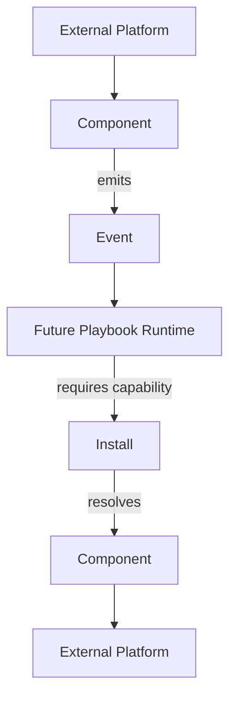

The side-effectful production Playbook Runtime is future work. Phase 43 executes only internal/test capabilities. Production platform capabilities remain on the legacy path.

Phase 44 keeps that boundary and adds one narrow exception: `calendar.event.read` can be executed through a production adapter that calls the existing local `ExecutionCalendarService`. This bridge is read-only and does not add calendar create/update/delete, external calendar providers, browser automation, HTTP calls, or production social mutations.

Phase 45 adds a second narrow read-only bridge for local Website/Git repository state. It does not connect file writes, website publication, GitHub APIs, remote fetch/pull, Git push, or arbitrary Git commands.

## Phase 42 Portable Playbooks

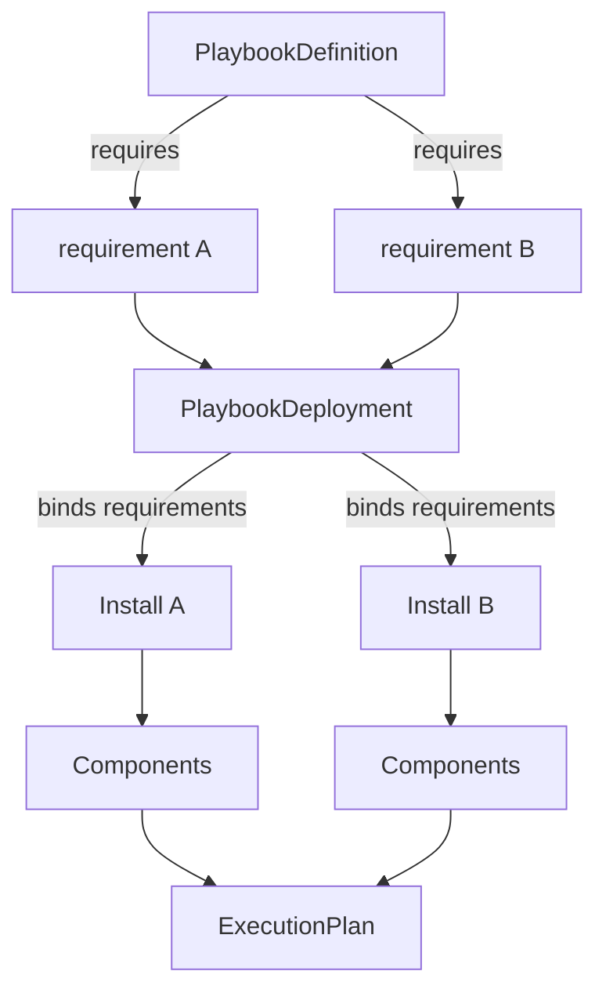

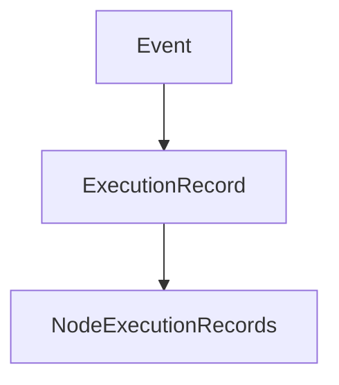

The distinction is explicit:

- `PlaybookDefinition` is portable intent. It can require logical slots and capabilities, but it must not contain install IDs, account IDs, workspace IDs, tokens, credentials, or secret references.
- `PlaybookDeployment` is environment-specific binding. It maps requirement slots to concrete installs and may contain non-secret configuration.
- `ExecutionPlan` is resolved representation. It contains concrete install/component/capability resolution and is produced without executing components.
- `ExecutionLedger` records execution and node state transitions for future observability, retries, approvals, and audit.

## New Contracts

| Contract | File | Purpose |
| --- | --- | --- |
| Event | `src/core/runtime/events.py` | Universal event envelope with source, correlation, causation, external ID, idempotency key, payload, and metadata. |
| Capability | `src/core/runtime/capabilities.py` | Extensible dot-namespaced capability descriptor with `read`, `write`, and `event` modes. |
| Component | `src/core/runtime/components.py` | Technical implementation manifest that can provide multiple capabilities. |
| Install | `src/core/runtime/installs.py` | Configured account/workspace instance with capability-to-component bindings and secret references only. |
| Resolver | `src/core/runtime/resolver.py` | Resolves `install_id + capability` to an install and component manifest. |
| Compatibility adapter | `src/core/runtime/legacy.py` | Describes capabilities from legacy plugin manifests without changing plugin behavior. |
| Phase 41 mappings | `runtime_foundation_mappings.py` | Concrete PoC component manifests and sample installs for existing domains, kept outside the generic core. |
| PlaybookDefinition | `src/core/runtime/playbooks.py` | Portable, versioned DAG definition with logical capability requirements, nodes, and edges. |
| PlaybookDeployment | `src/core/runtime/deployments.py` | Workspace binding from playbook requirement slots to concrete installs, validated through the capability resolver. |
| ExecutionPlan | `src/core/runtime/plans.py` | Deterministic, side-effect-free resolved plan containing install and component selections. |
| ExecutionLedger | `src/core/runtime/ledger.py` | Protocol plus in-memory implementation for execution and node execution state history. |
| ExecutionContext | `src/core/runtime/execution_context.py` | Per-execution context with trigger event, correlation/trace IDs, variables, and completed node outputs. |
| NodeResult | `src/core/runtime/results.py` | Handler result contract with `success`, `failure`, `wait`, and `skip` outcomes. |
| CapabilityHandler | `src/core/runtime/handlers.py` | Technical execution contract keyed by component and capability. |
| PlaybookExecutor | `src/core/runtime/executor.py` | Deterministic DAG orchestrator that updates the ledger and calls registered internal handlers only. |
| ExecutionTrace | `src/core/runtime/tracing.py` | Structured helper for execution, node execution, and transition history. |
| CalendarEventReadHandler | `publication_calendar_runtime_handlers.py` | Read-only production adapter from `calendar.event.read` to the existing `ExecutionCalendarService`. |
| GitRepositoryStatusReadHandler | `publication_git_runtime_handlers.py` | Read-only production adapter from `git.repository.status.read` to the existing Markdown Website `GitPublisher`. |

## Phase 43 Deterministic Executor

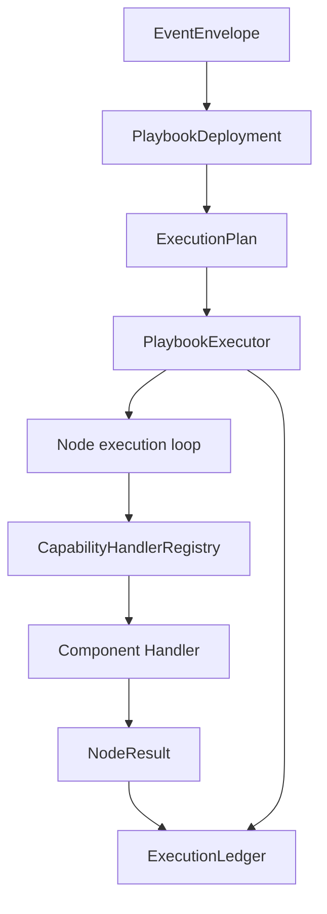

Execution lifecycle:

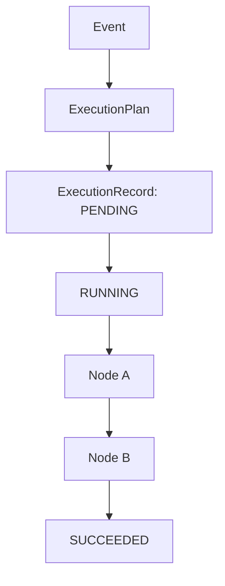

WAIT lifecycle:

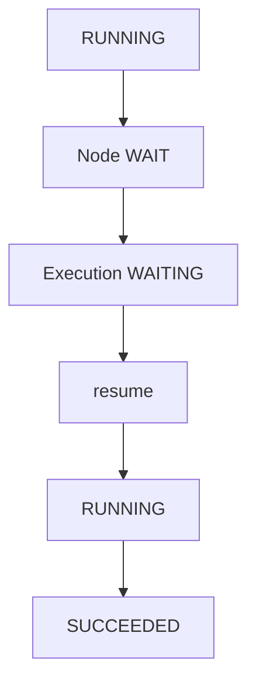

Phase 43 execution boundaries:

- `PlaybookDefinition` remains portable intent and contains no install IDs, account IDs, tokens, or secret references.
- `PlaybookDeployment` binds logical requirements to installs before execution.
- `ExecutionPlan` contains concrete install/component selections but no transport details or secret values.
- `PlaybookExecutor` executes a validated DAG deterministically and sequentially.
- Capability handlers are resolved by `component_id + capability_id`, not by capability alone.
- Input resolution supports literals, trigger event payload paths, and previous node outputs. It does not use Python eval, JavaScript, Jinja, or arbitrary expression execution.
- Conditions support a small deterministic operator set: `equals`, `not_equals`, `exists`, `gt`, `gte`, `lt`, `lte`, and `contains`.
- Transform nodes are deterministic/internal only, such as identity, field mapping, and uppercase string transformation.
- Retry is attempt-count based with no sleep/backoff in Phase 43.
- WAIT/resume is supported for internal handlers. No external callbacks, timers, approvals, or platform listeners are introduced.
- The Phase 43 reference flow uses only `test.*` capabilities and internal handlers.

Production isolation:

- `PluginRuntime`, `LinkedInChannelRuntime`, `YouTubeChannelService`, `GitPublisher`, and `ExecutionCalendarService` are not called by the Phase 43 executor.
- Existing dashboard, worker, scheduler, plugin runtime, and channel production paths remain unchanged.
- No LinkedIn publish/reply, YouTube upload, Git write/push, calendar mutation, browser automation, HTTP/API call, subprocess call, Research/RAG, agent planning, or visual editor behavior is added.

## Phase 44 Calendar Read Bridge

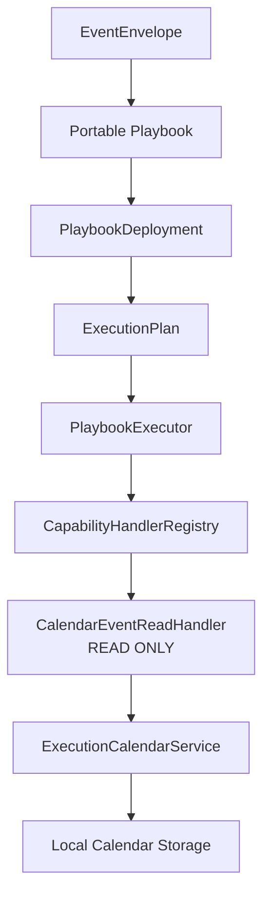

Current calendar responsibilities:

- `ExecutionCalendarService.list_calendar_entries` reads local publication calendar entries from schedule occurrences and publication targets.
- Existing UI/API routes call the same service directly, especially `/api/execution-calendar` and the content calendar page.
- The service supports workspace, start/end range, timezone label, channel plugin, campaign, status, attention-required, and limit filtering.
- `ExecutionCalendarService.summarize_range` is also read-only, but Phase 44 does not expose it as a generic capability.
- Calendar mutations remain in existing scheduling/campaign services such as schedule creation, materialization, pause/resume/cancel, and campaign coordination.

Safe `calendar.event.read` output:

- The production adapter returns normalized event dictionaries with IDs, title, start/end, status, timezone, source, workspace, entry type, safe schedule/campaign/target references, attention flag, blockers, and safe summary.
- It does not return repository objects, ORM/dataclass instances, storage paths, credentials, secret references, browser/session data, or arbitrary metadata dumps.

Business logic that must not move into the generic runtime:

- Recurrence calculation, materialization, schedule lifecycle, campaign coordination, authorization consumption, publication target lifecycle, and UI/API routing stay in the existing scheduling/calendar services.
- The generic executor has no `if calendar.event.read` switch. It only resolves a component/capability handler and records deterministic execution state.

Production adapter pattern:

- `CalendarEventReadHandler` lives outside `src/core/runtime/`.
- Registration is explicit through `register_calendar_runtime_handlers(handler_registry, calendar_service=...)`.
- The handler registers only `calendar.event.read` for component `publication-calendar-local`.
- No hidden import-time global registration is used.
- Later component packaging can describe `publication-calendar-local` as providing `calendar.event.read` with `CalendarEventReadHandler` as its handler entrypoint, without adding marketplace or dynamic installation in Phase 44.

## Phase 45 Git/Website Read Bridge

Inspection findings:

| Read operation | Existing implementation | Uses filesystem? | Uses subprocess? | Uses network? | Mutation risk? | Currently exposed where? |
| --- | --- | --- | --- | --- | --- | --- |
| Repository branch/HEAD state | `GitPublisher.head_state` | Reads Git worktree metadata | `git branch --show-current`, `git rev-parse --verify HEAD`, `git cat-file -e`, and for unborn repos `git rev-parse --is-inside-work-tree` | No | Read-only commands when called directly | Markdown Website publisher preflight/evidence |
| Worktree status | `GitPublisher.git(..., "status", "--porcelain")` and `changed_paths` | Reads worktree/index state | `git status --porcelain` | No | Read-only command when arguments are fixed | Publication preflight/conflict detection |
| Commit verification reads | `GitPublisher.verify_commit` | Reads Git object metadata | `git cat-file`, `git rev-parse`, `git show --name-only` | No | Read-only commands when commit ID is known from publish flow | Publication verification |
| File content read | No general public capability found | N/A | N/A | N/A | Would need path policy and output contract | Not exposed as a generic read capability |

Chosen capability:

- `github.file.read` remains too broad because the existing Markdown Website code does not expose general repository file-content reads.
- Phase 45 therefore bridges `git.repository.status.read`.
- The name is semantically accurate: the handler returns local repository state, branch, HEAD commit, clean/dirty status, and optionally changed paths.
- The capability belongs to the existing `github-markdown-website` component because that component represents the local Markdown Website Git worktree transport.
- The capability mode is `read`.

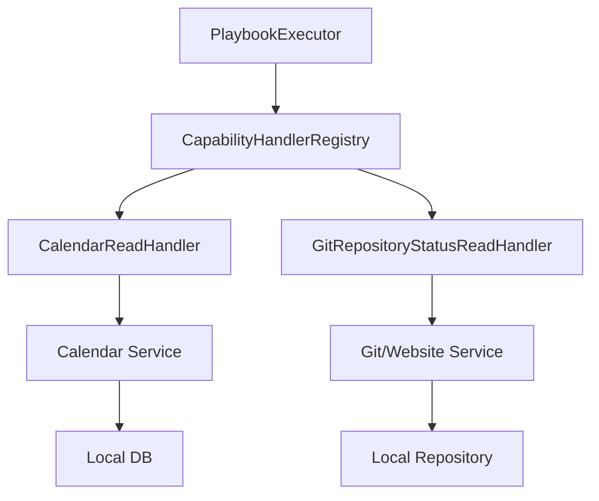

Phase 45 runtime path:

```text
Event
-> Portable Playbook
-> PlaybookDeployment
-> ExecutionPlan
-> PlaybookExecutor
-> CapabilityHandlerRegistry
-> GitRepositoryStatusReadHandler
-> GitPublisher
-> normalized NodeResult
-> ExecutionLedger
```

Read-only Git safety:

- The handler does not accept a command string.
- The input contract only accepts `include_changed_paths`.
- Invalid fields such as `command`, `path`, `../secret.txt`, or `/etc/passwd` are rejected because this capability is not path-based.
- `GitRepositoryStatusReadHandler` uses `WebsiteRepositoryReference` and existing repository validation.
- Runtime tests observe only fixed read-only Git commands: `branch --show-current`, `rev-parse --verify HEAD`, `cat-file -e <commit>^{commit}`, `status --porcelain`, and `rev-parse --is-inside-work-tree` for unborn repositories.
- Mutating and remote commands such as `add`, `commit`, `push`, `reset`, `checkout`, `clean`, `merge`, `rebase`, `fetch`, `pull`, `tag`, and `ls-remote` are blocked by tripwire tests.
- Repository integrity tests prove HEAD, tracked files, and tracked contents are preserved across runtime execution.

Legacy isolation:

- Existing `GitPublisher.publish`, Website publication, reconciliation, GitHub Pages/public URL verification, and UI/API flows remain unchanged.
- The new route is additive:

```text
Generic Runtime
-> GitRepositoryStatusReadHandler
-> GitPublisher
```

while the current production Website path remains:

```text
Current Website flow
-> GitPublisher.publish
```

## Phase 46 External Network Read Bridge

Phase 46 connects exactly one production network read capability to the generic runtime:

```text
youtube.video.metadata.read
```

Inspection findings:

| Candidate capability | Existing implementation | Actually uses network? | Authenticated? | Read-only? | Returns remote data? | Side effects? | Suitable for Phase 46? |
| --- | --- | --- | --- | --- | --- | --- | --- |
| `youtube.transcript.import` | `YouTubeSourcePlugin.import_source` parses caller-supplied transcript and stores local content | No | No | No, local import/write | No remote data | Writes local content records | No |
| `youtube.transcript.read` | `YouTubeSourcePlugin.parse_timestamped_transcript` parses supplied text; health reports transcript retrieval `not_configured` | No | No | Local parse only | No remote data | None for parse | No |
| `youtube.video.read` | `YouTubeSourcePlugin.validate_video_ref` validates URL/video ID and import metadata | No | No | Local validation/import support | No remote data | Import path writes local content | No |
| `youtube.publication.status.read` | `YouTubeChannelService.reconcile` calls `YouTubeTransport.get_video` for uploaded publication evidence | Yes | Yes, access token | Yes | Yes | None in `get_video`; tied to publication evidence status update | Partial |
| `youtube.video.metadata.read` | `YouTubeChannelService.read_video_metadata` calls existing `YouTubeTransport.get_video` | Yes | Yes, access token | Yes | Yes | None | Yes |

`youtube.video.metadata.read` is semantically correct because it reads remote YouTube Data API video metadata through the existing channel service and transport. It is more precise than `youtube.video.read` and avoids claiming transcript retrieval, which the current source plugin explicitly reports as not configured.

Phase 46 runtime path:

```text
Event
-> Portable Playbook
-> PlaybookDeployment
-> ExecutionPlan
-> PlaybookExecutor
-> CapabilityHandlerRegistry
-> YouTubeVideoMetadataReadHandler
-> YouTubeChannelService
-> HttpYouTubeTransport.get_video
-> External Network GET
-> normalized NodeResult
-> ExecutionLedger
```

Egress policy:

- The generic `ComponentManifest` now has a forward-compatible `network_policy` dictionary.
- `youtube-upload-channel` declares `network_policy.required = true`.
- Allowed domains are `www.googleapis.com` for YouTube Data API reads/uploads and `oauth2.googleapis.com` for the existing OAuth token endpoint.
- No wildcard egress is declared.
- The Phase 46 reference execution observes one `GET` request to `https://www.googleapis.com/youtube/v3/videos`.
- The handler accepts only `video_id`. It rejects URLs, arbitrary domains, metadata endpoints, local addresses, file URIs, and caller-controlled HTTP methods.

Authentication boundary:

- Playbooks contain no account IDs, install IDs, tokens, or secrets.
- Deployments bind the logical `youtube_source` requirement to a concrete install.
- Installs contain only config and secret references such as `access_token_ref`; raw tokens are resolved only at the production handler boundary.
- Access tokens are passed to the existing service/transport and never written into `ExecutionContext`, `NodeResult`, `ExecutionLedger`, or trace output.

Retry and timeout ownership:

- `HttpYouTubeTransport` already requires a bounded timeout and passes it to `urllib.request.urlopen`.
- Phase 46 does not add a second transport retry loop.
- Node-level retry remains owned by `PlaybookExecutor` through node config.
- Tests assert the success path performs exactly one network attempt.

External error normalization:

- Timeouts/network failures map to structured runtime failure.
- YouTube 429 maps to `RATE_LIMITED`.
- Authentication failure maps to `YOUTUBE_AUTHENTICATION_REQUIRED`.
- Missing videos map to `YOUTUBE_VIDEO_NOT_FOUND`.
- Malformed provider responses map to `YOUTUBE_RESPONSE_MALFORMED`.
- Provider response bodies, authorization headers, cookies, and raw token data are not exposed as runtime output.

Three production bridge proof:

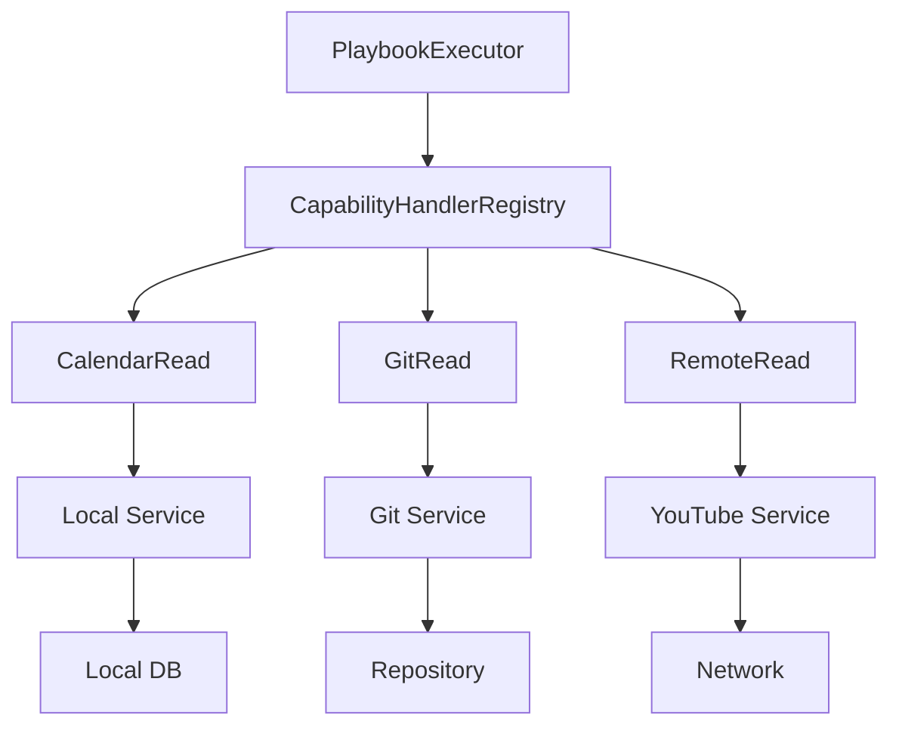

The generic runtime now supports production capabilities backed by local service I/O, local repository/subprocess I/O, and external network I/O without provider-specific branching in the core.

## Phase 47 Runtime Policy, Permissions, and Approval Gates

Phase 47 adds runtime authorization for the generic PlaybookExecutor path. No production mutation capability is enabled.

Inspection findings:

| Security concept | Existing repository shape | Phase 47 use |
| --- | --- | --- |
| Secret references | Channel configs and managed secret services use `*_secret_ref`, `secret_refs`, and redaction helpers. | Runtime policy validates only refs/scopes. Raw values stay at production handler boundaries. |
| Plugin permissions | Plugin manifests already list broad permissions such as `outbound_network`, `secret_storage`, and `media_read`. | Component manifests now expose generic technical `permissions` for runtime execution. |
| Component egress | Phase 46 added `network_policy` to `ComponentManifest`. | `RuntimePolicyEngine` evaluates network required/allowed domains before handler invocation. |
| Install ownership | `Install` already binds capabilities to components and stores secret refs. | `InstallGrants` now explicitly allows/denies capabilities and sensitive privileges. |
| Deployment config | `PlaybookDeployment` already binds portable requirements to installs. | `DeploymentPolicy` can only restrict effective permissions; it cannot grant beyond component/install. |
| WAIT/resume | Phase 43 supports WAITING executions and resume. | Approval gates reuse WAITING semantics before handler execution. |
| Audit/trace | `ExecutionLedger` stores node executions and append-only transitions. | Policy decisions are recorded in node metadata/transition metadata without secrets. |

Effective permission model:

```text
Component Permissions
        ∩
Install Grants
        ∩
Deployment Policy
        ↓
Effective Permission
        ↓
Policy Decision
        ↓
ALLOW / DENY / APPROVAL_REQUIRED
```

Execution policy flow:

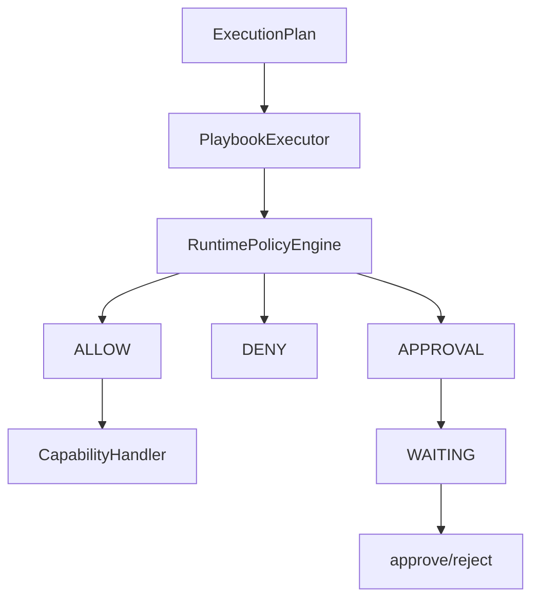

Deterministic evaluation order:

1. Deployment enabled.
2. Install enabled.
3. Component provides the capability.
4. Capability explicitly denied.
5. Capability explicitly granted.
6. Mutation allowed for write capabilities.
7. Network required/allowed.
8. Required egress domains allowed by install and deployment.
9. Filesystem access allowed.
10. Subprocess access allowed.
11. Required secret refs present and granted.
12. Approval requirement.
13. ALLOW.

Sensitive privileges are default-deny in the generic runtime policy layer:

- write/mutation;
- network egress;
- secret usage;
- filesystem access;
- subprocess access.

Approval semantics:

- Policy checks run after deterministic input resolution and before handler lookup/invocation.
- `DENY` returns a structured runtime failure and handler invocation count remains zero.
- `APPROVAL_REQUIRED` creates an `ApprovalRecord`, moves the node and execution to `WAITING`, and stores policy metadata in the ledger.
- `approve_execution_node()` marks the approval approved and resumes the waiting node.
- `reject_execution_node()` marks the approval rejected, fails the waiting node, and fails the execution.
- Approval cannot override hard denies such as `NETWORK_NOT_ALLOWED`, `SECRET_NOT_GRANTED`, or `MUTATION_NOT_ALLOWED`.

Production bridge permissions:

| Bridge | Capability | Component permissions | Install grants used in tests |
| --- | --- | --- | --- |
| Calendar | `calendar.event.read` | no network, no filesystem, no subprocess, no secrets | capability grant only |
| Git | `git.repository.status.read` | filesystem read, read-only Git subprocess, no network | capability + filesystem + subprocess |
| YouTube | `youtube.video.metadata.read` | network to `www.googleapis.com`/`oauth2.googleapis.com`, scoped secret ref, no subprocess/filesystem | capability + network domains + `youtube-access-token-ref` |

The only write capability used in Phase 47 is synthetic and internal:

```text
test.resource.write
```

It mutates only in-memory test state. It is used to prove mutation deny, approval wait, approval resume, rejection, and duplicate approval behavior without enabling a production mutation path.

### Phase 48 approved production mutation

Phase 48 connects exactly one production mutation to the generic runtime:

```text
calendar.event.create
-> publication-calendar-local
-> ScheduleOccurrenceRepository.create
-> local publication calendar JSON storage
```

Mutation inspection:

| Capability candidate | Existing service method | Local/external | Mutation type | Reversible? | Existing identifier? | Transaction/idempotency support | Suitable? |
| --- | --- | --- | --- | --- | --- | --- | --- |
| `calendar.event.create` | `ScheduleOccurrenceRepository.create` through the local publication scheduling stack | Local | Create a publication calendar occurrence record | Yes in tests through isolated temp storage; production data remains local JSON | `occurrence_key` and `id` | JSON store lock plus duplicate `occurrence_key` returns the existing occurrence | YES |
| `calendar.event.update` | Occurrence/schedule save/update paths exist | Local | Update existing scheduling state | More invasive because it changes existing records | Existing record IDs | Existing save methods, but broader state semantics | NO for Phase 48 |
| Git/Website write | `GitPublisher.publish` | Local + remote risk | File write/commit/push | Not small enough; may push externally | Commit/hash/path | Git idempotency is publication-specific | NO |
| LinkedIn/YouTube publish/reply/upload | Channel services | External | Platform mutation | Not reversible locally | Provider IDs | Provider-specific | NO |

The chosen mutation is intentionally scoped to the local publication calendar. The capability output uses a stable `resource_ref`:

```text
calendar-occurrence:<occurrence_id>
```

Phase 48 introduces generic mutation contracts:

- `MutationIntent`: exact normalized write input, input fingerprint, capability, component, install, execution, and idempotency key.
- `MutationReceipt`: durable record of the applied mutation, resource reference, applied timestamp, result fingerprint, and safe metadata.
- `MutationJournal`: durable state interface with `prepared`, `approved`, `applying`, `applied`, and `failed` states.
- `JsonMutationJournal`: minimal file-backed journal adapter matching the repository's existing JSON-storage style.

Write lifecycle:

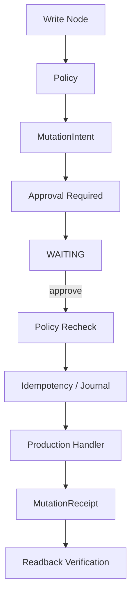

Approval authorizes an exact `MutationIntent`, not a generic capability. The runtime binds approval to the intent's `mutation_id` and deterministic input fingerprint. If input changes after approval, the old approval is invalid and the node returns to `WAITING` for a new approval. Policy is also re-evaluated immediately before handler invocation, so approval does not freeze or escalate permissions.

Phase 48 does not claim universal exactly-once delivery. It establishes durable idempotency semantics for the selected local production mutation by combining:

- explicit runtime mutation idempotency keys;
- a durable mutation journal;
- the existing `ScheduleOccurrenceRepository.create` duplicate-`occurrence_key` behavior;
- read-after-write verification through `ExecutionCalendarService.list_calendar_entries`.

The production handler lives outside the generic runtime in `publication_calendar_runtime_handlers.py` as `CalendarEventCreateHandler`. It adapts normalized capability input to the existing scheduling repository and returns a normalized receipt. The generic core contains no `calendar.event.create` branch.

### Phase 49 compensation and journal hardening

Phase 49 does not add a second production mutation capability. `calendar.event.create` remains the only production write capability connected to the generic runtime.

Inspection findings:

| Question | Result |
| --- | --- |
| Can created occurrence be deleted by stable ID? | No existing `ScheduleOccurrenceRepository.delete/remove` method was found. |
| Is delete already implemented? | No. Existing methods are `create`, `save`, `get`, `find_by_key`, `list_all`, and `list_by_schedule`. |
| Is delete local? | Not applicable; no existing delete inverse exists. |
| Is delete transaction-safe? | Not applicable; no existing delete inverse exists. |
| Does `JsonMutationJournal` survive restart? | Yes, it persists records to JSON. |
| Is `JsonMutationJournal` atomic? | It writes via temp-file replace, but it is not a multi-process transaction/claim mechanism. |
| Is it safe across processes/workers? | No. It remains suitable for local/dev and simple tests, not production multi-worker mutation claiming. |
| Is there existing SQLite transactional storage? | Yes. Several repository areas use SQLite with transactions/claims; Phase 49 adds a runtime-local SQLite journal without adding a new DB stack. |

Compensation proof for `calendar.event.create` is therefore:

```text
COMPENSATION PROOF: BLOCKED
```

The blocker is intentional. Phase 49 does not invent calendar delete functionality and does not expose `calendar.event.delete`. A future phase can make calendar create compensatable only after an existing safe inverse operation exists or the domain owner explicitly adds one outside the generic core.

Rollback and compensation are distinct:

```text
ROLLBACK
= undo an uncommitted transaction

COMPENSATION
= logically undo an already applied mutation
  through a new controlled and auditable side effect
```

Compensation is not mathematically equivalent to rollback. Phase 49 introduces generic compensation contracts but blocks production calendar compensation because the inverse operation is missing:

- `CompensatableMutationHandler`
- `CompensationIntent`
- `CompensationReceipt`
- `CompensationJournalRecord`
- `CompensationState`

The runtime still fingerprints node-level compensation policy as part of `MutationIntent`. Approval for:

```text
compensation.mode = none
```

cannot silently become approval for:

```text
compensation.mode = on_downstream_failure
```

Recovery and hardened journal model:

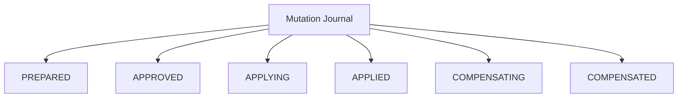

`SqliteMutationJournal` is the production-safe journal adapter for the generic mutation runtime. It uses:

- `UNIQUE idempotency_key`;
- `BEGIN IMMEDIATE` transactions;
- atomic `claim_applying`;
- atomic `claim_compensating`;
- durable mutation and compensation records;
- explicit `recover_mutation(...)` for stale `APPLYING` reconciliation.

A production mutation must be claimed atomically before execution so duplicate workers cannot apply the same intent concurrently.

Recovery is side-effect aware. `recover_mutation(...)` does not blindly retry an `APPLYING` record. It requires a caller-provided readback/verifier:

```text
APPLYING
-> verifier finds resource
-> mark APPLIED

APPLYING
-> verifier does not find resource
-> return to APPROVED for safe retry
```

For the selected local calendar mutation, the verifier can use the stable occurrence key/resource identity and `ExecutionCalendarService.list_calendar_entries`.

Because production compensation is blocked, the Phase 49 reference failure flow is not enabled for calendar create. The generic contracts and journal states are present for future compensatable components, but no internal calendar delete is registered and no public delete capability is added.

### Phase 50 private calendar compensation

Phase 50 resolves the Phase 49 calendar compensation blocker without adding a second public production mutation capability.

Inspection findings before the change:

| Question | Result |
| --- | --- |
| Current create identity | `CalendarEventCreateHandler` creates a `ScheduleOccurrence` with a stable `id` and caller/business `occurrence_key`. |
| Current receipt identity | Phase 48/49 receipts carried `resource_ref=calendar-occurrence:<id>` but did not persist enough provenance for a safe inverse. |
| Available persistence identifiers | `ScheduleOccurrence.id`, `occurrence_key`, `metadata`, and the durable SQLite mutation journal. |
| Safe inverse feasibility | Feasible only as a private repository operation that verifies mutation provenance and unchanged resource state before delete. |
| Race risks | Wrong-resource delete, changed-resource delete, duplicate compensation, and crash-after-delete are the key risks; Phase 50 guards them with provenance, state fingerprint, SQLite compensation claims, and readback. |

The public business capability remains:

```text
calendar.event.create
```

The private technical inverse is:

```text
compensate(calendar.event.create receipt)
```

It is not registered as:

```text
calendar.event.delete
```

`ScheduleOccurrenceRepository.remove_created_occurrence(...)` is a private infrastructure primitive. It atomically verifies:

- the exact occurrence ID from the durable mutation receipt;
- `metadata.created_by == generic-runtime`;
- `metadata.created_by_mutation_id == MutationReceipt.mutation_id`;
- the receipt's created-state fingerprint matches stored provenance;
- the current occurrence fingerprint still matches the originally created state.

If any check fails, compensation is blocked and the occurrence is preserved. The generic runtime still knows only about `CompensatableMutationHandler`, `CompensationIntent`, `CompensationReceipt`, policy recheck, and journal states; it contains no calendar-specific delete branch.

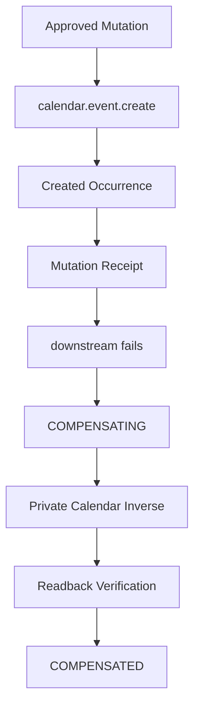

Compensation is implementation-owned recovery behavior and is not exposed as a general Playbook capability. A playbook can request compensation policy on the original write node, but it cannot directly resolve or call the private inverse.

Phase 50 also adds `recover_compensation(...)` as a generic recovery helper. Like `recover_mutation(...)`, it is side-effect aware: a component/domain verifier must prove the compensation already happened before the journal converges a stale `COMPENSATING` record to `COMPENSATED`.

### Phase 51 mutation safety policies

Phase 51 adds an explicit generic `MutationPolicy` contract. A capability still describes what can be done; a mutation policy describes the minimum runtime safety guarantees under which a specific mutation implementation may execute.

Inspection findings before the refactor:

| Safety assumption | Previous location | Phase 51 contract |
| --- | --- | --- |
| Approval required | `RuntimePolicyEngine` inferred from write mode plus install/deployment flags | `MutationPolicy.requires_approval` is owned by the mutation implementation and cannot be weakened. |
| Idempotency required | `PlaybookExecutor` always built mutation IDs/keys for write nodes | `MutationPolicy.idempotency_required` is validated before side effect. |
| Readback required | Calendar handler returned `readback_verified`; recovery depended on caller-provided readback | `ReadbackPolicy.REQUIRED` blocks execution unless the handler provides a verifier. |
| Compensation support | Node `compensation.mode` plus handler `compensate(...)` were checked only at compensation time | `CompensationPolicy` distinguishes `REQUIRED`, `SUPPORTED`, `UNAVAILABLE`, and `FORBIDDEN`. |
| Recovery behavior | `recover_mutation(...)` and `recover_compensation(...)` existed, but support level was implicit | `RecoveryPolicy` distinguishes `AUTOMATIC`, `MANUAL`, and `UNRECOVERABLE`. |

The effective policy is resolved from:

```text
implementation minimum policy
        +
playbook/deployment stricter request
        =
effective mutation policy
```

Playbooks and deployments may require stronger guarantees, but may never weaken an implementation's minimum safety policy. A downgrade such as `requires_approval=true` to `requires_approval=false` is rejected before handler invocation.

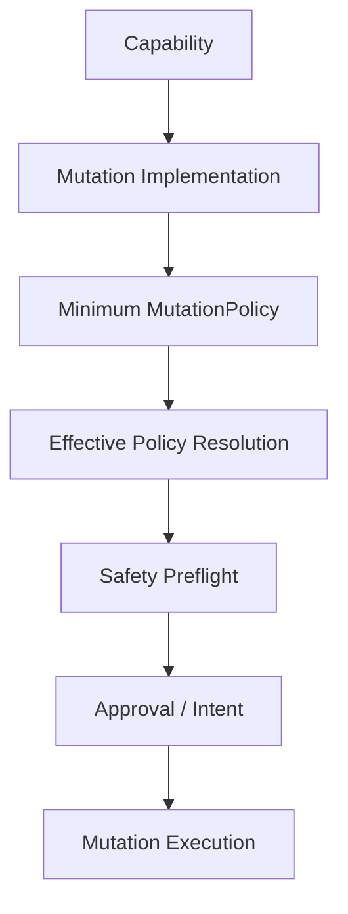

For `calendar.event.create`, the declared production policy is:

```text
requires_approval: true
idempotency_required: true
readback: REQUIRED
compensation: SUPPORTED
recovery: AUTOMATIC
```

The effective policy and policy fingerprint are included in `MutationIntent.normalized_input`, so approval is bound to the safety policy as well as to the mutation input. If the handler policy changes after approval, the old approval no longer matches the new intent fingerprint and no side effect is performed.

### Phase 52 Website/Git mutation admission

Phase 52 is an admission phase for the existing Markdown Website/Git publish path. It does not admit a second production mutation because the current implementation has not yet proven all Phase 51 safety contracts for generic runtime execution.

The selected candidate is `website.article.publish`, not `github.file.write`, because the existing production implementation renders and publishes a domain article snapshot with revision bindings, frontmatter, path templates, commit evidence, and optional push. It is not a general caller-directed file write API.

Inspection findings:

| Step | Existing implementation | Side effect | Idempotent? | Readback possible? | Crash ambiguity | Admission result |
| --- | --- | --- | --- | --- | --- | --- |
| Render Markdown | `MarkdownRenderer.render` | None | Yes | Render checksum | None | OK |
| Validate repository/path | `validate_repository_reference`, `ensure_under`, allowlisted roots/branches/remotes | None | Yes | Deterministic validation | None | OK |
| Write target file | `write_atomic(target_path, rendered.markdown_bytes)` | Local filesystem write | Not by itself; requires runtime journal/intent | File checksum | File can exist without commit if process dies | BLOCKED until recovery adapter proves convergence |
| Stage exact files | `git add -- <relative_paths>` plus staged-set verification | Git index mutation | Requires exact staged-set recovery | `git diff --cached --name-only` | Index can remain staged | BLOCKED for recovery |
| Commit | `git commit -m ... -- <relative_paths>` | Local Git history mutation | Requires lookup by approved intent/snapshot | `verify_commit` verifies current HEAD and committed paths | Commit can exist before journal receipt | BLOCKED for idempotent recovery |
| Push | `git push <remote> HEAD:<branch>` after fast-forward check | Remote Git mutation | Requires remote ref readback | Current code records local HEAD after push; reconciliation checks local file checksum | Push can succeed before journal receipt | BLOCKED for recovery/readback |

Existing safety positives:

- The publisher stages exact relative paths and rejects staged-set mismatches; it does not use `git add .`.
- Git subprocess calls use `shell=False`.
- Repository roots, content roots, media roots, branches, and remote names are allowlisted.
- Path traversal, absolute paths, `.git`, common secret directories, and symlink escapes are rejected.
- Existing tests prove unrelated dirty files are not committed.

Admission blockers:

| Code | Reason |
| --- | --- |
| `BLOCKED_COMPONENT_PERMISSION_MISMATCH` | `github-markdown-website` is currently declared with filesystem `read`, but article publishing requires filesystem writes. |
| `BLOCKED_UNCONTROLLED_GIT_OPERATION` | The component permission policy is `read-only-git`; publish requires a distinct write/publish Git subprocess policy covering add/commit/push/fetch. |
| `BLOCKED_REMOTE_EGRESS_POLICY` | The current component network policy says network is not required, while the existing publish path can push/fetch a configured remote. Remote host enforcement is not represented in the generic runtime policy. |
| `BLOCKED_IDEMPOTENCY` | `GitPublisher.publish` does not accept or persist a runtime mutation idempotency key, and duplicate/crash replay convergence is not yet implemented for article publish receipts. |
| `BLOCKED_READBACK` | Local commit verification exists, but generic mutation readback for file/index/commit/remote state is not available as a handler verifier. |
| `BLOCKED_RECOVERY` | Crash states around file write, index staging, commit creation, and especially push are not yet reconciled through the mutation journal. |

The conservative candidate policy, if a future phase adds the missing runtime adapter, is:

```text
requires_approval: true
idempotency_required: true
readback: REQUIRED
compensation: UNAVAILABLE
recovery: MANUAL
```

Compensation is classified as `UNAVAILABLE` for admission. Phase 52 does not add a private Git revert, article delete, history rewrite, or public rollback capability. If a downstream node fails after a future website publish mutation, the publication must remain applied and audit must report an applied non-compensated mutation unless a later phase designs a safe private inverse.

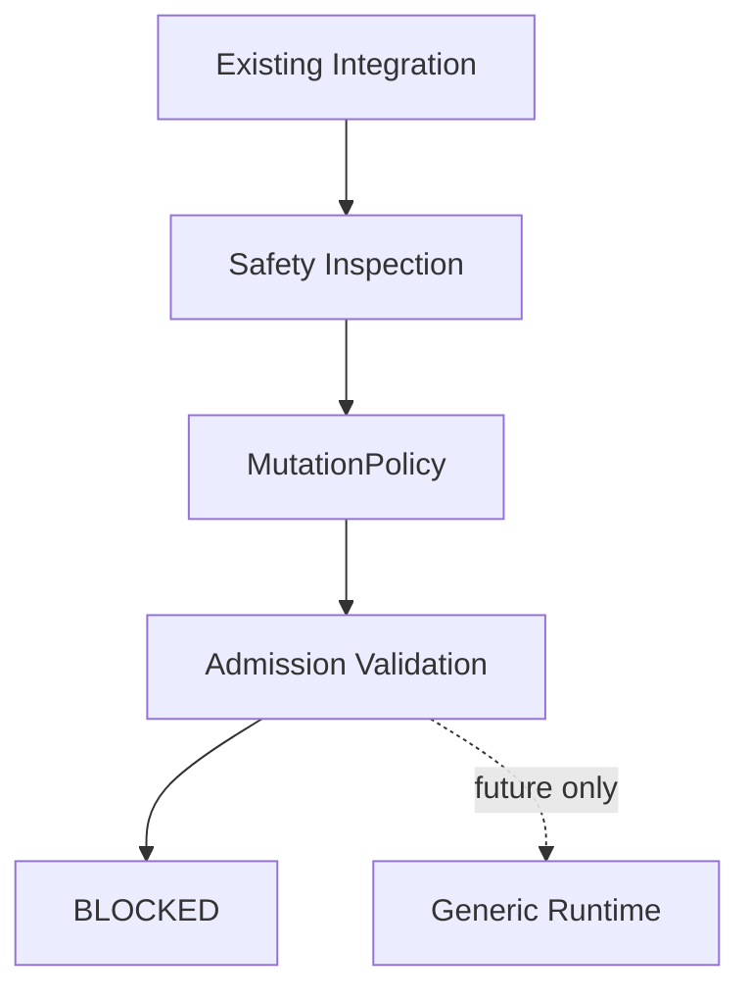

Existing functionality is not automatically eligible for the generic mutation runtime. A production mutation must prove the safety guarantees declared by its policy before it is admitted.

### Phase 53 component permissions and egress

Phase 53 turns host/external permissions into machine-readable runtime contracts. Capabilities define what a component can provide. Permissions define which host and external resources the implementation is allowed to use to provide those capabilities.

Inspection findings:

| Existing permission primitive | Can reuse? | Gap | Migration strategy |
| --- | --- | --- | --- |
| `ComponentManifest.permissions` dict | Yes | It previously mixed coarse booleans/metadata and was not capability-scoped. | Keep the dict for compatibility, add structured parsing through `ComponentPermissions`, and prefer capability `policy.permissions` for specific operations. |
| `InstallGrants.allow_filesystem` / `allow_subprocess` | Yes | Coarse gate only; no scope or named operation. | Preserve as backward-compatible broad gates while adding `InstallPermissionGrants`. |
| `InstallGrants.allowed_network_domains` | Yes | Domain allowlist existed, but not as structured egress destinations with ports/schemes. | Treat legacy domains as `https:443` egress grants for compatibility; new grants use `NetworkPermissions.egress`. |
| Capability secret policy | Yes | Secret scopes were already capability-level. | Leave secret refs separate from permissions and keep grants secret-value-free. |
| Markdown Website path guards | Yes | Domain-specific helpers already block traversal/symlink escapes. | Add generic `resolve_authorized_path(...)`; keep Git-specific path behavior in Markdown Website code. |
| `GitPublisher.git(...)` | Partially | Existing commands are fixed and `shell=False`, but not represented as named operation grants. | Model logical operation IDs such as `git.status`, `git.rev_parse`, `git.add.path`, `git.commit`, and `git.push`. |
| YouTube network policy | Yes | Existing policy used domains only. | Preserve old checks and expose effective egress metadata in policy decisions. |

The new permission model is:

```text
Component/capability requests
        ∩
Install grants
        =
Effective Permission Set
```

Permissions are default-deny. Undeclared permissions are not usable, ungranted requested permissions are denied, and install grants that exceed the component request do not expand the effective set.

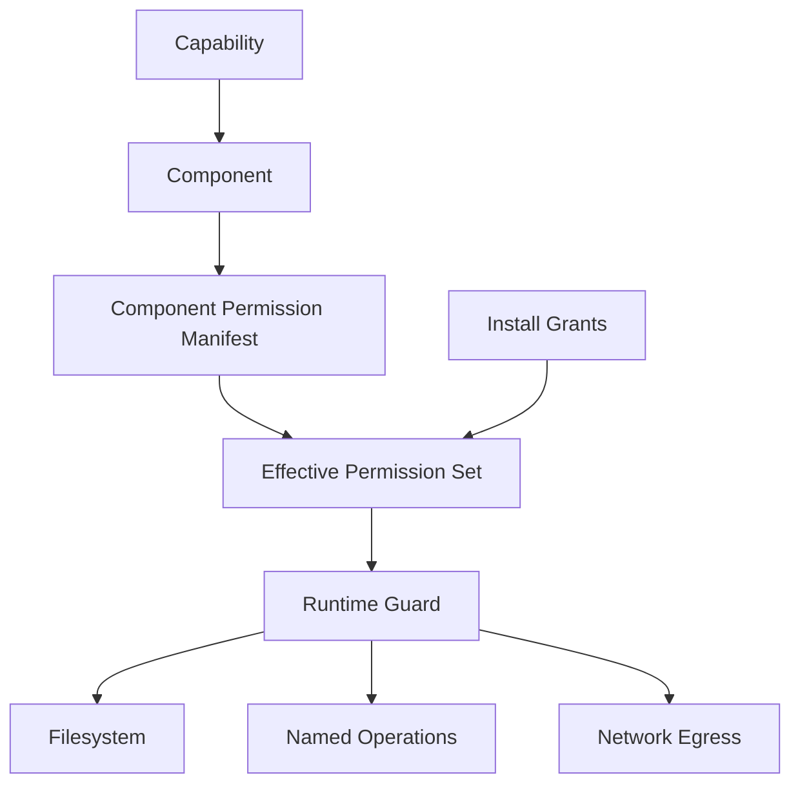

Implemented generic contracts:

- `ComponentPermissions`
- `FilesystemPermissions`
- `OperationPermissions`
- `NetworkPermissions`
- `EgressDestination`
- `InstallPermissionGrants`
- `EffectivePermissionSet`
- `PermissionContext`
- `resolve_effective_permissions(...)`
- `validate_component_permissions(...)`
- `resolve_authorized_path(...)`

Filesystem permissions use logical scopes such as `repository` instead of arbitrary host paths. Install configuration can map a logical scope to a concrete root, and the generic path resolver blocks absolute paths, `..` traversal, and symlink escapes.

Operations are namespaced implementation permissions, not capabilities. For example, a future `website.article.publish` handler may need `git.add.path`, `git.commit`, and `git.push`, but a playbook still asks for `website.article.publish`; it never asks for raw Git operations.

Network egress uses exact destinations with host, port, and scheme. Hostname suffix tricks such as `github.com.evil.example` do not match `github.com`. Local Git transport is treated as filesystem/local repository I/O, not external network egress. Git subprocess network egress still requires preflight validation of configured remote destinations before subprocess invocation; Phase 53 does not claim OS-level sandboxing or redirect-level inspection for subprocesses.

Production Git read now declares and enforces:

```text
capability: git.repository.status.read
filesystem.read: repository
operations:
  - git.status
  - git.rev_parse
  - git.cat_file
```

With a `RuntimePolicyEngine`, missing `git.rev_parse`/`git.cat_file` or missing `filesystem.read.repository` denies before `GitPublisher` starts any subprocess.

Phase 53 re-evaluates `website.article.publish` admission. The original Phase 52 permission/operation/egress blockers are now structurally representable:

```text
BLOCKED_COMPONENT_PERMISSION_MISMATCH: resolved structurally
BLOCKED_UNCONTROLLED_GIT_OPERATION: resolved structurally
BLOCKED_REMOTE_EGRESS_POLICY: resolved structurally
```

The mutation is still not admitted:

```text
BLOCKED_IDEMPOTENCY
BLOCKED_READBACK
BLOCKED_RECOVERY
```

No `website.article.publish` production handler is registered, and production mutation count remains `1`.

### Phase 54 Website/Git publish idempotency, readback, and recovery

Phase 54 hardens the same `website.article.publish` candidate. It does not add a second Website/Git capability and does not register a production publish handler with `PlaybookExecutor`.

The exact publish lifecycle is now documented as:

| Stage | Side effect | Durable evidence | Safe retry? | Readback possible? |
| --- | --- | --- | --- | --- |
| S0 approved intent | none | logical publication identity and approved-state fingerprint | yes | yes |
| S1 target rendered | none | rendered checksum and target relative path | yes | yes |
| S2 target file written | filesystem write | target file checksum | not blindly; file-only state is classified | yes |
| S3 target path staged | Git index mutation | staged set equals exact approved target paths | not blindly; unrelated staged files block | yes |
| S4 commit created | local Git history mutation | commit SHA, parent SHA, revision trailers, optional mutation trailers | yes, by existing commit evidence | yes |
| S5 push attempted | Git remote mutation | configured remote ref evidence | no blind retry on unknown state | yes for local bare remote |
| S6 remote contains expected commit | remote ref updated | read-only remote ref verification | no new logical publication | yes |
| S7 receipt durable | mutation journal/receipt metadata | target, content fingerprint, commit, remote state | no duplicate logical publication | yes |

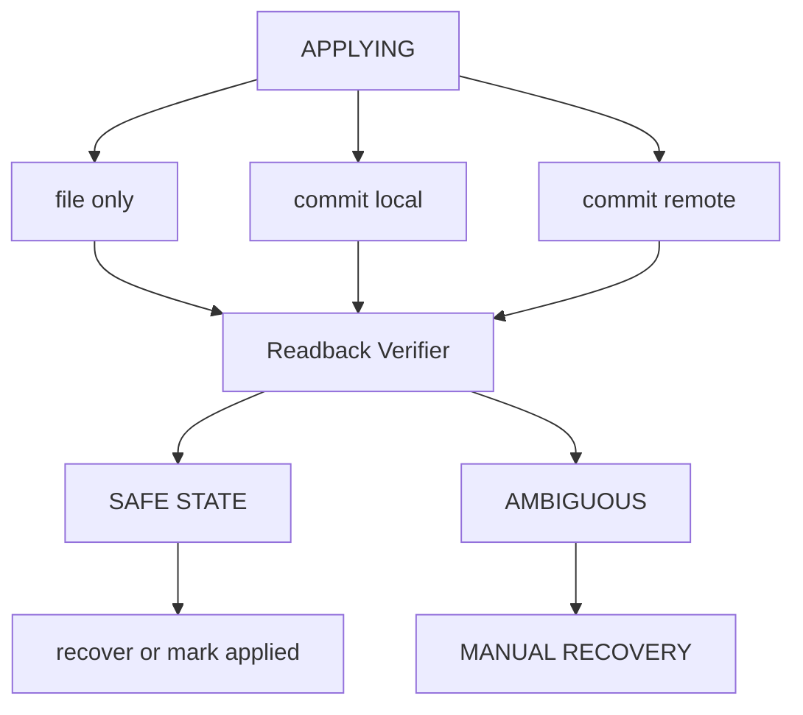

Idempotency identifies the logical mutation. Readback determines which side effects actually occurred. Recovery chooses the only safe next action from durable evidence.

New Website/Git safety helpers are intentionally outside the generic runtime core:

- `publication_git_publish_safety.build_website_publish_identity(...)` derives a deterministic logical publication identity from install, capability, content item, content revision, publication target, target path, branch, repository reference, and push target.
- `publication_git_publish_safety.approved_publish_fingerprint(...)` binds rendered content checksum, target path, branch/remote settings, effective mutation policy, and effective permissions.
- `publication_git_publish_safety.verify_website_publish(...)` classifies file, commit, and local-bare-remote readback as `NO_SIDE_EFFECT`, `TARGET_PRESENT_UNCOMMITTED`, `EXPECTED_COMMIT_PRESENT`, `EXPECTED_COMMIT_AT_HEAD`, `EXPECTED_COMMIT_REMOTE`, `STATE_CONFLICT`, `UNKNOWN`, or `MANUAL_RECOVERY_REQUIRED`.
- `publication_git_publish_safety.inspect_website_publish_recovery(...)` exposes a structured read-only recovery inspection result for future operator/UI use.

`GitPublisher.publish(...)` remains the existing production implementation. It now accepts optional `mutation_id` and `intent_fingerprint` values, writing them as safe Git commit trailers and evidence metadata when supplied. Existing callers that omit these parameters keep the previous behavior.

Repository isolation is still strict:

- target paths are deterministic relative repository paths;
- publication uses `git add -- <exact-approved-target-path>`;
- unrelated unstaged files, including `content/drafts/...`, are not committed;
- unrelated staged files cause `markdown_website.git.staged_set_mismatch`;
- no `git add .`, force push, reset, clean, rebase, merge automation, revert, or delete is introduced.

Admission now reports the Phase 52/53 safety blockers as structurally resolved:

```text
BLOCKED_COMPONENT_PERMISSION_MISMATCH: resolved structurally
BLOCKED_UNCONTROLLED_GIT_OPERATION: resolved structurally
BLOCKED_REMOTE_EGRESS_POLICY: resolved structurally
BLOCKED_IDEMPOTENCY: resolved by deterministic logical publication identity
BLOCKED_READBACK: resolved by file/commit/local-bare-remote verifier
BLOCKED_RECOVERY: resolved as safe MANUAL recovery with no blind retry on UNKNOWN
```

The candidate remains blocked only because no `website.article.publish` production mutation handler is registered in Phase 54:

```text
BLOCKED_HANDLER_NOT_REGISTERED
production mutation count: 1
```

### Phase 57 external event source foundation

Phase 57 establishes a generic external event source ingestion foundation without expanding production mutation capabilities.

Contracts & Core Components:
- `ExternalEventSource` protocol defining standard poll-based remote source behavior (`poll(install_id, checkpoint, limit)`).
- `SourceCheckpointStore` backing checkpoint persistence, worker leasing, and health metric tracking in SQLite.
- `poll_and_ingest_external_events` transaction workflow: acquires a worker lease, polls the source, persists normalized `EventEnvelope` instances into `SqliteEventStore`, and advances source checkpoints safely.

Admission Status:
```text
PHASE 57: BLOCKED_NO_EXISTING_DISCOVERY
```
Rationale: YouTube plugin inspection confirmed that no native remote channel feed discovery mechanism currently exists in the codebase (only single `video_id` lookups). To maintain production integrity and avoid fake scraping or API hacks, admission is held at `BLOCKED_NO_EXISTING_DISCOVERY` until a genuine discovery mechanism is identified.

Production Mutation Guard:
- Total active production mutations remain strictly `2` (`calendar.event.create` and `website.article.publish`).

## Current Inventory

| Area | Current abstraction | Future abstraction | Compatibility strategy | Migration candidate | Risk |
| --- | --- | --- | --- | --- | --- |
| Plugin base classes/protocols | `PluginLifecycle` protocol and `PluginContext`; async channel runtime base exists in `plugin_sdk`. | Component lifecycle remains technical; business workflows move to future playbooks. | Leave protocols intact. Use `LegacyCapabilityAdapter` to describe capabilities from existing manifests. | Add component manifests beside plugin manifests as plugins opt in. | Medium |
| Plugin loader/registry | `plugin_runtime.bootstrap_plugins` registers built-in manifests; `PluginRegistry` maps capability strings to plugin IDs. | Runtime registry maps component IDs and install IDs; resolution is install-scoped. | Do not alter `bootstrap_plugins`; new `RuntimeRegistry` is separate. | Optional bridge from `ApplicationPluginRuntime` to `RuntimeRegistry`. | Low |
| Config models | `pipeline.AppConfig` and `config.json` contain app/provider settings; channel state lives in `studio_data`. | Install config carries account/workspace config and secret references only. | Keep existing config as source of truth. | Generate installs from channel connections and config later. | Medium |
| Account/channel config | `ChannelConnection` in `channel_models.py`, stored through `channel_store.py`. | `Install` becomes account/workspace runtime identity with component bindings. | No migration now. Installs are in-memory/sample only. | Convert channel connections to install records later. | Medium |
| Secret handling | Managed secret metadata under `src/core/managed_secrets`; config schemas use `secret_ref`. | `Install.secret_refs` and `ComponentManifest.required_secrets` contain references only. | New models reject secret-shaped config keys unless they end in `_ref`. | Persist install secret refs using managed secret references. | Low |
| Scheduler | Legacy `scheduler.py` uses `outbox`; newer `publication_scheduling.py` uses `studio_data`. | Calendar capabilities describe local publication-calendar reads and schedule mutations. | No storage migration. Existing scheduler services keep running. | Add component-backed calendar adapter later. | Low |
| Worker/job models | `worker.py` processes legacy schedule records and channel publish/metric jobs. | Future executions consume events/playbooks and resolve capabilities. | No worker changes. Existing job models remain authoritative. | Execution attempts can later carry event/correlation IDs. | Medium |
| Workflow/playbook models | Business flows are embedded in pipeline, planning, scheduling, execution, and `plugins/playbooks/creator_commerce`. | Playbooks own business logic and request capabilities. | Document only; no migration. | Extract business decisions after capabilities are stable. | High |
| Event/task models | Domain-specific audit/scheduling events exist; no universal event envelope exists. | `EventEnvelope` provides universal event identity, source, tracing, idempotency, payload, and metadata. | New envelope does not replace domain events yet. | Wrap domain events at boundaries later. | Low |
| Database/schema/migrations | Mostly file-backed JSON under `studio_data` and `outbox`; some local DB files exist in other domains. | Components/installs can later persist in config/storage. | No migration now because contracts are sufficient and least invasive. | Add forward-compatible JSON stores later. | Low |
| LinkedIn plugin | `channel.linkedin` mixes browser transport, session actions, publish, metrics, and scraping. | `linkedin-browser-channel` component; `linkedin.post.create/read`, `linkedin.analytics.read`. | Map only existing behavior. No comment reply or DM capability declared. | Split browser transport from channel business flow later. | Medium |
| YouTube plugin | `source.youtube` imports video/transcripts; `channel.youtube` handles OAuth and video/short publish/status. | Separate source/import and upload components under same provider. | Two components prove capability does not equal component. | Convert OAuth/upload transport to component implementation later. | Medium |
| Website/GitHub | Markdown Website channel and `GitPublisher` publish Markdown into controlled Git worktrees. | `github-markdown-website` component. | Map constrained Git worktree behavior only; no broad GitHub API capability. | Persist repository install bindings later. | Medium |
| Calendar/agenda | No external calendar provider. Local execution calendar exists via scheduling services. | `publication-calendar-local` component. | Map local publication-calendar only. | Bind schedules/occurrences to future event envelope. | Low |
| Analytics | `analytics.service`, metric definitions, LinkedIn metrics, website analytics/Plausible read models. | Analytics read capabilities can be component capabilities. | Only existing read/collect behavior is mapped. | Add event emission around metric ingestion later. | Medium |

## Mixed Responsibility Hotspots

| Location | Current mix | Phase 41 note |
| --- | --- | --- |
| `channels/linkedin/runtime.py` | Browser transport selection, account/session state, publish action, metrics scraping, and post scraping. | Mapped as `linkedin-browser-channel`; future split should move transport into component and workflow choices into playbooks. |
| `channels/youtube/channel.py` | OAuth connection, validation, resumable upload, publish confirmation, reconciliation/status. | Mapped as `youtube-upload-channel`; source import remains separate. |
| `plugin_runtime.py` | Plugin discovery, dependency validation, service construction, provider resolution, and shared service registration. | Left unchanged; future runtime can derive component registry from it. |
| `publication_scheduling.py` | Schedule business policy, occurrence materialization, persistence, and calendar read models. | Mapped as local calendar capabilities only; playbook extraction is later. |
| `channels/markdown_website/git_publisher.py` | Technical Git mutation plus publication evidence construction and verification. | Mapped as Git/website component, but no generic GitHub API is claimed. |

## Capability Inventory

| Provider | Capability | Existing implementation | Component mapping | Status |
| --- | --- | --- | --- | --- |
| LinkedIn | `linkedin.connection.start` | `LinkedInChannelRuntime.connect` | `linkedin-browser-channel` | MAPPED |
| LinkedIn | `linkedin.connection.read` | `LinkedInChannelRuntime.connection_status` / `check_session` | `linkedin-browser-channel` | MAPPED |
| LinkedIn | `linkedin.post.create` | `LinkedInChannelRuntime.publish` and legacy `stage_linkedin_post` flow | `linkedin-browser-channel` | MAPPED |
| LinkedIn | `linkedin.post.read` | `LinkedInChannelRuntime.scrape_posts` | `linkedin-browser-channel` | MAPPED |
| LinkedIn | `linkedin.analytics.read` | `LinkedInChannelRuntime.collect_metrics` | `linkedin-browser-channel` | MAPPED |
| LinkedIn | `linkedin.comment.reply` | No implementation found | None | NOT IMPLEMENTED |
| LinkedIn | `linkedin.dm.received` | No implementation found | None | NOT IMPLEMENTED |
| YouTube | `youtube.video.read` | `YouTubeSourcePlugin.validate_video_ref` / import metadata | `youtube-source-import` | PARTIAL |
| YouTube | `youtube.video.metadata.read` | `YouTubeChannelService.read_video_metadata` through `YouTubeTransport.get_video` | `youtube-upload-channel` | MAPPED |
| YouTube | `youtube.transcript.read` | `YouTubeSourcePlugin.parse_timestamped_transcript` for supplied transcript | `youtube-source-import` | PARTIAL |
| YouTube | `youtube.transcript.import` | `YouTubeSourcePlugin.import_source` | `youtube-source-import` | MAPPED |
| YouTube | `youtube.video.publish` | `YouTubeChannelService.publish` | `youtube-upload-channel` | MAPPED |
| YouTube | `youtube.short.publish` | `YouTubeChannelService.publish` with short validation | `youtube-upload-channel` | MAPPED |
| YouTube | `youtube.publication.status.read` | `YouTubeChannelService.reconcile` | `youtube-upload-channel` | MAPPED |
| Website/GitHub | `github.file.read` | No general file-content read capability found; Phase 41 mapping was broader than the current implementation proves | `github-markdown-website` | PARTIAL |
| Website/GitHub | `git.repository.status.read` | `GitPublisher.head_state` and fixed `git status --porcelain` read | `github-markdown-website` | MAPPED |
| Website/GitHub | `github.file.write` | `GitPublisher.publish` writes/stages/commits/pushes allowed paths | `github-markdown-website` | MAPPED |
| Website/GitHub | `website.article.publish` | Markdown Website render/publish flow | `github-markdown-website` | MAPPED |
| Website/GitHub | `website.publication.verify` | Markdown Website verification/evidence flow | `github-markdown-website` | MAPPED |
| Website/GitHub | `website.analytics.read` | Website analytics read models/provider framework | `github-markdown-website` | PARTIAL |
| Calendar | `calendar.event.read` | `ExecutionCalendarService.list_calendar_entries` | `publication-calendar-local` | MAPPED |
| Calendar | `calendar.event.create` | `ScheduleOccurrenceRepository.create` via `CalendarEventCreateHandler` | `publication-calendar-local` | MAPPED |
| Calendar | `calendar.event.update` | Schedule/campaign/occurrence state updates | `publication-calendar-local` | PARTIAL |
| Calendar | External calendar sync | No Google/Microsoft/CalDAV implementation found | None | NOT IMPLEMENTED |

## Persistence Decision

Phase 41 uses an in-memory runtime registry with deterministic serialization for contracts. This is the least invasive option because existing durable state already lives in `config.json`, `studio_data`, `outbox`, and channel-specific stores.

Future persistence can add forward-compatible JSON stores under `studio_data/runtime_components.json` and `studio_data/runtime_installs.json`. Rollback should be deleting those additive files only, leaving existing channel and scheduler data untouched.

Phase 42 follows the same least-invasive persistence decision. `ExecutionLedger` is a protocol and `InMemoryExecutionLedger` is the first implementation. No SQLite migration or new durable store is added yet because the current repository has several file-backed stores and no single generic runtime database boundary. A future durable ledger can be added as an adapter without changing `ExecutionRecord` or `NodeExecutionRecord`.

Phase 43 keeps the same persistence boundary. The executor writes only to the provided `ExecutionLedger` implementation. Tests use `InMemoryExecutionLedger`; no database migration or file-backed execution store is added.

Phase 44 does not add persistence. Calendar reads use existing local calendar storage through `ExecutionCalendarService`; execution state still uses the provided ledger implementation.

Phase 45 does not add persistence. Repository reads use the existing local Git worktree and the provided execution ledger only.

Phase 46 does not add persistence. YouTube metadata reads use the existing YouTube channel service and transport; execution state still uses the provided ledger implementation.

Phase 47 does not add durable policy persistence. `InstallGrants`, `DeploymentPolicy`, policy decisions, and approval records are in-memory/runtime-contract objects for now. Durable policy and approval storage can be added later as an adapter without changing the policy decision contract.

Phase 48 adds a minimal durable mutation journal adapter. Tests use `JsonMutationJournal` against temporary storage; production callers can provide a concrete journal path. Rollback is additive: remove the journal file and unregister the mutation handler. Existing scheduling JSON data and legacy routes are not migrated or rewritten.

Phase 50 keeps the Phase 49 SQLite journal as the production-safe mutation and compensation journal. No storage engine is added. Calendar compensation uses the existing schedule occurrence JSON store through a private repository method guarded by mutation provenance and an unchanged-state fingerprint.

## Compatibility Strategy

- Existing `PluginManifest`, `PluginRegistry`, `PluginRuntime`, `ProviderResolver`, channel runtimes, scheduler, and workers are unchanged.
- New contracts are exposed from `src.core.runtime`.
- `LegacyCapabilityAdapter` can describe selected existing plugin capabilities as generic component capabilities.
- PoC manifests live in `runtime_foundation_mappings.py` as `phase41_component_manifests()` and sample installs in `phase41_sample_installs()`.
- Existing plugin capability strings remain valid and are not replaced in this phase.
- Playbook validation and plan compilation do not call channel runtimes, browser providers, HTTP clients, Git, or plugin services.
- Phase 43 execution does not call legacy channel runtimes, browser providers, HTTP clients, Git, subprocesses, or plugin services. Only explicitly registered internal handlers can execute.
- Phase 44 introduces an explicit production handler registration for the local calendar read adapter only. Existing calendar UI/API/scheduler callers still use `ExecutionCalendarService` directly and are not converted to playbook execution.
- Phase 45 introduces an explicit production handler registration for local Git repository status read only. Existing Website/Git production callers are not converted to playbook execution.
- Phase 46 introduces an explicit production handler registration for external YouTube video metadata reads only. Existing YouTube import, OAuth, upload, status reconciliation, UI, and worker flows are not converted to playbook execution.
- Phase 47 policy enforcement applies only to the generic `PlaybookExecutor` when configured with a `RuntimePolicyEngine`. Legacy production routes remain unchanged and are not blocked by missing `InstallGrants`.
- Phase 48 adds an explicit production mutation registration for local publication-calendar occurrence creation only. Existing calendar UI/API/scheduler callers still use the scheduling services directly and are not converted to playbook execution.
- Phase 50 adds no new public production capability. The calendar private inverse is owned by `CalendarEventCreateHandler.compensate(...)` and is reachable only from the compensation path for an already approved/applied `calendar.event.create` receipt.

## Phase 42 Validation Decisions

- Playbook graphs must be DAGs for now. Bounded loops can be introduced later as explicit schema features.
- Node kinds are limited to known schema kinds or namespaced third-party kinds; unknown plain strings fail with a controlled validation error.
- Capability nodes reference a logical requirement slot and a capability declared by that requirement.
- Deployment validation resolves each required capability through `CapabilityResolver` before any execution can exist.
- Compile-time capability reports use structured entries with requirement, capability, install, component, status, and error code fields.
- The generic execution state machine supports `pending`, `running`, `waiting`, `succeeded`, `failed`, `cancelled`, and `skipped`.
- Ledger transitions are append/audit oriented: records are updated to current state, while transition history is retained separately.

## Security Notes

- `Install` stores `secret_refs` only.
- `ComponentManifest.required_secrets` stores references/requirements only.
- `EventEnvelope` rejects secret-shaped payload or metadata keys.
- No runtime secret values were added to repository files.
- `PlaybookDefinition` rejects environment-specific and secret-shaped fields such as `install_id`, `account_id`, `workspace_id`, `token`, and `secret`.
- `PlaybookDeployment`, `ExecutionRecord`, and `NodeExecutionRecord` reject secret-shaped config/metadata values unless they are explicit references.
- `ExecutionPlan` contains concrete install/component IDs but no component config, secret refs, or secret values.
- `ExecutionContext`, `NodeResult`, and `ExecutionTrace` reject or omit obvious secret-shaped values.
- Arbitrary code evaluation is not used for input mapping, conditions, or transforms.
- External mutations are not possible in the Phase 43 reference flow because only internal/test handlers are registered and side-effect paths are covered by tests.
- Phase 44 `calendar.event.read` rejects secret-shaped handler input, normalizes output, and remains read-only when only read handlers are registered.
- Phase 45 `git.repository.status.read` rejects secret-shaped and arbitrary command/path input, exposes no write handler, uses no caller-controlled shell command, and is covered by Git mutation, remote-network, and repository-integrity tripwire tests.
- Phase 46 `youtube.video.metadata.read` rejects secret-shaped input, accepts only a provider video ID, exposes no caller-controlled URL/endpoint/method, and is covered by upload/OAuth mutation, subprocess, SSRF-style input, credential-leakage, timeout, and structured provider-error tests.
- Phase 47 enforces capability grants, network, secret scope, filesystem, subprocess, mutation, and approval policy before handler invocation. Policy metadata uses neutral keys such as `access_scope` so secret-shaped trace fields are rejected by existing runtime guards.
- Phase 48 requires approval for the first production mutation even when install/deployment policy allows writes. `MutationIntent`, `MutationReceipt`, journal records, approval records, ledger metadata, and trace output contain no raw credentials or secret-shaped fields. Duplicate approval, retry, resume, duplicate trigger delivery, and failure-after-apply paths are covered by idempotency tests for the selected local calendar mutation.
- Phase 50 proves private compensation for the selected local calendar create mutation. Arbitrary deletion is not exposed; wrong-resource and changed-resource compensation are blocked; compensation receipts, journal records, and traces contain no raw credentials.
- Phase 59 introduces `youtube.video.read` capability, `ResourceRef`, `ExternalResourceSnapshot`, and `ContentRepository` upsert with entity identity, content revisioning, external refs, and source provenance. The capability is strictly read-only, enforces secret canary isolation, and asserts explicit `METADATA_ONLY` completeness without transcript or AI claims. Production mutations remain strictly capped at 2 (`calendar.event.create`, `website.article.publish`).
- Phase 60 adds provider-neutral transcript artifacts. Official remote retrieval is limited to YouTube Data API `captions.list` plus `captions.download`; supplied transcripts use the same raw/normalized artifact pipeline. No unofficial transcript API, scraping, browser automation, ASR, LLM, summary, article generation, analytics linkage, or caption mutation is introduced.

## Phase 60 Transcript Artifact Ingestion

Phase 60 separates the conceptual work from concrete representations:

```text
YouTube Video ContentEntity
       |
       +---- Metadata Revisions
       |
       +---- Raw Transcript Artifact
       |          |
       |          v
       |     Normalization
       |          |
       +---- Normalized Transcript Artifact
                  |
                  v
        TRANSCRIPT_AVAILABLE
```

Metadata, transcript and audiovisual content are different completeness levels.

A transcript provides a strong textual representation of spoken/captioned content, but does not necessarily represent all visual information in a video.

Transcript source provenance must distinguish official provider captions, provider-generated ASR and user-supplied transcripts.

### Existing Primitive Inspection

| Existing primitive | Reusable? | Gap | Migration strategy |
| --- | --- | --- | --- |
| `YouTubeSourcePlugin.import_source` supplied transcript path | Partially | Creates legacy `ContentItem` text and timeline metadata, not Phase 59 `ContentEntity` artifacts | Keep legacy behavior; route supplied transcript ingestion through `TranscriptArtifactIngestor.ingest_supplied_transcript(...)` for Phase 60 entity/revision artifacts. |
| `YouTubeSourcePlugin.parse_timestamped_transcript` | No for Phase 60 canonical normalization | Uses floats and line-oriented supplied text, not exact raw VTT bytes or deterministic parser version | New `src.core.content.transcripts.parse_vtt` preserves integer millisecond timings and parser metadata. |
| Phase 41 `youtube.transcript.read` mapping | Partially | Was mapped to local import/source plugin and explicitly not configured for remote retrieval | Add `youtube-official-captions` component providing read-only `youtube.transcript.read`; activation remains `NOT_CONFIGURED` unless OAuth scope contract is configured. |
| Legacy transcript models (`TimelineSegment`) | Partially | Float seconds are acceptable for older clip tools but create nondeterminism for artifact identity | New `TranscriptSegment(start_ms,end_ms,text)` stores normalized artifact content; older models can derive later. |
| `ContentItem` / `ContentRevision` from Phase 59 | Yes | Needed artifact binding and completeness convergence | `Artifact` stores `content_entity_id` and `revision_id`; completeness changes only after normalized artifact exists. |
| Existing local JSON/SQLite storage style | Yes | No generic transcript artifact store existed | Add `LocalArtifactStorage`, `InMemoryArtifactRepository`, and `SqliteArtifactRepository`. Storage refs are portable relative refs. |
| Hashing helpers | Yes in pattern | No content-addressed transcript identity | Raw bytes hash and canonical normalized JSON hash drive idempotency/versioning. |
| Provenance guards | Yes | Transcript provenance needed track/language/parser fields | Artifact provenance is checked with existing secret-value canary guard and excludes headers/tokens. |
| YouTube transport | Yes | Had videos/channel/playlist reads, not captions | Add official `list_captions` and `download_caption` read methods only. |
| OAuth/secret handling | Partially | Existing sample install has secret refs but production caption scope is not proven | Admission requires configured scope contract; absent scope returns `OFFICIAL_TRANSCRIPT_SOURCE_NOT_CONFIGURED` / runtime `TRANSCRIPT_AUTH_REQUIRED`. |

### Artifact Contract

The generic `Artifact` model records `artifact_id`, `content_entity_id`, `revision_id`, `artifact_type`, `media_type`, `source`, `language`, `content_hash`, `storage_ref`, `created_at`, `provenance`, and `metadata`.

Phase 60 defines two transcript artifact types:

- `transcript.raw`: exact provider/import representation such as downloaded VTT bytes.
- `transcript.normalized`: deterministic JSON containing `language`, `segments`, `plain_text`, `parser_id`, `parser_version`, and `source_artifact_id`.

Raw and normalized artifacts are never overwritten. Same video, same track, same content deduplicates; updated content or replacement track creates new artifacts while preserving history. Multiple languages remain separate variants.

### Official YouTube Caption Flow

`youtube.transcript.read` is implemented by `youtube-official-captions` as a read-only capability. It performs at most one `captions.list(videoId=...)` call and one `captions.download(id=..., tfmt=vtt)` call per requested operation. It does not expose `captions.insert`, `captions.update`, or `captions.delete`.

Track selection is deterministic:

1. require a caption track id;
2. require `status == serving` when status is present;
3. require `isDraft == false`;
4. require preferred language exact match when configured;
5. prefer primary audio track where known;
6. prefer standard/manual captions over `ASR` unless `allow_asr` is explicit;
7. use language and track id only as deterministic tie-break fields after semantic ranking;
8. return `TRANSCRIPT_TRACK_AMBIGUOUS` when multiple tracks share the same semantic winning rank.

Provider `trackKind = ASR` is preserved. Normalized artifact metadata records `generation_method = provider_asr`; standard provider captions record `provider_caption`; supplied transcripts record `user_supplied`.

### Error And Auth Model

Structured transcript errors include `TRANSCRIPT_NOT_AVAILABLE`, `TRANSCRIPT_AUTH_REQUIRED`, `TRANSCRIPT_AUTH_FORBIDDEN`, `TRANSCRIPT_TRACK_AMBIGUOUS`, `TRANSCRIPT_DOWNLOAD_FAILED`, `TRANSCRIPT_PARSE_FAILED`, `TRANSCRIPT_EMPTY`, `ARTIFACT_TOO_LARGE`, and `CONTENT_ENTITY_NOT_FOUND` for callers that require pre-existing entity binding.

OAuth is secret-ref only. Playbooks, deployments, events, artifacts, provenance, logs, and traces must not contain tokens, headers, or raw OAuth metadata. If the OAuth scope contract cannot prove YouTube caption read access, official caption retrieval is conservatively not configured. There is no hidden fallback to unofficial transcript APIs, HTML scraping, player endpoint reverse engineering, browser scraping, audio download, Whisper, or local ASR.

### Idempotency And Recovery

Persistence order is retrieve, validate, persist raw, normalize, persist normalized, link provenance, then mark `TRANSCRIPT_AVAILABLE`.

If a process crashes after raw persistence, restart can reuse the raw artifact and normalize it. If it crashes after normalized persistence but before completeness update, reconciliation uses the normalized artifact to restore `TRANSCRIPT_AVAILABLE`. Completeness is never set to `FULL_CONTENT`/`complete` by transcript ingestion.

Production boundaries remain unchanged:

```text
production external source count: 1
production mutation count: 2
production mutations: calendar.event.create, website.article.publish
caption mutation endpoints used: 0
```

## Phase 61 Publication & Metrics Provenance Graph

Phase 61 connects actual content to external manifestations and historical performance observations without adding AI analysis, recommendations, classifications, causality, LinkedIn integration, YouTube mutations, analytics mutations, or another event source.

```text
ContentEntity
     |
     +-- Revisions
     |      |
     |      +-- Transcript Artifact
     |
     +-- Publications
             |
             +-- MetricsSnapshots
                    |
                    +-- normalized
                    +-- raw
```

Content describes what the work is. A publication describes where a manifestation of that work exists. Metrics describe observations about that publication at specific points in time.

Metrics are attached to publications rather than directly to content entities because the same conceptual content can have different performance on different channels.

Raw provider metrics are retained so normalization can evolve without requiring provider data to be fetched again.

### Existing Primitive Inspection

| Existing concept | Current responsibility | Reusable? | Needs extension? | Potential migration risk |
| --- | --- | --- | --- | --- |
| `ContentItem` / `ContentRevision` in `src.core.content.repository` | Phase 59 entity identity and metadata revision lineage | Yes | Add publication relation outside the entity model | Reusing legacy `ContentItem` naming as entity can confuse newer docs; Phase 61 calls it ContentEntity semantically. |
| `Artifact` / transcript repositories | Phase 60 raw/normalized transcript storage | Yes | Query service needs artifact refs only, not raw transcript bodies | Raw artifacts must not be dumped into every performance query. |
| `PublishedPost` in `channel_models.py` | Legacy channel publication result from worker/browser flows | Conceptually | Not bound to Phase 59 external ContentEntity graph | Legacy IDs are channel/job oriented and not stable generic publication identity for YouTube resource ingestion. |
| `PublicationAttribution` in `src.core.analytics.models` | Legacy attribution from published posts to content variants/plans | Partially | New `Publication` is first-class in content graph | Existing analytics services validate against `channel_store.get_published_post`, so they cannot represent YouTube resource publications discovered by Phase 59. |
| `MetricObservation` | Per-metric normalized observation tied to legacy publication IDs | Partially | Phase 61 requires append-only snapshot grouping with raw provider payload retained | Migrating existing observations into snapshot groups later must avoid changing historical meaning. |
| `PostMetricSnapshot` | LinkedIn/browser-era metric snapshot with raw JSON and deltas | Conceptually | Provider-specific and channel-store bound | Not suitable as generic core because it carries channel-specific fields and screenshot paths. |
| Website analytics services | Website instrumentation/read models | No for Phase 61 core | Can later feed generic `MetricsSnapshot` via provider normalizer | Existing website metrics are not connected to Phase 59 YouTube ContentEntity graph. |
| YouTube transport/read code | Official video metadata, uploads, captions read | Partially | No safe YouTube Analytics/Data metrics reader exists | Do not infer `youtube.metrics.read` from mappings; production status is `BLOCKED_NO_SAFE_EXISTING_READER`. |
| Runtime capability mappings | Declares legacy analytics/read capabilities for LinkedIn/Website | Partially | No new production mutation or external source | Adding metrics read admission without real implementation would be false production capability. |

### Publication Model

`Publication` is provider-neutral and distinct from `ContentEntity`. Stable identity is:

```text
provider + install_id + external resource identity
```

For a YouTube video discovered through Phase 59, the existing canonical external ref such as `youtube:video:<id>` reconciles to one publication. Metadata title/description changes create content revisions but do not create another publication.

Publication provenance retains provider, install, external ref, source content entity, source revision, source event/execution when present, observed time, and published time. It contains no secrets or OAuth data.

### MetricsSnapshot Model

`MetricsSnapshot` is append-only and belongs to a `Publication`, not directly to a content entity. It stores:

- `observed_at`: when this system observed the metric state.
- provider reporting window/time separately when available.
- `normalized_metrics`: metric key, value, unit, value type, provider source field, normalizer metadata.
- `raw_metrics_payload` or `raw_metrics_ref`: safe provider payload used for normalization.
- provider/local schema version.
- normalizer id/version.
- reconstructable provenance.

Exact retry of the same logical observation deduplicates by publication, observed time/provider observation identity, and collection execution. Same values at a later observation time are retained as a distinct snapshot because no-growth history is meaningful later.

### Provider Normalizer Boundary

Provider-specific normalization remains outside the generic core. Phase 61 adds a deterministic local YouTube statistics normalizer for tests and future adapter work:

```text
Provider Raw Metrics
        |
        v
Provider Normalizer
        |
        v
MetricsSnapshot.normalized_metrics
```

Generic content publication/metrics code contains no provider-specific branch. The YouTube metrics normalizer is not a production remote reader.

### YouTube Metrics Admission

Actual current YouTube code has official API support for video metadata, uploads, upload discovery, and captions. There is no narrow, safe, resource-scoped YouTube metrics reader currently implemented for production. Therefore:

```text
YOUTUBE_METRICS = BLOCKED_NO_SAFE_EXISTING_READER
```

No YouTube Studio scraping, browser automation, arbitrary analytics query, fake remote analytics, or YouTube mutation is introduced in Phase 61.

### Read-Only Performance Query

`ContentPerformanceQueryService` returns a deterministic AI-readiness structure:

```text
content identity
current metadata revision
transcript availability and artifact ref
publication identities
metric history
provenance refs
```

It returns normalized metrics by default. Raw provider payload is available only through an explicit snapshot method for debugging/re-normalization.

Production boundaries remain unchanged:

```text
production external source count: 1
production mutation count: 2
new mutation capabilities: 0
new external event sources: 0
AI calls: 0
```

## Phase 73 Execution Preparation Contract

Phase 73 adds a read-only execution preparation boundary. It combines an existing `ExecutionEligibilityDecision`, `ApprovalRequest`, `PromotionDecision`, and `PlaybookPlan` into a deterministic `ExecutionPreparationRecord`.

```text
ExecutionEligibilityDecision
ApprovalRequest
PromotionDecision
PlaybookPlan
        |
        v
ExecutionPreparationBuilder
        |
        v
ExecutionPreparationRecord
        |
        v
Future Executor
```

The preparation builder only inspects supplied objects. It does not start execution, invoke sandbox/replay/evaluation/promotion, mutate approval state, open raw payloads, call AI, scrape, automate browsers, write external systems, add event sources, or admit a YouTube metrics production reader.

### Builder API

```text
ExecutionPreparationBuilder.prepare(
    eligibility_decision,
    approval_request,
    promotion_decision,
    plan,
    policy=None,
)
ExecutionPreparationBuilder.fingerprint_plan(plan)
ExecutionPreparationBuilder.summarize(record)
```

No preparation store is added in Phase 73. Durable preparation storage remains a future concern.

### Preparation Record

`ExecutionPreparationRecord` records:

```text
preparation_id
status
eligibility_decision_id
approval_id
promotion_decision_id
plan_id
playbook_id
playbook_version
requested_action_kind
subject_scope
plan_fingerprint
required_capabilities
forbidden_side_effects
readiness_reasons
blocked_reasons
provenance
redaction
created_at
schema_version
```

Statuses are `ready`, `blocked`, and `needs_review`.

Default `ExecutionPreparationPolicy` requires eligibility, approved approval, eligible promotion, executable plan, a stable plan fingerprint, safe action kind, no raw access requirement, no mutation requirement, and safe redaction. `needs_review` is only produced when policy explicitly allows needs-review inputs.

Ready means the future executor may be prepared from this record later. It does not mean execution has started. Approved approval alone is insufficient. Eligible promotion alone is insufficient. The preparation binds all relevant ids and scope facts together before any future execution layer can consume it.

### Plan Fingerprint

The plan fingerprint is deterministic over stable plan fields:

```text
plan id
playbook id/version
context ref/schema
step ids/kinds/status
required capabilities
blocked reasons
raw access requirement
mutation requirement
```

It ignores generated timestamps, local paths, and nondeterministic ordering. The same stable plan yields the same fingerprint; changed capabilities, steps, blockers, or raw/mutation requirements change the fingerprint.

### Required Capabilities

Preparation copies required capabilities from the plan but does not activate or admit them. If the plan is blocked or records unavailable capabilities, preparation is blocked with structured reason codes such as `plan_blocked`, `plan_not_executable`, or `capability_not_available` where present in the plan metadata.

### Forbidden Side Effects

Every preparation explicitly records future executor constraints:

```text
production_mutation
external_write
ai_call
browser_automation
scraping
raw_metrics_default
raw_transcript_default
approval_state_mutation
```

These are constraints for a later executor, not actions performed in Phase 73.

### Redaction And Boundaries

Preparation records contain no raw metrics payloads, raw transcript bodies, provider headers, Authorization/Bearer values, OAuth material, API keys, refresh tokens, secret canaries, full provider payloads, or full step output.

```text
raw_metrics_included: false
raw_transcript_included: false
secrets_included: false
provider_headers_included: false
approval_state_mutated: false
execution_started: false
production_mutation_used: false
```

Production boundaries remain:

```text
production external source count: 1
production mutation count: 2
new mutation capabilities: 0
new external event sources: 0
production execution: 0
approval UI: 0
external approval provider: 0
YouTube metrics production reader: BLOCKED_NO_SAFE_EXISTING_READER
AI calls: 0
LLM evaluation: 0
```

## Phase 75 Execution Claim Contract

Phase 75 introduces a local execution claim contract. It reserves ready preparation records for future workers without starting execution.

```text
ExecutionPreparationStore.ready
        |
        v
ExecutionClaim
        |
        +-- claimed
        +-- rejected
        +-- released
        +-- expired
        |
        v
Future Executor Worker
```

The claim layer is lease/reservation only. It does not execute playbooks, start production execution, mutate approval state, open raw payloads, call AI, scrape, automate browsers, write external systems, add event sources, or admit YouTube metrics.

### Claim API

```text
ExecutionClaimStore.claim(preparation_id, claimant_id, policy=None, now=None)
ExecutionClaimStore.get(claim_id)
ExecutionClaimStore.get_active_for_preparation(preparation_id, now=None)
ExecutionClaimStore.release(claim_id, claimant_id=None, reason=None, now=None)
ExecutionClaimStore.expire(claim_id, now=None)
ExecutionClaimStore.list(status=None, preparation_id=None, claimant_id=None)
ExecutionClaimStore.audit_events(preparation_id=None, claim_id=None)
```

There is no execution API and no claim API that starts work.

### Claim Policy

Default `ExecutionClaimPolicy`:

```text
lease_seconds: 900
allow_reclaim_expired: true
require_ready_status: true
allowed_claimant_kinds: []
```

A claim is allowed only when the preparation exists, the preparation is `ready`, redaction is safe, claimant id is valid and non-empty, the lease is finite, and no active claim exists. An active claim blocks duplicate workers. Released and expired claims are terminal for that claim and may be reclaimed by a new claim when policy allows it.

Cancelled, stale, blocked, and needs-review preparations are not claimable by default.

### Claim Lifecycle

Claim statuses are:

```text
claimed
rejected
released
expired
```

`released`, `expired`, and `rejected` are terminal. Repeated release/expire attempts append `invalid_transition_attempted` and do not change claim status.

Expiration is explicit. There is no background scheduler and no autonomous lease cleanup.

Phase 75 deliberately does not introduce:

```text
executing
executed
succeeded
failed_production
completed_production
```

Those belong to a later execution lifecycle.

### Audit Trail

Audit event types:

```text
claim_created
claim_rejected
duplicate_claim_rejected
claim_released
claim_expired
invalid_transition_attempted
```

Audit events carry event id, claim id, preparation id, claimant id, event type, reason, timestamp, provenance, redaction flags, and sequence. Claimant ids and reasons are redacted if they contain credential or raw-payload markers.

### Redaction And Boundaries

Claim records and audit events contain no raw metrics payloads, raw transcript bodies, provider headers, Authorization/Bearer values, OAuth material, API keys, refresh tokens, secret canaries, full provider payloads, or full step output.

```text
raw_metrics_included: false
raw_transcript_included: false
secrets_included: false
provider_headers_included: false
approval_state_mutated: false
execution_started: false
production_mutation_used: false
```

Production boundaries remain:

```text
production external source count: 1
production mutation count: 2
new mutation capabilities: 0
new external event sources: 0
production execution: 0
approval UI: 0
external approval provider: 0
YouTube metrics production reader: BLOCKED_NO_SAFE_EXISTING_READER
AI calls: 0
LLM evaluation: 0
```

## Phase 76 Non-Production Execution Attempt Ledger

Phase 76 introduces a local `ExecutionAttemptLedger`. The ledger records non-production attempts against an active `ExecutionClaim` and its `ExecutionPreparationRecord`. It is a bookkeeping and audit boundary for future executors, not execution itself.

```text
ExecutionClaim
ExecutionPreparationRecord
        |
        v
ExecutionAttemptRecord
        |
        +-- opened
        +-- blocked
        +-- completed_noop
        +-- failed_safe
        +-- cancelled
        |
        v
Future Production Executor
```

The only supported modes are:

```text
non_production
no_op
simulation
```

The attempt ledger does not start a production executor, execute playbook side effects, mutate approval state, open raw payloads, call AI, scrape, automate browsers, write external systems, add event sources, or admit YouTube metrics.

### Attempt API

```text
ExecutionAttemptLedger.open_attempt(claim, preparation, mode="no_op", actor=None, now=None)
ExecutionAttemptLedger.get(attempt_id)
ExecutionAttemptLedger.list(status=None, preparation_id=None, claim_id=None)
ExecutionAttemptLedger.complete_noop(attempt_id, result=None)
ExecutionAttemptLedger.fail_safe(attempt_id, reason)
ExecutionAttemptLedger.cancel(attempt_id, reason=None)
ExecutionAttemptLedger.audit_events(attempt_id=None)
```

Opening is allowed only when the claim is `claimed`, the claim lease has not expired, the preparation is `ready`, claim/preparation ids match, idempotency keys match, the requested action kind is safe, redaction is safe, and the mode is one of the non-production modes.

Duplicate active attempts for the same claim, preparation, and mode are prevented. A duplicate returns a blocked result with `active_attempt_exists` and an existing active attempt reference. Terminal attempts are retained as history, so later non-production attempts can be opened after a prior attempt reaches `completed_noop`, `failed_safe`, or `cancelled`.

### Attempt Transitions

Valid transitions:

```text
opened -> completed_noop
opened -> failed_safe
opened -> cancelled
blocked terminal
```

Terminal states are:

```text
completed_noop
failed_safe
cancelled
blocked
```

Invalid terminal transitions append `invalid_transition_attempted` and do not mutate the attempt status.

`complete_noop` persists only a safe result summary:

```text
completed: true
side_effects: false
production_mutation_used: false
external_write_used: false
ai_call_used: false
raw_access_used: false
```

### Audit And Redaction

Audit event types:

```text
attempt_opened
attempt_blocked
attempt_completed_noop
attempt_failed_safe
attempt_cancelled
duplicate_attempt_detected
invalid_transition_attempted
```

Attempt records and audit events contain no raw metrics payloads, raw transcript bodies, provider headers, Authorization/Bearer values, OAuth material, API keys, refresh tokens, secret canaries, full provider payloads, or full step output.

```text
raw_metrics_included: false
raw_transcript_included: false
secrets_included: false
provider_headers_included: false
approval_state_mutated: false
production_mutation_used: false
external_write_used: false
ai_call_used: false
```

Production boundaries remain:

```text
production external source count: 1
production mutation count: 2
new mutation capabilities: 0
new external event sources: 0
production execution: 0
playbook side effects: 0
external approval provider: 0
approval UI: 0
YouTube metrics production reader: BLOCKED_NO_SAFE_EXISTING_READER
AI calls: 0
LLM evaluation: 0
```

## Phase 77 Execution Readiness Report

Phase 77 introduces a read-only `ExecutionReadinessReporter`. The reporter consumes supplied governance objects and produces an `ExecutionReadinessReport` for inspection before a future executor interface. It reports readiness and consistency only; it does not execute, mutate approval/claim/attempt state, replay, evaluate, promote, open raw payloads, call AI, scrape, automate browsers, write external systems, add event sources, or admit YouTube metrics.

```text
ApprovalRequest
PromotionDecision
ExecutionEligibilityDecision
ExecutionPreparationRecord
ExecutionClaim
ExecutionAttemptRecord
        |
        v
ExecutionReadinessReport
        |
        v
Future Executor Interface
```

### Reporter API

```text
ExecutionReadinessReporter.build(
    approval_request=None,
    promotion_decision=None,
    eligibility_decision=None,
    preparation_record=None,
    claim=None,
    attempt=None,
    policy=None,
)

ExecutionReadinessReporter.summarize(report)
```

There is no report store in Phase 77. The report is generated from caller-supplied objects and remains read-only.

### Report Contract

`ExecutionReadinessReport` includes:

```text
report_id
status
subject_scope
approval_summary
promotion_summary
eligibility_summary
preparation_summary
claim_summary
attempt_summary
consistency_checks
blockers
warnings
safe_next_actions
provenance
redaction
generated_at
schema_version
```

Statuses:

```text
ready
blocked
needs_review
informational
```

Default policy requires:

```text
approval approved
promotion eligible
eligibility eligible
preparation ready
safe redaction
matching scope and identity
no production/AI/browser/network markers
```

Active claim is optional by default and summarized. Active attempt is allowed only as a warning by default; callers may route warnings to `needs_review` with policy. Historical no-op/simulation attempts can be informational when readiness requirements are disabled.

### Consistency Checks

Checks cover:

```text
approval id
promotion decision id
eligibility decision id
plan id
playbook id/version
requested action kind
preparation id
claim id
idempotency key
attempt mode/status
redaction across all supplied objects
production/AI/browser/network markers
```

Mismatches become blockers. Optional missing claim/attempt metadata is represented as warning/info according to policy rather than causing side effects.

### Safe Next Actions

The only report next actions are local inspection/control labels:

```text
inspect_readiness
request_manual_review
replay_sandbox
open_non_production_attempt
release_claim
expire_claim
cancel_preparation
```

The report never emits:

```text
execute_production
publish
mutate
send
call_ai
```

### Redaction And Boundaries

Reports contain no raw metrics payloads, raw transcript bodies, provider headers, Authorization/Bearer values, OAuth material, API keys, refresh tokens, secret canaries, full provider payloads, or full step output.

```text
raw_metrics_included: false
raw_transcript_included: false
secrets_included: false
provider_headers_included: false
approval_state_mutated: false
execution_started: false
production_mutation_used: false
external_write_used: false
ai_call_used: false
```

Production boundaries remain:

```text
production external source count: 1
production mutation count: 2
new mutation capabilities: 0
new external event sources: 0
production execution: 0
playbook side effects: 0
external approval provider: 0
approval UI: 0
YouTube metrics production reader: BLOCKED_NO_SAFE_EXISTING_READER
AI calls: 0
LLM evaluation: 0
```

## Phase 78 Controlled Executor Interface Contract

Phase 78 introduces the controlled executor interface contract. It defines how a future executor may receive a ready governance chain without implementing production execution.

```text
ExecutionReadinessReport
ExecutionPreparationRecord
ExecutionClaim
        |
        v
ControlledExecutorInput
        |
        v
ControlledExecutorResult
        |
        v
Future Production Executor Implementation
```

The interface validates inputs, checks readiness/preparation/claim metadata, enforces forbidden side effects, structurally checks capability names, and returns `validated`, `simulated`, `blocked`, `not_implemented`, or `failed_safe` results. It does not execute production work, mutate approvals, mutate claims, mutate attempts, open raw payloads, call AI, scrape, automate browsers, publish, send, call providers, or write external systems.

### Input Builder

```text
ControlledExecutorInputBuilder.build(readiness_report, preparation_record, claim, policy=None, mode=None)
```

`ControlledExecutorInput` contains:

```text
input_id
readiness_report_id
preparation_id
claim_id
playbook_id
playbook_version
requested_action_kind
mode
allowed_side_effects
forbidden_side_effects
required_capabilities
subject_scope
provenance
redaction
created_at
schema_version
```

Allowed modes:

```text
validate_only
no_op
simulation
```

There is no production mode. `production` and unknown modes block as `unsupported_mode`.

### Executor Interface

```text
ControlledExecutor.validate_input(input)
ControlledExecutor.run(input)
ControlledExecutor.execute(input)
```

`execute` is an alias for the controlled no-side-effect contract. It does not call a production executor.

Mode behavior:

```text
validate_only -> validated or blocked
no_op -> simulated safe no-op summary or blocked
simulation -> deterministic local simulation summary or blocked
```

### Side-Effect Contract

Inputs and results keep:

```text
allowed_side_effects: []
side_effects_used: []
```

Forbidden side effects include:

```text
production_mutation
external_write
publish
send
ai_call
browser_automation
scraping
raw_metrics_default
raw_transcript_default
approval_state_mutation
claim_mutation
```

If any side effect is requested or recorded, the result blocks or fails safe.

### Capability Checks

Capabilities are checked structurally only. Read-only capabilities may appear in `capabilities_checked`; no external call is made. Production mutation capabilities block with:

```text
production_capability_not_supported
```

No capability admission or fake activation is performed.

### Redaction And Boundaries

Controlled executor inputs/results contain no raw metrics payloads, raw transcript bodies, provider headers, Authorization/Bearer values, OAuth material, API keys, refresh tokens, secret canaries, full provider payloads, or full step output.

```text
raw_metrics_included: false
raw_transcript_included: false
secrets_included: false
provider_headers_included: false
execution_started: false
simulation_only: true
production_mutation_used: false
external_write_used: false
ai_call_used: false
```

Production boundaries remain:

```text
production external source count: 1
production mutation count: 2
new mutation capabilities: 0
new external event sources: 0
production execution: 0
real playbook side effects: 0
external approval provider: 0
approval UI: 0
YouTube metrics production reader: BLOCKED_NO_SAFE_EXISTING_READER
AI calls: 0
LLM evaluation: 0
```

## Phase 74 Prepared Execution Store And Idempotency

Phase 74 makes execution preparation durable and idempotent without introducing execution. It adds a local `ExecutionPreparationStore` around Phase 73 `ExecutionPreparationRecord` objects.

```text
ExecutionPreparationRecord
        |
        v
ExecutionPreparationStore
        |
        +-- idempotency
        +-- duplicate prevention
        +-- audit trail
        +-- preparation lifecycle
        |
        v
Future Execution Claim Layer
```

The store only persists local preparation state. It does not execute, reserve work for execution, mutate approvals, open raw payloads, call AI, scrape, automate browsers, write external systems, add event sources, or admit a YouTube metrics production reader.

### Store API

```text
ExecutionPreparationStore.save(record)
ExecutionPreparationStore.get(preparation_id)
ExecutionPreparationStore.get_by_idempotency_key(key)
ExecutionPreparationStore.list(status=None, playbook_id=None, approval_id=None)
ExecutionPreparationStore.audit_events(preparation_id=None)
ExecutionPreparationStore.mark_cancelled(preparation_id, actor=None, reason=None)
ExecutionPreparationStore.mark_stale(preparation_id, actor=None, reason=None)
ExecutionPreparationStore.idempotency_key(record)
```

There is no `claim`, `execute`, `executing`, or `executed` API in Phase 74.

### Idempotency

The idempotency key is computed from stable semantic inputs:

```text
approval_id
promotion_decision_id
eligibility_decision_id
plan_id
plan_fingerprint
playbook_id
playbook_version
requested_action_kind
subject_scope
required_capabilities
forbidden_side_effects
```

It ignores `preparation_id`, `created_at`, `updated_at`, audit event ids, local paths, and nondeterministic ordering. Saving the same semantic preparation twice returns the original persisted record and records `duplicate_detected`; the active preparation count remains one.

Changed plan fingerprint, action, scope, or required capabilities produces a different key.

### Lifecycle

Store statuses are:

```text
ready
blocked
needs_review
cancelled
stale
```

Valid transitions:

```text
ready -> cancelled
ready -> stale
needs_review -> cancelled
needs_review -> stale
blocked -> stale
```

`cancelled` and `stale` are terminal. Invalid transitions append `invalid_transition_attempted` and do not mutate current status.

### Audit Trail

Audit event types:

```text
saved
duplicate_detected
cancelled
stale
invalid_transition_attempted
```

Audit events carry event id, preparation id, idempotency key, event type, actor, reason, timestamp, provenance, redaction flags, and sequence. Actors and reasons are redacted if they contain credential or raw-payload markers.

### Redaction And Boundaries

Persisted records and audit events contain no raw metrics payloads, raw transcript bodies, provider headers, Authorization/Bearer values, OAuth material, API keys, refresh tokens, secret canaries, full provider payloads, or full step output.

```text
raw_metrics_included: false
raw_transcript_included: false
secrets_included: false
provider_headers_included: false
approval_state_mutated: false
execution_started: false
production_mutation_used: false
```

Production boundaries remain:

```text
production external source count: 1
production mutation count: 2
new mutation capabilities: 0
new external event sources: 0
production execution: 0
approval UI: 0
external approval provider: 0
YouTube metrics production reader: BLOCKED_NO_SAFE_EXISTING_READER
AI calls: 0
LLM evaluation: 0
```

## Phase 70 Approval Request Contract

Phase 70 adds a read-only approval request draft boundary. It converts an existing `ManualReviewPacket` into an `ApprovalRequestDraft` and stops there.

```text
ManualReviewPacket
        |
        v
ApprovalRequestDraft
        |
        v
Future Approval State / UI / Operator Decision
```

The builder is intentionally narrow:

```text
ApprovalRequestDraftBuilder.build(packet, requested_action, policy=None)
ApprovalRequestDraftBuilder.available_actions(packet, policy=None)
ApprovalRequestDraftBuilder.summarize(draft)
```

It does not request approval from any system, mutate approval state, write an approval store, start execution, start replay, run evaluation, run promotion, fetch raw payloads, call AI, add a user interface, add an event source, or add a production mutation.

### Draft Contract

`ApprovalRequestDraft` records:

```text
draft_id
packet_id
subject_execution_id
subject_decision_id
requested_action
requested_action_kind
reviewer_role
scope
status
reason_codes
safety_summary
required_reviews
expires_at
provenance
redaction
created_at
schema_version
```

Statuses are:

```text
draft
not_requestable
blocked
```

Requested action kinds are limited to:

```text
manual_review
read_only_agent_consumption
sandbox_replay
prepare_approval_request
```

No production execution, publish, mutate, send, or AI action kind is emitted.

### Requested Action Mapping

Safe packet next actions map deterministically:

```text
allow_manual_review                 -> manual_review
allow_read_only_agent_consumption   -> read_only_agent_consumption
allow_sandbox_replay                -> sandbox_replay
allow_prepare_approval_request      -> prepare_approval_request
```

If a requested action is not present in the packet, the draft is `not_requestable` with `action_not_allowed_by_packet`. Unsafe input labels are omitted and recorded as `unsafe_action_omitted`.

### Draft Policy

Default `ApprovalRequestDraftPolicy`:

```text
require_ready_for_review: true
allow_informational: false
allow_blocked: false
default_reviewer_role: human_reviewer
default_expiration_hours: None
require_safe_redaction: true
```

Only a `ready_for_review` packet creates a requestable draft by default. Informational packets require explicit policy. Blocked or unsafe-redaction packets fail closed.

Scope is exact and contains packet id, execution id, decision id, playbook id/version where available, and requested action kind. There is no wildcard approval scope.

Expiration is data only. When policy configures `default_expiration_hours`, `expires_at` is calculated deterministically from `created_at`; no timer, scheduled job, or automation is started.

### Safety Summary And Redaction

Safety summary contains only safe facts:

```text
packet status
redaction flags
decision status
evaluation status
execution sandbox/read_only flags
plan executable flag
safe next action source
```

Approval request drafts contain no raw metrics payloads, raw transcript bodies, provider headers, Authorization/Bearer values, OAuth material, API keys, refresh tokens, secret canaries, full provider payloads, or full step output.

Redaction flags are explicit:

```text
raw_metrics_included: false
raw_transcript_included: false
secrets_included: false
provider_headers_included: false
approval_state_mutated: false
```

### Boundaries

```text
production external source count: 1
production mutation count: 2
new mutation capabilities: 0
new external event sources: 0
approval execution: 0
approval state mutation: 0
approval UI: 0
production execution: 0
YouTube metrics production reader: BLOCKED_NO_SAFE_EXISTING_READER
AI calls: 0
LLM summarization: 0
```

## Phase 71 Approval State Machine

Phase 71 adds a local, provider-neutral approval state machine. It converts `ApprovalRequestDraft` into local approval state and audit events, then stops.

```text
ApprovalRequestDraft
        |
        v
ApprovalRequest
        |
        +-- pending
        +-- approved
        +-- rejected
        +-- expired
        +-- cancelled
        +-- blocked
        |
        v
Future Execution Gate
```

The store API is:

```text
ApprovalStore.create_from_draft(draft, actor=None)
ApprovalStore.get(approval_id)
ApprovalStore.list(status=None, reviewer_role=None, requested_action_kind=None)
ApprovalStore.approve(approval_id, reviewer_id, reason=None)
ApprovalStore.reject(approval_id, reviewer_id, reason=None)
ApprovalStore.cancel(approval_id, actor=None, reason=None)
ApprovalStore.expire(approval_id, now=None)
ApprovalStore.audit_events(approval_id=None)
```

This is local state only. It does not execute playbooks, start production execution, perform mutations, call external approval providers, build approval UI, call AI, fetch raw payloads, write external systems, add event sources, or admit YouTube metrics.

### Request Contract

`ApprovalRequest` records:

```text
approval_id
draft_id
packet_id
requested_action
requested_action_kind
reviewer_role
scope
status
reason_codes
safety_summary
required_reviews
decision
decided_by
decided_at
expires_at
audit_events
provenance
redaction
created_at
updated_at
schema_version
```

Request statuses are:

```text
pending
approved
rejected
expired
cancelled
blocked
```

Only a `draft` approval request draft with a safe requested action kind becomes `pending`. `not_requestable`, `blocked`, or unsafe action drafts become `blocked` approval requests with structured reason codes.

### Transitions

Valid transitions:

```text
pending -> approved
pending -> rejected
pending -> cancelled
pending -> expired
```

Terminal states:

```text
approved
rejected
cancelled
expired
blocked
```

Invalid transitions return a structured `ApprovalTransitionResult` with `changed: false`; status and decision remain unchanged. A safe `invalid_transition_attempted` audit event is appended for auditability.

Approved does not execute anything. It is only local approval state. A future execution gate must consume this state under its own contract before any execution can happen.

### Expiration

Expiration is explicit:

```text
ApprovalStore.expire(approval_id, now=None)
```

No background scheduler, timer, automation, or job is created. If `expires_at` is absent or `now < expires_at`, the request remains pending. Terminal approvals cannot expire.

### Audit Trail

Audit events include:

```text
created
approved
rejected
cancelled
expired
invalid_transition_attempted
```

Each event records event id, approval id, event type, actor/reviewer where provided, reason code, timestamp, provenance, and redaction flags. Actor and reason inputs are defensively redacted before persistence.

### Redaction And Boundaries

Approval requests and audit events contain no raw metrics payloads, raw transcript bodies, provider headers, Authorization/Bearer values, OAuth material, API keys, refresh tokens, secret canaries, full provider payloads, or full step output.

Redaction flags are:

```text
raw_metrics_included: false
raw_transcript_included: false
secrets_included: false
provider_headers_included: false
approval_state_mutated: true
execution_started: false
production_mutation_used: false
```

```text
production external source count: 1
production mutation count: 2
new mutation capabilities: 0
new external event sources: 0
approval state mutation: local only
external approval provider: 0
approval UI: 0
production execution: 0
playbook execution: 0
YouTube metrics production reader: BLOCKED_NO_SAFE_EXISTING_READER
AI calls: 0
LLM evaluation: 0
```

## Phase 72 Execution Eligibility Gate

Phase 72 adds a read-only execution eligibility boundary. It combines promotion state, local approval state, plan metadata, and sandbox execution metadata into a deterministic `ExecutionEligibilityDecision`.

```text
PromotionDecision
ApprovalRequest
PlaybookPlan metadata
SandboxExecutionRecord metadata
        |
        v
ExecutionEligibilityGate
        |
        v
ExecutionEligibilityDecision
        |
        v
Future Execution Preparation Layer
```

The gate API is:

```text
ExecutionEligibilityGate.decide(
    promotion_decision,
    approval_request,
    plan=None,
    execution_record=None,
    policy=None,
)
ExecutionEligibilityGate.explain(decision)
ExecutionEligibilityGate.is_eligible(decision)
```

The gate only decides and explains. It does not execute playbooks, start sandbox runs, replay stored runs, run evaluation, run promotion, mutate approval state, fetch raw payloads, call external systems, call AI, add event sources, or add production mutations.

### Decision Contract

`ExecutionEligibilityDecision` records:

```text
decision_id
status
subject_execution_id
subject_plan_id
subject_promotion_decision_id
subject_approval_id
requested_action_kind
reasons
blocked_capabilities
matched_scope
provenance
redaction
decided_at
schema_version
```

Statuses:

```text
eligible
blocked
needs_review
```

### Default Policy

Default `ExecutionEligibilityPolicy` requires:

```text
promotion.status == eligible
approval.status == approved
scope match
requested action kind match
sandbox execution metadata
read_only execution metadata
raw access forbidden
mutations forbidden
needs_review not eligible
```

Allowed safe action kinds are:

```text
manual_review
read_only_agent_consumption
sandbox_replay
prepare_approval_request
```

Unsafe action kinds are blocked:

```text
production_execute
publish
mutate
send
call_ai
```

### Scope And Action Matching

Approval scope is matched against promotion, plan, and sandbox metadata:

```text
decision_id
execution_id
playbook_id
playbook_version
requested_action_kind
```

Approved approval alone is insufficient. Eligible promotion alone is insufficient. Both must match the same sandbox execution and playbook metadata where those refs are available.

### Blocked And Needs Review

Blocked cases include:

```text
missing approval
missing promotion
approval pending/rejected/cancelled/expired/blocked
promotion blocked
promotion needs_review by default
scope mismatch
action mismatch
unsafe action kind
raw access used
mutation used
unsafe redaction
execution not sandbox/read_only
forbidden execution markers
```

`needs_review` is only produced when policy explicitly allows needs-review promotion or similarly reviewable uncertainty. It is still not execution.

### Redaction And Boundaries

Eligibility decisions contain no raw metrics payloads, raw transcript bodies, provider headers, Authorization/Bearer values, OAuth material, API keys, refresh tokens, secret canaries, full provider payloads, or full step output.

Redaction flags are:

```text
raw_metrics_included: false
raw_transcript_included: false
secrets_included: false
provider_headers_included: false
approval_state_mutated: false
execution_started: false
production_mutation_used: false
```

```text
production external source count: 1
production mutation count: 2
new mutation capabilities: 0
new external event sources: 0
approval mutation: 0
external approval provider: 0
approval UI: 0
production execution: 0
playbook execution: 0
YouTube metrics production reader: BLOCKED_NO_SAFE_EXISTING_READER
AI calls: 0
LLM evaluation: 0
```

## Phase 63 Playbook Registry, Versioning & Safe Context Binding

Phase 63 adds a provider-neutral playbook registry that describes, validates, and selects playbooks against the Phase 62 content performance context. It does not execute playbooks, call AI, create recommendations, mutate production state, add event sources, scrape, automate browsers, or admit a YouTube metrics production reader.

```text
ContentPerformanceContext
        |
        v
Playbook Registry
        |
        v
Playbook Selection
        |
        v
Future Execution Layer
```

### Registry Record

The registry stores `PlaybookDefinitionRecord` keyed by:

```text
playbook_id + version
```

This prevents name-only overwrites and allows:

- multiple playbooks for the same content domain with different intent
- the same `playbook_id` with multiple versions
- active and deprecated versions side by side
- disabled and invalid definitions retained for audit while excluded from normal selection

The record contains:

```text
playbook_id
version
name
description
status
scope
input_contract
context_contract
capability_requirements
mutation_policy
raw_access_policy
steps
provenance
created_at
updated_at
```

Status values are `draft`, `active`, `deprecated`, `disabled`, and `invalid`.

### Context Binding

Playbooks bind to Phase 62 context through `PlaybookContextContract`:

```text
schema_version: content-performance-context.v1
requires_transcript: true/false
requires_publications: true/false
requires_metrics_history: true/false
raw_metrics_required: false by default
raw_transcript_required: false by default
```

Default context binding uses the safe context object only. It does not include raw metrics payloads, raw transcript bodies, provider payloads, provider headers, OAuth material, or secrets. Raw access playbooks must be explicitly marked and ordinary selection rejects them unless the caller supplies a policy allowing raw metrics or raw transcript access. Secret access is always forbidden.

### Input And Capability Contracts

The input contract describes allowed or required logical inputs such as content entity id, external ref, provider, install id, time window, target channel, and intent label. It does not accept free secrets, OAuth tokens, provider headers, or raw payloads as default inputs.

Capability requirements are declarative only:

```text
read:
  - content.performance.context.read
optional: []
mutations: []
```

Phase 63 does not activate capabilities. Missing capabilities validate as unavailable or are rejected during selection. A mutation-requiring definition is invalid unless its definition explicitly allows that mutation, and even then normal selection rejects it unless the selection policy allows mutations.

### Selection Semantics

`PlaybookRegistry.select_for_context(...)` is deterministic:

- disabled and invalid definitions are excluded
- deprecated definitions are excluded unless explicitly allowed
- context schema must match
- required transcript/publication/metric facts must exist
- required capabilities must be available
- raw and mutation access must be explicitly allowed by selection policy
- highest compatible version is selected only when the policy says to select highest version
- tie-breakers sort by scope, playbook id, and version

The registry records provenance such as definition source, version, validation result, selected-by policy, context schema version, and capability validation result. It does not persist secrets or raw provider payloads.

### Production Boundaries

Phase 63 leaves production boundaries unchanged:

```text
production external source count: 1
production mutation count: 2
new mutation capabilities: 0
new external event sources: 0
YouTube metrics production reader: BLOCKED_NO_SAFE_EXISTING_READER
AI calls: 0
```

## Phase 65 Read-Only Playbook Execution Sandbox

Phase 65 introduces a sandbox executor that can evaluate only safe, deterministic, side-effect-free steps from an executable dry-run `PlaybookPlan`. It is not the production execution path and does not invoke `PlaybookExecutor`.

```text
ContentPerformanceContext
        |
        v
PlaybookRegistry
        |
        v
PlaybookPlanner
        |
        v
ReadOnlyPlaybookSandbox
        |
        v
SandboxExecutionRecord
        |
        v
Future Production Execution Layer
```

### Execution Contract

`ReadOnlyPlaybookSandbox.execute(plan, context, policy=None)` returns:

```text
SandboxExecutionRecord(
    execution_id,
    plan_id,
    playbook_id,
    playbook_version,
    dry_run_source_plan,
    sandbox: true,
    read_only: true,
    executed_at,
    step_results,
    status,
    blocked_reasons,
    provenance,
    redaction,
    schema_version,
)
```

`StepExecutionResult` records:

```text
step_id
status
output_ref_or_value
blocked_reasons
capability_used
raw_access_used
mutation_used
side_effects
provenance
```

Statuses include `completed`, `blocked`, `skipped`, and `failed_safe`.

### Supported Read-Only Steps

Phase 65 supports only local evaluators:

- `inspect_context`
- `list_publications`
- `list_metric_history`
- `summarize_available_fields`
- `check_transcript_available`
- `check_metrics_available`

These evaluators read only the already supplied safe context and plan metadata. They do not fetch raw snapshots, provider payloads, transcript bodies, secrets, network resources, browser data, or external systems.

Unknown step kinds fail closed:

```text
status: blocked
reason: unsupported_step_kind
```

### Blockers And Safety

Non-executable plans produce a blocked sandbox record and no step execution. Missing step capabilities block with `capability_not_available`. Raw-required steps block by default with `raw_access_not_allowed`. Mutation-required steps block in the sandbox even when planning policy allowed mutation hypothetically.

Every sandbox result has:

```text
mutation_used: false
raw_access_used: false by default
side_effects: false
```

Execution redaction defaults:

```text
raw_metrics_included: false
raw_transcript_included: false
secrets_included: false
provider_headers_included: false
mutations_used: false
```

### Determinism

The same plan, context, and policy produce equivalent step results except for `execution_id` and `executed_at`. Publications, metrics, step results, and blockers are sorted deterministically.

### Production Boundaries

Phase 65 adds no AI, no autonomous production execution, no `PlaybookExecutor` production path, no scraping, no browser automation, no YouTube metrics production reader, no network, no event source, and no production mutation.

```text
production external source count: 1
production mutation count: 2
new mutation capabilities: 0
new external event sources: 0
YouTube metrics production reader: BLOCKED_NO_SAFE_EXISTING_READER
AI calls: 0
```

## Phase 66 Sandbox Execution Store, Replay & Audit Trail

Phase 66 makes the Phase 65 sandbox output durable and replayable without changing the production runtime boundary. It introduces a local, provider-neutral `SandboxExecutionStore` plus explicit `SandboxReplayService`.

```text
ReadOnlyPlaybookSandbox
        |
        v
SandboxExecutionRecord
        |
        v
SandboxExecutionStore
        |
        +-- durable save/get/list
        +-- deterministic fingerprint
        +-- explicit replay
        +-- deterministic comparison
        +-- audit trail
        |
        v
Future learning/agent layer
```

The store is local/durable and writes only its own sandbox execution store file. It does not write to providers, production content stores, event sources, mutation journals, calendars, websites, browsers, or analytics systems.

### Persisted Record Contract

Persisted records retain:

```text
execution_id
plan_id
playbook_id
playbook_version
sandbox: true
read_only: true
status
step_results
blocked_reasons
redaction flags
provenance
executed_at
schema_version
fingerprint
```

Default persisted records do not contain raw metrics payloads, raw transcript bodies, provider headers, OAuth tokens, API keys, Authorization headers, refresh tokens, or secret values. If caller-provided audit actors contain secret-shaped values, the persisted audit actor is redacted.

### Fingerprints And Comparison

`SandboxExecutionStore.fingerprint(record)` creates a deterministic content fingerprint. It ignores volatile fields:

```text
execution_id
executed_at
generated_at
fingerprint
store_schema_version
```

It preserves semantic fields including playbook id/version, plan reference, step statuses, step outputs, blockers, redaction flags, context schema/ref, sandbox schema version, and provenance. Therefore the same execution content with a different id or timestamp has the same fingerprint, while changed outputs or blockers produce a different fingerprint.

`SandboxExecutionStore.compare(a, b)` returns deterministic reason codes, including:

```text
status_changed
step_status_changed
blocker_changed
output_changed
redaction_changed
playbook_version_changed
context_ref_changed
context_schema_changed
step_set_changed
record_changed
```

No AI diffing or interpretation is performed.

### Replay

Replay is explicit. `SandboxReplayService.replay(execution_id, context, plan=..., policy=..., save_replay=False)`:

1. loads the stored execution record;
2. requires caller-provided context and plan;
3. runs the read-only sandbox again;
4. compares original and replay fingerprints;
5. returns a `SandboxReplayResult`.

If the execution, context, or plan is missing, replay returns structured blockers such as `missing_execution`, `missing_context`, or `missing_plan`. Replay does not save the new record unless `save_replay=True` is explicitly passed.

### Audit Trail

Saves append local audit events. Saved replay results append replay audit linkage back to the original execution id. Audit events include source, safe actor, execution id, status, fingerprint, playbook id/version, and replay comparison refs where relevant. Audit events contain no raw payloads, provider headers, credentials, or transcript bodies.

Phase 66 adds no AI, no autonomous production execution, no production `PlaybookExecutor`, no scraping, no browser automation, no YouTube metrics production reader, no network path, no event source, no production mutation, and no external write.

```text
production external source count: 1
production mutation count: 2
new mutation capabilities: 0
new external event sources: 0
YouTube metrics production reader: BLOCKED_NO_SAFE_EXISTING_READER
AI calls: 0
```

## Phase 64 Playbook Planning & Dry-Run Resolution

Phase 64 inserts a read-only planning layer between the Phase 63 registry and any future execution layer. It can explain what would be required to run a selected playbook against a `ContentPerformanceContext`, but it never runs the playbook.

```text
ContentPerformanceContext
        |
        v
PlaybookRegistry
        |
        v
PlaybookPlanner
        |
        v
DryRunPlan
        |
        v
Future Execution Layer
```

### Plan Contract

`PlaybookPlanner` returns `PlaybookPlan`:

```text
plan_id
playbook_id
playbook_version
selection_result
context_ref
context_schema_version
step_plans
required_capabilities
blocked_reasons
raw_access_required
mutation_required
executable
dry_run
executed
provenance
generated_at
schema_version
```

Every Phase 64 plan has:

```text
dry_run: true
executed: false
```

`StepPlan` records include step id, name, kind, required inputs, required capabilities, side-effect allowance, raw access requirement, mutation requirement, status, blockers, and provenance. Side effects are false by default, and Phase 64 does not perform any step action.

### Selection Modes

The planner supports:

- explicit `playbook_id + version`
- explicit `playbook_id` with deterministic policy version resolution
- registry `select_for_context(context, intent, policy)`

Disabled and invalid playbooks are not executable. Deprecated playbooks require explicit policy. Raw or mutation playbooks require explicit policy. Highest compatible version is selected only through the planner/registry policy.

### Blocker Resolution

The planner checks context requirements from Phase 63 against Phase 62 facts. Missing requirements produce non-executable plans with structured blockers, not exceptions:

```text
transcript_required
publication_required
metrics_required
context_schema_mismatch
capability_not_available
mutation_not_allowed
raw_access_not_allowed
```

Capability checks only inspect declared availability. They do not admit, register, activate, or invoke capabilities. Mutation requirements are visible in plan metadata, but ordinary policy blocks them. Even if policy allows mutations, the plan only says the dry-run is theoretically executable under that policy; it still executes nothing.

Raw access requirements are recorded but not performed. Raw metrics lookup remains outside the planner and is not called during Phase 64. Secrets are always forbidden.

### Provenance And Safety

Plan provenance records planner version, playbook definition source/version, selection policy, context schema version, context identity/ref, validation results, and generated time. It contains no secrets, provider headers, raw provider payloads, or transcript body.

Phase 64 adds no AI, no autonomous execution, no `PlaybookExecutor` invocation, no scraping, no browser automation, no YouTube metrics production reader, no event source, and no production mutation.

```text
production external source count: 1
production mutation count: 2
new mutation capabilities: 0
new external event sources: 0
YouTube metrics production reader: BLOCKED_NO_SAFE_EXISTING_READER
AI calls: 0
```

## Phase 67 Evaluation Harness For Sandbox Runs

Phase 67 introduces a read-only `SandboxEvaluationHarness` over Phase 66 sandbox execution records and comparison results. It is structural and deterministic. It does not use AI, LLM judges, browser automation, scraping, network, production execution, raw payload lookup, external writes, event source registration, or mutation capabilities.

```text
SandboxExecutionRecord
        |
        v
SandboxExecutionStore
        |
        v
Replay / Compare
        |
        v
SandboxEvaluationHarness
        |
        v
SandboxEvaluationResult
        |
        v
Future promotion gates
```

### Evaluation Model

`SandboxEvaluationResult` contains:

```text
evaluation_id
execution_id
subject_fingerprint
status
checks
warnings
failures
policy_version
evaluated_at
provenance
redaction
schema_version
```

`SandboxEvaluationCheck` contains:

```text
check_id
status
severity
reason_code
subject_ref
details
```

Statuses are `passed`, `warning`, and `failed`. Severities are `info`, `warning`, and `error`.

### Built-In Checks

The default harness verifies:

- `sandbox == true`
- `read_only == true`
- all step `mutation_used` flags are false unless policy allows mutation
- all step `raw_access_used` flags are false unless policy allows raw access
- redaction says secrets, provider headers, raw metrics, and raw transcript are absent by default
- status is one of the sandbox execution states
- fingerprint is present and shaped as a stable SHA-256 hex digest
- step ordering is deterministic
- forbidden raw/credential strings are absent
- production executor, AI, and interactive collection markers are absent

Safety violations fail the evaluation.

### Policy Evaluation

`EvaluationPolicy` controls:

```text
allow_blocked
require_all_steps_completed
allow_warnings
allow_raw_metrics
allow_raw_transcript
allow_mutations
required_step_kinds
forbidden_step_kinds
allowed_difference_codes
forbidden_difference_codes
```

The default policy forbids mutations and raw access, allows warnings, and rejects blocked executions unless explicitly configured. Required and forbidden step kinds are checked structurally against recorded step evaluator ids. Blockers such as `unsupported_step_kind`, `capability_not_available`, `raw_access_not_allowed`, and `mutation_not_allowed` are surfaced deterministically as warnings when the policy otherwise permits the blocked execution.

### Regression Evaluation

The harness can evaluate an existing compare result or `SandboxReplayResult`. It does not start replay automatically. Matched comparisons pass. Differences become warnings by default, allowed difference codes remain warnings, and forbidden difference codes such as `redaction_changed` fail.

No semantic or natural-language judgment is performed. There is no causal analysis, recommendation, classification, LLM scoring, or output quality assessment.

### Redaction And Boundaries

Evaluation results contain no raw metrics payloads, raw transcript bodies, provider headers, Authorization/Bearer values, OAuth material, API keys, refresh tokens, or secret canaries. Phase 67 does not persist evaluations; future promotion gates may add durable evaluation storage under a separate contract.

```text
production external source count: 1
production mutation count: 2
new mutation capabilities: 0
new external event sources: 0
YouTube metrics production reader: BLOCKED_NO_SAFE_EXISTING_READER
AI calls: 0
LLM evaluation: 0
```

## Phase 68 Promotion Gate For Sandbox Evaluations

Phase 68 introduces a provider-neutral promotion gate above Phase 67 evaluations. It makes deterministic promotion decisions for sandbox runs, but it does not execute, replay, re-evaluate, request approvals, open raw payloads, call AI, use LLM judging, scrape, automate browsers, write external systems, add event sources, or admit YouTube metrics.

```text
SandboxEvaluationResult
        |
        v
PromotionGate
        |
        v
PromotionDecision
        |
        v
Future review / approval / agent consumption layer
```

### Promotion Model

`PromotionDecision` contains:

```text
decision_id
subject_execution_id
subject_evaluation_id
status
reasons
required_reviews
policy_id
policy_version
eligible_next_actions
blocked_capabilities
provenance
redaction
decided_at
schema_version
```

Statuses are:

```text
eligible
blocked
needs_review
```

`PromotionReason` contains:

```text
reason_code
severity
subject_ref
details
```

Severities are `info`, `warning`, and `error`.

### Promotion Policy

`PromotionPolicy` controls:

```text
require_evaluation_passed
allow_warnings
require_replay_match
allow_blocked_execution
allow_raw_access
allow_mutations
require_manual_review_for_warnings
required_checks
forbidden_reason_codes
```

The default policy requires a passed evaluation, blocks warnings from becoming eligible, forbids raw access and mutations, rejects blocked executions, and does not require replay match unless configured.

### Decision Rules

Eligible requires a passed evaluation, no error-severity checks, no forbidden reason codes, sandbox/read-only execution where provided, no mutation or raw access by default, safe redaction flags, and no production-executor, AI, or interactive collection markers.

Needs review is used for warnings when policy routes warnings to review, replay mismatches that remain warning-level, missing optional required checks that policy allows to review, and deprecated playbook usage.

Blocked is used for failed evaluations, forbidden reason codes, mutation/raw use without policy allowance, secret/header/raw leakage, production executor markers, AI or interactive collection markers, missing required replay match, blocked executions under default policy, and non-sandbox/non-read-only execution records.

### Safe Next Actions

Promotion decisions expose only safe labels:

```text
allow_manual_review
allow_read_only_agent_consumption
allow_sandbox_replay
allow_prepare_approval_request
```

No production execution, publishing, mutation, sending, or AI-call label is emitted.

### Redaction And Boundaries

Promotion decisions contain no raw metrics payloads, raw transcript bodies, provider headers, Authorization/Bearer values, OAuth material, API keys, refresh tokens, or secret canaries. Phase 68 does not persist decisions and does not create an approval UI.

```text
production external source count: 1
production mutation count: 2
new mutation capabilities: 0
new external event sources: 0
production execution: 0
approval UI: 0
YouTube metrics production reader: BLOCKED_NO_SAFE_EXISTING_READER
AI calls: 0
LLM evaluation: 0
```

## Phase 69 Manual Review Packet For Promotion Decisions

Phase 69 introduces a safe, read-only `ManualReviewPacketBuilder` above Phase 68 promotion decisions. It structures existing promotion/evaluation/execution/plan state for human or future agent review. It does not approve, create an approval UI, execute, replay, evaluate, re-run promotion, call AI, use LLM summarization, fetch raw payloads, scrape, automate browsers, write external systems, add event sources, or admit YouTube metrics.

```text
PromotionDecision
        |
        v
ManualReviewPacket
        |
        v
Future approval workflow
```

### Packet Model

`ManualReviewPacket` contains:

```text
packet_id
subject_execution_id
subject_evaluation_id
subject_decision_id
status
review_reason
decision_summary
evaluation_summary
execution_summary
plan_summary
safe_next_actions
required_reviews
provenance
redaction
generated_at
schema_version
```

Packet statuses are:

```text
ready_for_review
informational
blocked_from_review
```

Reason codes include:

```text
decision_needs_review
decision_blocked
decision_eligible
evaluation_warning
evaluation_failed
missing_evaluation
missing_execution
missing_plan
unsafe_redaction
unsupported_decision_status
unsafe_next_action_omitted
```

### Safe Summaries

Decision summary records decision status, reason codes, severities, safe next actions, required reviews, and policy id/version.

Evaluation summary records evaluation status, check counts, warnings/failures reason codes, policy version, and subject fingerprint.

Execution summary records execution id, playbook id/version, sandbox/read-only flags, execution status, step counts by status, blocker reason codes, redaction flags, and fingerprint.

Plan summary records plan id, playbook id/version, executability, step count, blocked reasons, required capabilities, and raw/mutation required flags.

The packet omits full step outputs by default. Even when policy marks `include_step_output=True`, Phase 69 only records the redaction flag; it does not include raw step output bodies.

### Packet Policy

`ReviewPacketPolicy` controls:

```text
include_step_output
include_check_details
include_provenance_refs
allow_blocked_packets
require_decision
require_evaluation
require_execution
require_plan
```

Default policy requires a decision, treats evaluation/execution/plan as optional, records missing optional objects as reason codes, includes provenance refs, and omits full step output.

### Safe Next Actions

Packets copy only safe next-action labels:

```text
allow_manual_review
allow_read_only_agent_consumption
allow_sandbox_replay
allow_prepare_approval_request
```

Unsafe input labels such as production execution, publishing, mutation, sending, or AI calls are omitted and recorded as `unsafe_next_action_omitted`.

### Redaction And Boundaries

Packets contain no raw metrics payloads, raw transcript bodies, provider headers, Authorization/Bearer values, OAuth material, API keys, refresh tokens, secret canaries, or full provider payloads.

```text
production external source count: 1
production mutation count: 2
new mutation capabilities: 0
new external event sources: 0
production execution: 0
approval UI: 0
approval action: 0
YouTube metrics production reader: BLOCKED_NO_SAFE_EXISTING_READER
AI calls: 0
LLM summarization: 0
```

## Phase 62 Read-Only Content Performance Context API

Phase 62 adds a deterministic, provider-neutral, read-only context layer over the Phase 61 content/publication/metrics graph. It is intended as a future input boundary for agents, AI, and playbooks, but it does not call AI and does not generate recommendations, classifications, summaries, causality claims, mutations, event sources, scraping, browser automation, or production YouTube metrics reads.

```text
ContentEntity
     |
     v
Content Performance Context API
     |
     +-- current ContentRevision identity
     +-- Transcript Artifact refs
     +-- Publications
     |      |
     |      +-- MetricsSnapshot history
     |
     +-- explicit raw snapshot lookup
```

### Context Contract

`ContentPerformanceContextService.get_context(content_entity_id)` returns a single safe object:

```text
ContentPerformanceContext(
    content_entity,
    current_revision,
    transcript_state,
    publications,
    metric_history inside each publication,
    provenance,
    redaction,
    freshness,
    generated_at,
    schema_version,
)
```

The ordinary context includes transcript availability and normalized transcript artifact refs, but not raw transcript body, full normalized transcript text, or raw provider caption payload. Transcript state carries availability, completeness level, normalized artifact id/ref, language, source type, generation method, parser id/version, and provenance refs.

Publication state includes publication id, provider, install id, canonical external ref, linked content entity/revision ids, published/observed times, state, safe metadata, and provenance refs. It contains no OAuth material, headers, tokens, or provider-specific core branches.

Metrics history includes snapshot id, publication id, observed time, provider reporting window, normalized metric values, normalizer id/version, provider/local schema version, and provenance refs. Raw provider metrics are omitted by default.

### Raw Lookup Boundary

`ContentPerformanceContextService.get_raw_metrics_snapshot(snapshot_id)` is the explicit raw metrics lookup. This method returns the stored safe raw payload for debugging or future re-normalization, along with redaction flags that state raw metrics were intentionally included. Ordinary context queries never include raw metrics payloads.

### Freshness And Determinism

The context distinguishes:

- no metrics (`metrics_present: false`)
- metrics present with latest observation timestamp
- same metric values observed at later times as separate snapshot entries
- changed metrics as appended history
- multiple publications for the same content entity

It does not compute growth, velocity, ranking, recommendations, or causal explanations. Publications, metric snapshots, metric keys, and provenance refs are sorted deterministically. The same repository state produces the same context except for the explicit `generated_at` timestamp when a live clock is used.

### Redaction Contract

Default context redaction is explicit:

```text
raw_metrics_included: false
raw_transcript_included: false
secrets_included: false
provider_headers_included: false
```

Credential canaries are tested to stay out of ordinary context responses. Raw provider metrics, normalized metrics, publication state, query output, and provenance refs must not persist OAuth tokens, API keys, Authorization headers, refresh tokens, or secret values.

### Production Boundaries

YouTube metrics remains honestly blocked:

```text
YOUTUBE_METRICS = BLOCKED_NO_SAFE_EXISTING_READER
```

Production boundaries remain:

```text
production external source count: 1
production mutation count: 2
new mutation capabilities: 0
new external event sources: 0
AI calls: 0
```
